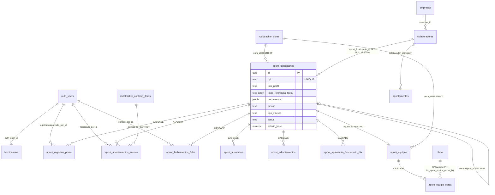
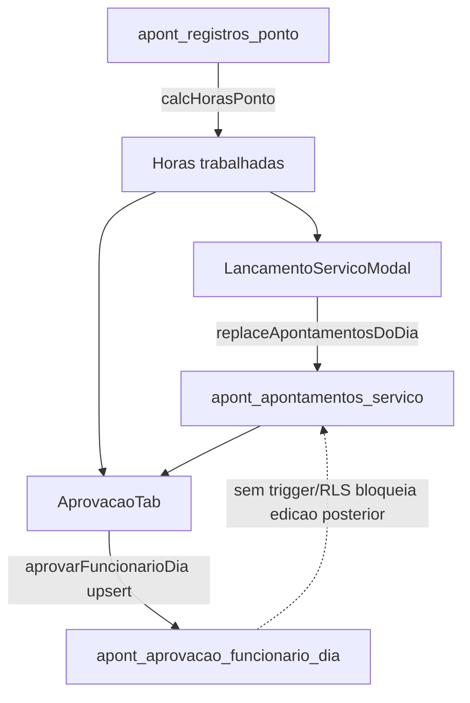

# Auditoria do Módulo Apontamento RH — Gestão Obras

**Data:** 2026-05-24
**Projeto Supabase:** `gunyitwrbxbmnezokgjq` (us-east-1, Postgres 17.6.1)
**Repositório:** `/Users/tiagocameli/projects/Gestao_Obras`
**Escopo:** apenas leitura/análise — **nada foi modificado** no banco ou no código.
**Baseline:** `permissoes-audit.md`, `combustivel-audit.md`, `frota-manutencao-audit.md`, `frete-audit.md`.

---

## Sumário executivo

> 🚨 **O módulo Apontamento RH grava ponto + serviço + ausência, mas NÃO calcula NADA de CLT.** Folha, HE 50/100%, adicional noturno, periculosidade/insalubridade, DSR, banco de horas, eSocial — **0 de 8 categorias trabalhistas implementadas**. Estrutura `apont_fechamentos_folha` existe com 0 rows e 0 código de INSERT. O sistema funciona como timesheet operacional, não como folha.
>
> 🚨 **Biometria facial sem consentimento LGPD.** Zero menções a "consentimento"/"lgpd"/"biometria" como base legal em todo o `src/`. Coleta facial é violação direta de LGPD Art. 11 II "a" (dado pessoal sensível).
>
> 🚨 **Storage `apont_fotos_authed_all` libera TODO o bucket para qualquer authenticated.** RG, CPF, CTPS, ASO, fotos faciais — qualquer usuário do sistema (estagiário do Frete, motorista) pode listar, baixar e deletar tudo. Sem `current_has_action`.
>
> 🚨 **Aprovação não congela nada.** Aprovado pode ser editado/deletado sem log; `apont_auditoria` existe e está vazia; nenhum trigger BEFORE UPDATE bloqueia. `tighten_rls_apontamento` deixou `apont_aprovacao_funcionario_dia`, `apont_registros_ponto`, `apont_ausencias` em `USING(true)`. Edição silenciosa = prova periciada como fraude (Súmula 338 TST, Portaria 671/2021).

### Top achados

| # | Achado | Gravidade | Fase |
|---|--------|-----------|------|
| 1 | **Folha/CLT 0% implementado** — schema `apont_fechamentos_folha` vazio; HE, noturno, DSR, banco de horas, periculosidade/insalubridade ausentes | 🔴 Crítica | 8 |
| 2 | **Biometria facial sem consentimento LGPD** — coleta sem base legal, sem opt-out, sem retenção | 🔴 Crítica | 3.2, 14.3 |
| 3 | **Storage `apont_fotos_authed_all` libera bucket inteiro a qualquer authenticated** (RG, CPF, CTPS, fotos faciais) | 🔴 Crítica | 9, 14 |
| 4 | **Aprovado pode ser editado/deletado sem log nem bloqueio** (Súmula 338 TST) | 🔴 Crítica | 7.4, 3.5 |
| 5 | **Hora da batida vem do device do cliente** (`new Date().toISOString()`); usuário pode alterar relógio | 🔴 Alta | 3.6 |
| 6 | **70/71 funcionários sem `salario_base`** — constraint NOT NULL foi droppada por seed; UI nem tem o campo | 🔴 Alta | 2.2 |
| 7 | **35/71 sem CPF, 67/71 sem data_nascimento, 35/71 sem foto** — cadastro semi-vazio em produção | 🔴 Alta | 2.1 |
| 8 | **RLS `USING(true)` ainda em 7+ tabelas RH** (registros_ponto, ausencias, equipes, equipe_obras, aprovacao_funcionario_dia, aprovacoes_ponto_dia, residual em apontamentos_servico) | 🔴 Crítica | 1.3, 7.2 |
| 9 | **Geofence inexistente** — funcionário pode bater ponto de casa, bar, outro estado; lote/manual gravam GPS null | 🟠 Alta | 3.4 |
| 10 | **Bypass biométrico silencioso** — se funcionário não tem foto, `validarFace` retorna `{match:true, distancia:0}` | 🔴 Alta | 3.2 |
| 11 | **Sem segregação de função** — quem lança apontamento pode aprovar | 🟠 Alta | 7.2 |
| 12 | **`empresa_id='mm4em4xic5sp2'` (EMT) hardcoded** em trigger de unificação → quebra multi-tenant | 🔴 Alta | 1.5 |
| 13 | **Fotos/documentos órfãos no storage após `deleteFuncionario`** (viola LGPD Art. 16) | 🟠 Alta | 9, 14.5 |
| 14 | **Mass assignment em `apont_funcionarios.update()`** — cliente pode setar `auth_user_id`, `equipe_id`, `obra_id` | 🟠 Alta | 14 |
| 15 | **`identifyFace` baixa fotos de TODOS funcionários ativos** pro browser do encarregado (exposição em massa) | 🟠 Alta | 3.2 |
| 16 | **Tabela `apont_auditoria` existe (10 colunas) e está vazia** — 0 registros, 0 código, 0 triggers populando | 🟠 Alta | 3.5 |
| 17 | **eSocial 0%** — sem S-2200/S-2230/S-2299/S-1200; CAT/ASO/férias inexistentes | 🟠 Alta | 12 |
| 18 | **Apontamentos legacy (1925 rows) sem `apont_funcionario_id`** — toda métrica histórica via JOIN duplo | 🟡 Média | 10.1 |
| 19 | **Multi-obra: equipe_obras sem data_inicio/data_fim** — sem histórico temporal de alocação | 🟡 Média | 6.1 |
| 20 | **Horas RH não viram custo de obra** — `custo_mao_obra_propria` em manutenção zerado em todo lugar | 🟡 Média | 11.1 |

---

## Fase 1 — Mapeamento completo

### Fase 1.1 — Estrutura de arquivos

**`src/modules/apontamento/` (20 arquivos, ~10.5k linhas)**

| Arquivo | Linhas | Função |
|---|---:|---|
| `ApontamentoPage.tsx` | 218 | Roteia 7 tabs (Dashboard, Funcionários, Alocação, Ponto, Serviço, Aprovação, Histórico) + abre Drawer FuncionarioForm. Persiste tab em `?tab=`. |
| `types/funcionario.ts` | 159 | Tipos Funcionario/Equipe/Obra; enum TipoVinculo (com diarista legado), StatusFuncionario; FUNCOES canônica (40); `calcularValorHora` (220h hardcoded), `isCpfValido`, `formatarCpf`. |
| `utils/apontamentoApi.ts` | 522 | CRUD apont_funcionarios, fotos/docs storage, obras, equipes M:N, alocação, transferência equipe↔obra. |
| `utils/pontoApi.ts` | 512 | Registrar/atualizar/excluir batidas, aprovação dia, signed-URL foto, reabertura. |
| `utils/apontamentoServicoApi.ts` | 264 | Apontamento por serviço lendo `rodotracker_contract_items`. |
| `utils/aprovacaoApi.ts` | 144 | Aprovar/desaprovar funcionário-dia. |
| `utils/ausenciaApi.ts` | 99 | CRUD apont_ausencias. |
| `utils/faceRecognition.ts` | 169 | `@vladmandic/face-api` v1.7.15; compararFace, identifyFace, preloadFaceModels. |
| `hooks/useApontamentoData.ts` | 132 | React Query: funcs, obras, equipes, alocação. |
| `components/DashboardTab.tsx` | 469 | KPIs, recharts, auto-refresh 60s. |
| `components/RegistroPontoTab.tsx` | 1675 | Bater ponto (foto+face), lote, manual, pendências, edição, fila offline. |
| `components/AprovacaoTab.tsx` | 1474 | Calendário mensal, aprovação funcionário-dia, edição inline, criar batida faltante. |
| `components/AlocacaoTab.tsx` | 874 | CRUD equipes, DnD func↔equipe, transferência equipe↔obra. |
| `components/HistoricoTab.tsx` | 779 | 3 sub-tabs (ponto, serviço, ausências) + exclusão. |
| `components/ApontamentoServicoTab.tsx` | 639 | Horas por serviço; única tab com versão mobile cards. |
| `components/FuncionarioForm.tsx` | 603 | Form RH: CPF/RG/PIS/CTPS, função, vínculo, salário (fantasma), 1..5 fotos faciais, docs. |
| `components/FuncionarioList.tsx` | 279 | Tabela funcs com filtros + thumb foto. |
| `components/LancamentoServicoModal.tsx` | 510 | Modal produtivo/improdutivo. |
| `components/CapturaFotoModal.tsx` | 208 | Captura getUserMedia. |
| `components/MarcarFaltaModal.tsx` | 122 | Modal ausência. |

**`src/components/funcionarios/` (3 arquivos)**

| Arquivo | Linhas | Função |
|---|---:|---|
| `FuncionarioForm.tsx` | 596 | **DIFERENTE** — form de **Usuário do sistema** (CARGOS, perms, perfil). Salva em `funcionarios`. |
| `FuncionarioList.tsx` | 186 | Lista usuários do sistema. |
| `PermissoesMatrix.tsx` | 128 | **Código morto** — 0 importações fora do próprio arquivo. |

**Pages**

| Arquivo | Linhas | Função |
|---|---:|---|
| `src/pages/Funcionarios.tsx` | 201 | Página `/usuarios` — gerencia **Usuários do sistema** (auth). UI rotulada "Usuários", tabela ainda chama `funcionarios`. |

**3 populações distintas no banco:**
- `funcionarios` (9) → Usuários do sistema (login).
- `colaboradores` (80) → cadastro RH legado (Cadastros Hub).
- `apont_funcionarios` (71) → Apontamento RH atual.

Dois `useFuncionarios` com mesmo nome em paths distintos — **risco real de confusão**.

### Fase 1.2 — Duplicação FuncionarioForm/List

**Correção do briefing inicial:** os dois `FuncionarioForm.tsx` NÃO são cópias do mesmo entity. Operam em tabelas distintas:

| Arquivo | Tabela | Entidade | Hook |
|---|---|---|---|
| `src/components/funcionarios/FuncionarioForm.tsx` (596 l) | `public.funcionarios` | **Usuários do sistema** (login + RBAC) | `src/hooks/useFuncionarios.ts` → Edge Function `create-user` |
| `src/modules/apontamento/components/FuncionarioForm.tsx` (603 l) | `public.apont_funcionarios` | **Funcionários CLT/MEI/prestador** (sem login) | `src/modules/apontamento/utils/apontamentoApi.ts` |

Ambos são fonte da verdade dos seus universos. **Não há código a deduplicar**, mas o risco real é dev abrir o arquivo errado e fazer mudança no lado errado.

#### Divergências relevantes

| Aspecto | Usuários (legacy) | RH (novo) |
|---|---|---|
| Valida CPF (DV) | Sim (`validarCPF`, l.27-40) | Sim (`isCpfValido`, types/funcionario.ts:139) |
| Máscara CPF | `onChange` formata (l.366) | só no `value`; onChange strippa |
| Telefone máscara | Sim | NÃO captura (col `telefone` no DB fica vazia) |
| CEP/Endereço form | Sim | NÃO (col `endereco` no DB fica vazia) |
| Idade mínima | "≥18" (l.212) | sem validação |
| CTPS/PIS/RG | NÃO | Sim, mas inputs livres sem formato/DV (l.338-344) |
| Cargo/Função | Select fechado em 10 cargos | `FUNCOES[]` (40 hardcoded), **texto livre no DB** |
| Vínculo (CLT/etc) | N/A | Select sem `'diarista'`, mas **CHECK no banco ainda aceita `'diarista'`** |
| Salário base | N/A | **NÃO existe no form**; `payload.salarioBase = initial?.salarioBase ?? null` (l.229) |
| Data admissão obrig. | NÃO | NÃO (default `today`) |
| Senha/confirmação | Sim (l.86-88, 214-217) | N/A |
| Foto/biometria | NÃO | 1-5 fotos, "primeira = avatar = referência facial" |
| Documentos anexos | NÃO | Qualquer arquivo (UI sem `accept`; MIME só no backend l.484) |
| Auto-bloqueio admin | Robusto (l.228-251) | N/A |
| ID gerado | `Date.now().toString(36)+random` — **NÃO é UUID v4** | `crypto.randomUUID()` (l.191) |

### Fase 1.3 — Estrutura do banco

**Inventário (16 tabelas — todas RLS ON, nenhuma FORCE RLS)**

| Tabela | Cols | Rows | PK | Unique | Soft-delete | Notas |
|---|---|---|---|---|---|---|
| `apont_funcionarios` | 28 | 71 | id uuid | cpf | `status` | Mestre RH. Vínculos CLT/diarista/prestador_servico/terceirizado/MEI. `documentos jsonb` array. EPI inline. |
| `apont_registros_ponto` | 14 | 502 | id | — | ❌ | Ponto. CHECK tipo_batida, status_aprovacao, origem. `hora timestamptz`. |
| `apont_apontamentos_servico` | 14 | 185 | id | — | ❌ | FK servico_id → rodotracker_contract_items (RESTRICT). |
| `apont_ausencias` | 9 | 0 | id | — | ❌ | CHECK data_fim ≥ data_inicio. |
| `apont_adiantamentos` | 7 | 0 | id | — | ❌ | CHECK valor>0. |
| `apont_fechamentos_folha` | 16 | 0 | id | (funcionario_id,mes,ano) | ❌ | Folha mensal. **0 código de INSERT.** |
| `apont_equipes` | 7 | 14 | id | — | ativo | FK encarregado_id, obra_id → rodotracker_obras. |
| `apont_equipe_obras` | 3 | 9 | (equipe_id,obra_id) | — | ❌ | FK obra_id → **obras** (mestre), corrigida 01/05. |
| `apont_aprovacoes_ponto_dia` | 6 | 0 | id | (equipe_id,data) | ❌ | Tabela legada. |
| `apont_aprovacao_funcionario_dia` | 4 | 154 | (funcionario_id,data) | — | ❌ | Aprovação atual (30/04). |
| `apont_auditoria` | 10 | **0** | id | — | ❌ | jsonb audit (vazia). **0 código populando.** |
| `apont_permissoes_usuario` | 3 | 0 | (usuario_id,permissao) | — | ❌ | Vazia — sistema usa `funcionarios.acoes_permitidas`. |
| `funcionarios` | 14 | 9 | id text | email | `status` | Usuários do sistema. `acoes_permitidas text[]`. |
| `colaboradores` | 18 | 80 | id text | — | ativo | Legacy. `apont_funcionario_id uuid` (PR28b) SET NULL. |
| `apontamentos` | 13 | 1925 | id text | — | ❌ | Legacy. FK colaborador_id. **Sem coluna funcionario_id.** |
| `registros_horas_diaristas` | 8 | 15 | id text | — | ❌ | Legacy. **Sem FK pra pessoa.** |

**CHECK constraints relevantes:**

```
apont_funcionarios.apont_func_vinculo_check  → tipo_vinculo IN ('CLT','diarista','prestador_servico','terceirizado','MEI')
apont_funcionarios.apont_func_status_check   → status IN ('ativo','inativo','afastado','demitido')
apont_funcionarios.apont_func_remuneracao_check → salario_base IS NOT NULL AND salario_base > 0
    ⚠ Migration 20260425130000 criou, mas 20260429000200_seed_funcionarios.sql:14 dropou. Hoje NÃO EXISTE.
apont_apontamentos_servico.apont_as_horas_check → horas > 0
apont_apontamentos_servico.apont_as_tipo_check  → tipo IN ('produtivo','improdutivo')
apont_apontamentos_servico.apont_as_lado_check  → lado IS NULL OR lado IN ('direito','esquerdo','ambos')
apont_registros_ponto.apont_rp_tipo_check    → tipo_batida IN ('entrada','saida_almoco','retorno_almoco','saida_final')
apont_registros_ponto.apont_rp_status_check  → status_aprovacao IN ('aprovado','pendente_aprovacao','rejeitado')
apont_ausencias.apont_aus_periodo_check      → data_fim >= data_inicio
```

**RLS — estado pós `tighten_rls_apontamento` (22/05):**

| Categoria | Tabelas |
|---|---|
| ✅ Granulares (`private.current_has_action`) | `apont_funcionarios`, `apont_adiantamentos`, `apont_fechamentos_folha`, `apont_permissoes_usuario`, `apont_auditoria`, `registros_horas_diaristas`, `funcionarios` (com trigger guard), `colaboradores` |
| 🔴 Blanket `USING(true) WITH CHECK(true)` ainda ativas | `apont_registros_ponto`, `apont_ausencias`, `apont_equipes`, `apont_equipe_obras`, `apont_aprovacao_funcionario_dia`, `apont_aprovacoes_ponto_dia`, `apontamentos`, **+1 residual em `apont_apontamentos_servico`** |

> **Bug crítico em `tighten_rls_apontamento`:** o DROP de `"Authenticated full access" ON apont_apontamentos_servico` não atingiu o alvo — a policy real se chama `apont_apontamentos_servico_authed` (loop em `apontamento_schema` 25/04). Como PERMISSIVE são combinadas com OR, as 4 policies granulares criadas em seguida ficaram **inúteis**.

**Triggers ativos:**

```
apont_funcionarios:
  apont_funcionarios_set_upd        BEFORE UPDATE → apont_set_updated_at()
  apont_insert_cria_colab           AFTER  INSERT → trigger_apont_insert_cria_colab()   (PR28i)
  sync_apont_to_colab               AFTER  UPDATE → trigger_sync_apont_to_colab()       (PR28i)
apont_registros_ponto:
  apont_registros_ponto_set_upd     BEFORE UPDATE
  apont_rp_valida_unicidade         BEFORE INSERT → fn_apont_validar_batida()           (16/05)
  trg_apont_escalar_aps_ponto       AFTER INSERT/DELETE/UPDATE → fn_apont_escalar_apontamentos_para_ponto()
colaboradores:
  colab_insert_cria_apont           BEFORE INSERT → trigger_colab_insert_cria_apont()   (PR28g)
  sync_colab_to_apont               AFTER  UPDATE → trigger_sync_colab_to_apont()       (PR28f)
funcionarios:
  trg_funcionarios_guard_sensitive  BEFORE UPDATE → private.guard_funcionarios_sensitive_columns()  (22/05)
```

**Storage:** único bucket relacionado: `apontamento-fotos` (public=false). Policy única: `apont_fotos_authed_all FOR ALL TO authenticated USING(bucket_id='apontamento-fotos')`. **Qualquer autenticado tem CRUD total em foto facial, CPF, RG, CTPS, atestados de qualquer pessoa.**

### Fase 1.4 — Mapa das relações



**Observações:**
- `funcionarios` (9 usuários) e `apont_funcionarios` (71 RH) são **separadas, sem FK direta**. Ponte só via `colaboradores.apont_funcionario_id`.
- `apontamentos` (1925, legacy) **não tem `funcionario_id`** — toda métrica histórica depende do JOIN duplo `apontamentos → colaboradores → apont_funcionarios`.
- Foto/biometria/documentos ficam embutidos em `apont_funcionarios.documentos jsonb` (não há tabela `funcionario_documentos` separada).

### Fase 1.5 — Unificação Colaborador → apont_funcionarios

#### Cadeia PR28 (13/05/2026 19:23–22:38)

| Versão | Nome | Resumo |
|---|---|---|
| 20260513192307 | pr28_unificacao_fase1 | **Direção errada — depois revertida**. Criou `colaboradores.funcionario_id` para `funcionarios` (9 usuários). |
| 20260513193853 | pr28b_unificacao_fix_apont_funcionarios | **Fix**: drop coluna errada, cria `colaboradores.apont_funcionario_id uuid → apont_funcionarios SET NULL` + matching score 100/80/50. |
| 20260513202419 | pr28c_backfill_colaborador_para_apont | Adiciona `apont_funcionarios.telefone`. Cria `colaborador_to_apont_backfill_preview/apply(text)`. |
| 20260513204325 | pr28d_apont_funcionarios_epi_e_backfill | Adiciona EPI: altura, tamanho_camisa/calca/sapato, endereco, email. |
| 20260513204445 | pr28e_importar_colaboradores_sem_par | `importar_colaboradores_sem_par_no_apont()` cria espelho. |
| 20260513205056 | pr28f_trigger_sync_colaborador_apont | `sync_colab_to_apont AFTER UPDATE`. |
| 20260513212759 | pr28g_trigger_insert_colaborador_cria_apont | `colab_insert_cria_apont BEFORE INSERT`. **Bug: documentos='{}'**. |
| 20260513215032 | pr28h_fix_documentos_array_no_trigger | Fix `{}` → `[]`. |
| 20260513222831 | pr28i_bidirecional_apont_para_colab | **Bidirecional**: triggers `apont_insert_cria_colab AFTER INSERT` + `sync_apont_to_colab AFTER UPDATE`. **Anti-loop via `pg_trigger_depth() > 1`**. **Hardcode `empresa_id='mm4em4xic5sp2'` (EMT)**. |
| (várias) | duplicatas PR28c, d, f, g, i | Re-aplicadas (idempotentes). |
| 20260430000100 | apont_diarista_to_prestador | UPDATE 'diarista' → 'prestador_servico'. CHECK ainda aceita ambos. |

#### Avaliação de consistência

| Aspecto | Estado |
|---|---|
| `colaboradores.apont_funcionario_id` | ✅ uuid FK SET NULL |
| `apont_funcionarios.colaborador_id` simétrico | ❌ NÃO existe |
| Trigger BEFORE INSERT em colaboradores | ✅ colab_insert_cria_apont |
| Trigger AFTER INSERT em apont_funcionarios | ✅ apont_insert_cria_colab |
| Trigger AFTER UPDATE bidirecional | ✅ sync_colab_to_apont + sync_apont_to_colab |
| Anti-loop | ✅ no lado apont→colab; ⚠ não no lado colab→apont |
| Matching CPF/nome | ✅ score 100/80/50 |
| Hardcode de empresa | ⚠ `empresa_id='mm4em4xic5sp2'` (EMT) — quebra multi-tenant |
| `apontamentos` legacy recebeu apont_funcionario_id? | ❌ NÃO. PR28c só backfilla cadastro, não migra horas |
| `apont_funcionarios.documentos` default | ✅ `[]` |

---

## Fase 2 — Cadastro de Funcionário (FuncionarioForm RH)

### 2.1 Dados pessoais (LGPD CRÍTICO)

| Campo | Validação | Banco | Observação |
|---|---|---|---|
| CPF | DV via `isCpfValido` | `text` plano, UNIQUE | **35/71 funcionários sem CPF.** Sem `pgcrypto`/`supabase_vault`. |
| RG | Input livre | `text` | Sem UF, sem DV. |
| Data nascimento | Sem validação | `date` | **67/71 sem data**. > hoje passa. ≥14/16/18 não validado. |
| Estado civil, nacionalidade, naturalidade, sexo | — | **NÃO existem** | |

### 2.2 Dados trabalhistas

| Campo | Status |
|---|---|
| CTPS | Input único "número e série"; sem UF/emissão/foto |
| PIS/PASEP | Sem validação de DV |
| Cargo/Função | Texto livre no DB; UI mostra 40 FUNCOES hardcoded; sem tabela `cargos` |
| Data admissão | NÃO obrigatória (default `today`) |
| Tipo contrato | Select sem `'diarista'`; CHECK no banco ainda aceita. 0 funcionários com `diarista`. |
| **Salário base** | **NÃO existe input no form**. Migration tornou obrigatório, seed dropou constraint. **70/71 com `salario_base IS NULL`** — folha não calcula. |
| Jornada (carga horária) | **Não existe coluna**; `calcularValorHora` divide por 220 hardcoded. |
| `permiteHorasExtras` | UI hardcoda `false` na criação (l.239); coluna DB default `true`. **Em edição força para false, perdendo dado.** |

### 2.3 Documentos (sem tabela dedicada)

- **Não existe `funcionario_documentos`** — vivem em `apont_funcionarios.documentos jsonb DEFAULT '[]'`.
- Sem RLS granular por documento; sem audit de download; sem campo `validade`/`categoria`/`criado_por`.
- Limite 20 MB/doc; sem quota total.
- **97% dos funcionários sem documento** (com_docs=2, sem_docs=69, total=5).

### 2.4 Foto de perfil + biometria

- 35/71 sem foto. **Mesma foto serve avatar + referência facial.**
- Modelos face-api carregados de `cdn.jsdelivr.net` **sem SRI/CSP** (supply-chain).
- Descritores 128D **não persistidos** (em memória `REF_CACHE`) — bom.
- Fotos cruas em `fotos_referencia_facial text[]` (paths para bucket).
- Migration `apont_backfill_foto_perfil` rodou (`foto_perfil = fotos_referencia_facial[1]` onde NULL).

### 2.5 Lotação inicial

Form **não captura obra/equipe inicial**; só preserva `initial?.X`. Pode-se cadastrar sem obra e alocar depois.

### Edge cases ruins (resumo)

- Nome 1-char passa.
- Data nasc > hoje passa.
- Demissão < admissão passa.
- Status=`demitido` não exige `dataDemissao`.
- **2 homônimos quebram** (`_seed_funcionarios_nome_idx UNIQUE(nome)` criado em seed 20260429000200 e nunca removido).
- `alert(err.message)` + `console.error(err)` vazam schema do PostgREST.

---

## Fase 3 — Registro de Ponto

### 3.1 Modalidades de batida

Seis caminhos, todos convergindo em `registrarBatida` (`pontoApi.ts:267`):

| Modalidade | `origem` | Status default | Onde |
|---|---|---|---|
| Captura individual com face | `automatico` | `aprovado` | `RegistroPontoTab.tsx:264-286` |
| Captura rápida (identifica pelo rosto) | `automatico` | `aprovado` | `RegistroPontoTab.tsx:424-451` |
| Sem foto (funcionário sem fotos) | `automatico` | `aprovado` | `RegistroPontoTab.tsx:334-348` |
| Lançamento manual individual | `manual` | `pendente_aprovacao` | `RegistroPontoTab.tsx:1546-1566` |
| Lançamento em lote (FAB) | `manual` | `pendente_aprovacao` | `RegistroPontoTab.tsx:973-1054` |
| Criar batida faltante na Aprovação | `manual` | **`aprovado` direto** ⚠ | `AprovacaoTab.tsx:1419-1430` |

Sem leitor biométrico físico nem QR Code. Sem página mobile dedicada.

**Trigger `fn_apont_validar_batida`:** bloqueia 2ª entrada/dia, saída sem entrada, saída ≤ entrada, 2ª saída final. **Não valida** `saida_almoco`/`retorno_almoco` (sem duplicidade nem ordem).

### 3.2 Biometria facial (LGPD CRÍTICO)

**Lib:** `@vladmandic/face-api` v1.7.15 (fork ativo). 100% client-side. Modelos baixados de `cdn.jsdelivr.net`. Nenhum serviço cloud.

**Onde armazena template:**
- Descritor 128D `Float32Array` gerado em runtime, **NUNCA persistido**. Vive em `REF_CACHE: Map<string,Float32Array>` (`faceRecognition.ts:64`).
- O que persiste são as **fotos JPEG cruas** em `apont_funcionarios.fotos_referencia_facial text[]` → bucket `apontamento-fotos`.
- Confirmado: **não existe** `face_descriptor`, `biometria`, `template_facial`.

**Proteção das fotos:**
- Upload: MIME image/jpeg|png|webp, máx 10 MB (`apontamentoApi.ts:417,427-432`).
- Acesso via **signed URLs de 1h** (`apontamentoApi.ts:446`). Sem criptografia aplicação-side.
- 🔴 `identifyFace` baixa **todas as fotos de referência de todos os funcionários ativos da equipe** pro browser do encarregado (`RegistroPontoTab.tsx:363-383`) — exposição em massa.

**LGPD Consentimento — 🔴 AUSENTE:**
- Nenhuma tabela `apont_consentimentos`, `consents`, `lgpd_*`.
- Nenhum campo `consentimento_*` em `apont_funcionarios`.
- Nenhum checkbox/modal de consentimento no cadastro.
- LGPD Art. 11, II "a" exige consentimento específico e destacado para dado pessoal sensível. **Sem isso, o fluxo é potencialmente ilegal.**

**Fallback:**
- Threshold fixo `0.55` (não configurável).
- 🔴 Se funcionário **não tem foto cadastrada**, `validarFace` retorna `{match:true, distancia:0}` (`RegistroPontoTab.tsx:354-357`) — **bypass silencioso**.
- 🔴 Encarregado pode escapar via `LancamentoManualModal`, e se tiver `aprovar_apontamento_rh` aprova a si mesmo.

**Retenção / desligamento — 🔴 NÃO IMPLEMENTADO:**
- Sem trigger/job que apague `fotos_referencia_facial[]` em `status='demitido'`.
- `deleteFuncionario` (`apontamentoApi.ts:156-162`) só faz `DELETE FROM` — fotos ficam órfãs (viola LGPD Art. 16).

### 3.3 Validações de horário (CLT)

| Regra | Status |
|---|---|
| Entrada antes de saída final | ✅ trigger `23P03` |
| 2 entradas no dia | ✅ trigger `23P01` |
| Saída sem entrada | ✅ trigger `23P02` |
| Ordem almoço/retorno | 🔴 NÃO |
| Duplicidade almoço/retorno | 🔴 NÃO |
| Intervalo intrajornada mín (1h se jornada>6h, CLT 71) | 🔴 NÃO |
| Jornada diária máx 10h (CLT 59) | 🔴 NÃO |
| Batida no futuro | 🔴 NÃO — aceita qualquer `hora` |
| Batida retroativa > N dias | 🔴 NÃO |
| Status check (inativo/demitido não pode bater) | 🔴 NÃO |
| Anti-double-click (intervalo mín entre batidas) | 🔴 NÃO |

### 3.4 Geolocalização

- Captura via `navigator.geolocation.getCurrentPosition` (`CapturaFotoModal.tsx:56-60`, timeout 15s).
- Persistido em `apont_registros_ponto.latitude/longitude double precision`.
- Overlay com data/hora/GPS impresso na foto.
- 🔴 **Geofence inexistente.** Sem leitura de coordenadas/raio da obra, sem Haversine. **Funcionário pode bater de casa, bar, outro estado.**
- Lote e manual gravam `latitude=null, longitude=null` (backdoor pra GPS).

### 3.5 Edição posterior (CRÍTICO COMPLIANCE)

| Cenário | Quem pode | Audit trail |
|---|---|---|
| Editar hora | `editar_batida_ponto` | 🔴 NENHUMA |
| Excluir batida + foto | `excluir_batida_ponto` | 🔴 NENHUMA |
| Aprovar/rejeitar manual | `aprovar_lancamento_manual` | grava só `aprovado_por_id` |
| Reabrir dia aprovado | `reabrir_periodo` | 🔴 DELETE da aprovação, sem rastro |
| Criar batida retroativa "já aprovada" | `aprovar_apontamento_rh` | grava `motivo_manual` mas pula fluxo |

**Tabela `apont_auditoria` EXISTE** (10 colunas) mas:
- **0 registros**.
- **0 referências no código** (`grep -rln "apont_auditoria" src/` → vazio).
- **0 triggers** populando.

🔴 **Sem trigger no banco bloqueando UPDATE/DELETE em `apont_registros_ponto` após aprovação.** O `congelado = !!aprovacao` em `RegistroPontoTab.tsx:236` só esconde botões da UI; qualquer chamada SQL contorna.

Risco trabalhista: Súmula 338 TST e Portaria 671/2021 MTP exigem espelho de ponto auditável. Edição silenciosa = prova periciada como fraude.

### 3.6 Mobile vs Desktop

- **Sem página mobile dedicada** (`find src/pages/mobile -iname '*apont*'` → vazio).
- Permissão `bater_ponto_mobile` declarada sem consumidor (dormente).
- `RegistroPontoTab.tsx` é responsivo; câmera direta (`getUserMedia facingMode:user`).
- 🔴 **Hora do cliente:** `pontoApi.ts:286` faz `new Date().toISOString()` no browser. Coluna `hora timestamptz` sem `DEFAULT NOW()`. **Usuário altera relógio do device e bate retroativo/adiantado.**
- **Offline:** via `lib/offlineQueue.ts` (IndexedDB `emt-obras-offline` v3, store `batidas_ponto`). 🔴 **Apenas lançamento em lote** enfileira; captura individual quebra offline.

### 3.7 Casos de intervalo

- 🔴 "Esqueceu de bater saída do almoço" — **não é deduzido nem alertado**. `fn_apont_escalar_para_ponto` calcula `(saida_final - entrada)` cheio se faltar par almoço/retorno.
- `listPendenciasSaida` (`pontoApi.ts:459-512`) detecta quem entrou e não saiu (30 dias) — só cobre saída final.

---

## Fase 4 — Apontamento de Serviço

### 4.1 Ponto vs Serviço

Ponto define duração do dia; Serviço distribui em itens de contrato (produtivo) ou motivos de parada (improdutivo). Mesmo funcionário/dia tem ambos. UI força soma de horas de serviço = horas de ponto com tolerância 0.01h (`LancamentoServicoModal.tsx:251-266`). "1 lançamento por pessoa por dia" é convenção via `replaceApontamentosDoDia` (DELETE + INSERT) — **sem constraint de banco**.



### 4.2 Vínculo com contrato/obra

- Tabela: `apont_apontamentos_servico`. `servico_id text NULL → rodotracker_contract_items(id) ON DELETE RESTRICT` (`apont_aps_servico_fk`).
- Combobox filtra por obra (`listServicosDaObra`); se obra não selecionada, cai em `listTodosServicos` — **usuário pode escolher item de outra obra**.
- **Nenhuma validação cruzada `funcionario.obra_id` × `servico.obra_id`** (front ou banco).

### 4.3 Estaca e lado (drop)

Migration `apont_servico_drop_estaca_lado` (20260426160000) só relaxou NOT NULL ("não fazem sentido pra Administração local %"). Colunas continuam existindo mas o app sempre grava `null` e nem expõe inputs. **Hoje o app não rastreia local de execução** — único proxy é `observacao` (text livre). **Para um construtor rodoviário, é regressão significativa.**

### 4.4 Quantidade / unidade

- Captura só `horas` (CHECK > 0).
- 🔴 **Não há campo de quantidade produzida** (m³, m²).
- `rodotracker_contract_items.unit` é só display no rótulo (`LancamentoServicoModal.tsx:270-275`), não gravado.
- Não existe `valor_unitario`/`preco`/`custo` — custo deriva depois (horas × valor_hora), mas valor_hora vem de salário NULL.

### 4.5 Produtividade

- Grep "produtividade" no `src/` → **0 ocorrências**.
- Inviável habilitar sem coluna `quantidade`.

---

## Fase 5 — Faltas e Ausências

### 5.1 Tipos (`ausenciaApi.ts:3-20`)

`falta_injustificada`, `falta_justificada`, `atestado`, `ferias`, `licenca`, `folga`, `abono`.

- Licença **não desdobrada** (maternidade/paternidade/óbito/casamento).
- Suspensão e afastamento INSS **inexistem**.
- **`apont_ausencias.tipo` é text sem CHECK** — qualquer string passa.

### 5.2 Comprovação / LGPD

- Schema tem `atestado_arquivo text NULL` e `cid text NULL`, mas o `MarcarFaltaModal` **não expõe** nenhum dos dois.
- Nenhum bucket de atestado existe.
- 🔴 **RLS de `apont_ausencias` é `USING true WITH CHECK true`** — `tighten_rls_apontamento` deixou de fora. Se `cid` (dado de saúde, Art. 11) for ativado sem RLS dedicada = violação LGPD direta.

### 5.3 Impacto DSR

🔴 Não implementado. `apont_fechamentos_folha.dsr` existe sem população. Sem cálculo "semana com falta injust." nem trigger.

### 5.4 Impacto folha

🔴 `apont_fechamentos_folha` schema completo, **0 código de INSERT**. Permissão `fechar_folha` declarada sem componente que invoque. Falta just. ≠ injust. é só semântica hoje.

### 5.5 Aprovação de ausência

Não existe fluxo. `criarAusencia` insere direto; `removerAusencia` deleta sem checagem de permissão no front + RLS permissiva. Sem campos `aprovado_por`/`status`.

---

## Fase 6 — Alocação Multi-obra

### 6.1 Modelo de dados

`apont_equipe_obras (equipe_id uuid, obra_id text, created_at, PK composta)`.

- 🔴 **Sem `data_inicio`/`data_fim`** — só fotografia atual, nunca histórico temporal.
- M:N só no nível de equipe; `apont_funcionarios.obra_id` continua 1:1.

### 6.2 Transferência

`transferirEquipeObra` (`apontamentoApi.ts:340-381`): UPSERT destino → DELETE origem (se `removerOrigem`) → UPDATE `apont_equipes.obra_id = destino` → UPDATE `apont_funcionarios SET obra_id = destino`. **Destrutivo, sem log**, sem registro em `apont_auditoria`. Não dá pra responder "em 15/03 a equipe X estava em qual obra?".

### 6.3 Horas por obra (CRÍTICO custo)

- 🔴 **Não há divisão automática.** Obra é inferida transitivamente via `servico_id → rodotracker_contract_items.obra_id`.
- Para 8h em 2 obras, operador precisa criar 2 linhas manualmente (4h+4h).
- UI **não alerta** se equipe atende N obras e operador lançou tudo em uma só — **risco de custo zerado em obra esquecida**.

### 6.4 FK fix (`fix_apont_equipe_obras_fk`)

01/05 trocou FK de `rodotracker_obras` para `obras` (mestre), porque rodotracker só "abre" obra na Medição depois — ordem operacional contraintuitiva.

⚠ **Inconsistência herdada**: `apont_equipes.obra_id` e `apont_funcionarios.obra_id` **ainda referenciam `rodotracker_obras`** — equipe pode ter obra "principal" em rodotracker que não existe em `obras`.

---

## Fase 7 — Workflow de Aprovação

### 7.1 Modelo (`apont_aprovacao_funcionario_dia`)

`(funcionario_id uuid, data date, aprovado_em timestamptz default now(), aprovado_por_id uuid NULL, PK (funcionario_id, data))`. Granularidade por funcionário×dia. "Lote" no front é só for-each não-transacional. Tabela legada `apont_aprovacoes_ponto_dia` (por equipe) ainda coexiste.

### 7.2 Quem aprova

- Permissão `aprovar_apontamento_rh`. Verificação **só no front** (`AprovacaoTab.tsx:85`).
- 🔴 **RLS é `USING true, WITH CHECK true`** — qualquer authenticated, mesmo sem a permissão, faz INSERT/DELETE direto via SDK.
- 🔴 **Sem segregação de função**: mesmo usuário pode lançar serviço e aprovar (não há check `aprovado_por_id != registrado_por_id`).

### 7.3 Estados

- Linha inexistente = pendente; linha existente = aprovado.
- Reverter = DELETE (`desaprovarFuncionarioDia`) — sem histórico de aprovação anterior, sem confirm dialog.
- 🔴 **Não existe "rejeitado com motivo"**.
- Sem limite de tempo para reverter.

### 7.4 Pós-aprovação

- Não vai pra folha (nenhuma escrita em `apont_fechamentos_folha`).
- 🔴 **Aprovado pode ser editado/excluído livremente**:
  - Front: nenhum check `if (aprovado) return`.
  - RLS: `apont_apontamentos_servico_update` exige só `editar_apontamento_servico`, sem consultar aprovação.
  - Trigger: nenhum BEFORE UPDATE valida.
  - `apont_auditoria` existe mas não é populada.

### 7.5 Lançamento tardio

- Inputs `type="date"` sem `min`/`max`.
- `apont_apontamentos_servico.data` sem CHECK de range.
- Sem trigger de janela aberta.
- 🔴 **Pode-se lançar pra qualquer data passada ou futura** — só barreira é a permissão binária.

---

## Fase 8 — Cálculo de horas (CLT BRASILEIRO)

**Síntese:** o módulo grava batidas e apontamento por serviço — **NÃO calcula nada relacionado a CLT**.

Única função SQL aritmética é `fn_apont_escalar_para_ponto`, que só **re-escala proporcionalmente** as horas dos apontamentos por serviço pra bater com o total do ponto:

```sql
IF v_saida_almoco IS NOT NULL AND v_retorno_almoco IS NOT NULL THEN
  v_horas_ponto :=
    EXTRACT(EPOCH FROM (v_saida_almoco - v_entrada)) / 3600.0
    + EXTRACT(EPOCH FROM (v_saida_final - v_retorno_almoco)) / 3600.0;
ELSE
  v_horas_ponto := EXTRACT(EPOCH FROM (v_saida_final - v_entrada)) / 3600.0;
END IF;
v_ratio := v_horas_ponto / v_horas_apont;
UPDATE apont_apontamentos_servico SET horas = round(horas * v_ratio, 2) ...
```

**Busca exaustiva confirmou ausência:**
- `proname LIKE '%hora%' OR '%folha%' OR '%extra%' OR '%noturn%' OR '%dsr%'` → **0 resultados**.
- `grep -rln "fechamentos_folha\|FechamentoFolha"` no `src/` → **0 matches** (tabela existe, ninguém escreve).
- Sem tabela de feriados.

| Item | Status | Detalhe |
|---|---|---|
| **8.1 Horas normais** (8h/dia, 44h/sem) | 🔴 NÃO | Coluna `apont_fechamentos_folha.horas_normais` existe, 0 registros, 0 código |
| **8.2 HE 50% e 100%** (2h vs >2h; domingos/feriados) | 🔴 NÃO | Colunas `horas_extras_50/100` sem população. **Sem tabela de feriados** — domingo = qualquer dia |
| **8.3 Adicional noturno** (22h-5h, +20%, hora reduzida 52'30") | 🔴 NÃO | Coluna existe, sem código. Nenhuma constante de janela noturna |
| **8.4 Periculosidade 30% / Insalubridade 10/20/40%** | 🔴 NÃO | 🔴 **Coluna no funcionário NEM EXISTE**. ELETRICISTA, OPERADOR DE USINA, MOTORISTA DE CARRETA listados sem flag |
| **8.5 Intervalo intrajornada não cumprido** (1h extra 50%, CLT 71§4) | 🔴 NÃO | `fn_apont_escalar_para_ponto` aceita silenciosamente |
| **8.6 DSR** (Lei 605/49) | 🔴 NÃO | Coluna `dsr` existe sem população |
| **8.7 Banco de horas** | 🔴 NÃO | Sem `saldo_banco_horas`, sem tabela de movimentos |
| **8.8 Espelho de ponto + folha** (Port. 671/2021, eSocial S-1200, Domínio/Senior) | 🔴 NÃO | Sem PDF assinado, sem NSR sequencial, sem hash. `grep -i "esocial\|S-1200"` → 0 |

**Resumo:** das 8 categorias, **0 implementadas, 0 parciais, 8 ausentes**. Estrutura de banco preparada, motor de folha **vazio** — equivalente a formulário de NF-e sem código SEFAZ.

---

## Fase 9 — Documentos do Funcionário (LGPD)

### 9.1 Tabela `funcionario_documentos`

**Não existe tabela dedicada.** Documentos vivem em `apont_funcionarios.documentos jsonb NOT NULL DEFAULT '[]'`.

- RLS ATIVA em `apont_funcionarios` (`relrowsecurity=true`). Policies granulares via `private.current_has_action`.
- `private.current_has_action(p_action)` SECDEF com bypass implícito: `cargo='Administrador' OR p_action = ANY(acoes_permitidas)`. **Admin vê CPF/RG/PIS/CTPS de todos.** Combinado com privilege escalation do baseline (cargo auto-promovível), compromete o módulo inteiro.
- Sem campo `validade`/`categoria`/`criado_por`/`audit_download`.

### 9.2 Storage

- Bucket `apontamento-fotos`: `public=false` ✅.
- 🔴 **Storage policy `apont_fotos_authed_all` é fatal**: `cmd=ALL, qual=(bucket_id='apontamento-fotos')`, sem `current_has_action`. **Qualquer usuário autenticado faz SELECT/INSERT/DELETE em qualquer foto ou documento do bucket.** Compare com `financeiro-anexos` que usa `current_has_action('ver_financeiro')`.
- URLs assinadas: TTL fixo 1h. Sem revogação imediata.

### 9.3 Retenção

- 🔴 `deleteFuncionario` (`apontamentoApi.ts:156`) só faz `DELETE FROM`. **Não apaga fotos nem documentos do storage.**
- Trigger `trigger_sync_apont_to_colab` em `status='inativo'|'demitido'` apenas seta `colaboradores.ativo=false`, **mantém PII** (CPF/RG/endereço/telefone).
- **Sem cron de purge, sem anonimização.**
- CLT exige guarda 5 anos pós-demissão, mas LGPD exige eliminação após finalidade.

---

## Fase 10 — Unificação Colaborador → Funcionário (status)

### 10.1 SQL de verificação

| Verificação | Resultado |
|---|---|
| Tabela `colaboradores` existe | ✅ 80 rows |
| Colaboradores vinculados (`apont_funcionario_id IS NOT NULL`) | **71/80 (88,75%)** |
| Colaboradores sem vínculo | **9** (todos ativos, 3 sem CPF) |
| `apont_funcionarios` sem colab espelho | 0 |
| Colaboradores com FK apont quebrada | 0 |
| Apontamentos legacy com `colaborador_id` órfão | 0 (em 1925 rows) |
| `apont_funcionarios` com `tipo_vinculo='diarista'` | **0** (migração 30/04 limpou) |
| `apont_funcionarios.tipo_vinculo` distribuição | prestador_servico=42, CLT=28, terceirizado=1 |
| `apont_funcionarios.status` distribuição | ativo=63, inativo=5, demitido=3 |
| FK apont_registros_ponto.funcionario_id quebrada | 0 |
| FK apont_apontamentos_servico.funcionario_id quebrada | 0 |
| FK apont_equipe_obras.equipe_id/obra_id quebrada | 0 / 0 |
| CPFs duplicados em apont_funcionarios | 0 |
| Batidas com saída sem entrada (post-trigger) | 0 |
| Apont com docs em jsonb | **com_docs=2, sem_docs=69 (97%)** |
| Status batidas | pendente=208, aprovado=294, rejeitado=0 |
| **Bucket apont_fotos público** | Não (mas policy blanket) |

#### 9 colaboradores sem vínculo

```
ALTAIR DA SILVA CORREIA           461.633.282-72  ativo
ANTONIO DA SILVA SOUZA            695.706.392-53  ativo
ANTONIO DA SILVA SOUZA(Santim)    (vazio)         ativo
JARLISSON DA SILVA COSTA          (vazio)         ativo
JOSE FRANCISCO BEZERRA LUSTOZA    666.590.272-20  ativo
RACENILTON DE MENEZES CAMELI      721.882.432-34  ativo
RENAN DE OLIVEIRA LIMA            (vazio)         ativo
RIAN HARISSON SOARES CAVALCANTE   035.475.322-30  ativo
ROGERIO LOPES FERREIRA            239.514.942-04  ativo
```

Função `importar_colaboradores_sem_par_no_apont()` pronta mas precisa ser chamada manualmente — sem cron, sem invocação na UI.

### 10.2 Código órfão "colaborador"

**Total: 103 ocs em 11 arquivos** — NÃO é dead code (triggers bidirecionais ativos), mas é dívida clara.

| Arquivo | Categoria | Status |
|---|---|---|
| `src/types/index.ts` 751-786, 1518 | tipo `Colaborador` + FK p/ apont | usado |
| `src/hooks/useColaboradores.ts` (48L) | CRUD `colaboradores` | usado em OS, Cadastros, Unificação |
| `src/hooks/useUnificacao.ts` (~190L) | RPCs match/backfill | usado |
| `src/lib/mappers.ts` 1188, 1427, 1442 | mappers DB↔domínio | usado |
| `src/utils/permissions.ts` 193-195, 235, 1267 | perms criar/editar/excluir_colaboradores + unificar_funcionarios | UI label |
| `src/modules/cadastros/CadastrosHub.tsx:10` | label "Funcionários, colaboradores e empresas" | UI label |
| `src/modules/cadastros/UnificacaoPage.tsx` 14, 38, 140 | UI unificação | usado |
| `src/modules/cadastros/configs/colaboradores.config.tsx` | EntityConfig slug=colaboradores | rota /cadastros/colaboradores |
| `src/components/manutencao/os/OSDetalhe.tsx` 31, 85, 175, 413, 549 | OS usa useColaboradores() | **PROBLEMA cross-módulo** |
| `src/components/manutencao/os/AdicionarMaoObraOSModal.tsx` 15, 30-90 | label "Mecânico / colaborador" | **PROBLEMA cross-módulo** |

### 10.3 Código órfão "diarista"

- **3 ocorrências no `src/`**: `src/modules/apontamento/types/funcionario.ts:2,3,10` (mantido como valor legado em `type TipoVinculo`).
- UI já removeu "diarista" do dropdown (`FuncionarioForm.tsx:42-47`).
- Banco: `tipo_vinculo` distribuição: CLT 28, prestador_servico 42, terceirizado 1, **diarista 0**. CHECK constraint `apont_func_vinculo_check` ainda aceita `'diarista'` — pode dropar.
- Migrations órfãs: `20260228120000_create_diaristas.sql` (tabela legado pré-Marco5), `20260430000100_apont_diarista_to_prestador.sql`.

**Conclusão:** código praticamente limpo, banco zerado, cleanup trivial.

---

## Fase 11 — Cross-módulo

### 11.1 Apontamento ↔ Obras

- 🔴 **Horas viram custo de obra? NÃO.** Único `custo_mao_obra*` no projeto é `custo_mao_obra_propria` em `manutencao_os` (zerado em todo lugar — `usePlanosPreventivos.ts:347`, `useOfflineSync.ts:215`, `MAbrirOSPage.tsx:159`). `apont_apontamentos_servico` não alimenta nenhum relatório de custo.
- Migration `apont_obras_from_rodotracker.sql`: hoje lê `obras` (master) + LEFT JOIN rodotracker_obras pra lote/rodovia. Integração ativa.
- Serviço = item de contrato (rodotracker_contract_items): acoplamento forte e correto.

### 11.2 Apontamento ↔ Manutenção

- 🔴 **Mecânico em apont_funcionarios = OS? NÃO.** `AdicionarMaoObraOSModal.tsx:15` recebe `colaboradores: Colaborador[]`, salva `colaboradorId`. OS usa `colaboradores`, RH usa `apont_funcionarios`.
- 🔴 **Horas OS ↔ ponto: RISCO ALTO DUPLA CONTAGEM.** Mesmo mecânico pode bater ponto E ter horas em `manutencao_os_mao_obra` sem reconciliação.
- UI inconsistente: "Mecânico / colaborador".

### 11.3 Apontamento ↔ Frota / Frete

- 🔴 **Motorista frete = TEXTO LIVRE** (`FreteForm.tsx:59,447`, `placeholder="Nome do motorista"`). Salva string em `fretes.motorista`. Sem FK p/ apont_funcionarios.
- 🔴 **Motorista abastecimento = TEXTO LIVRE** (`saidas_combustivel.motorista`).
- Frota equipamentos: sem coluna "responsável" cruzando RH.

### 11.4 Apontamento ↔ Folha externa

- **Integra Domínio/ADP/EFD: NÃO.** Zero ocorrências.
- Permissões `lancar_adiantamento`, `fechar_folha`, `exportar_folha` declaradas. **UI não encontrada.**

### 11.5 Apontamento ↔ Combustível

- Motorista do `saidas_combustivel` = texto livre. **Não cruza com apont_funcionarios** nem colaboradores. Sem FK/autocomplete — risco de typo nos relatórios.

---

## Fase 12 — eSocial + Compliance Trabalhista

| Item | Status |
|---|---|
| 12.1 eSocial (S-2200/S-2230/S-2299/S-1200) | 🔴 **AUSENTE** — zero hits. App não envia, não gera arquivo, não mapeia eventos |
| 12.2 CAT (Comunicação Acidente Trabalho) | 🔴 **AUSENTE** — sem fluxo, sem tabela |
| 12.3 ASO (admissional/periódico/demissional/retorno) | 🔴 **AUSENTE** — sem alerta vencimento. Risco NR-7 |
| 12.4 Férias (aquisitivo/concessivo) | 🔴 **AUSENTE** — sem alerta >11 meses. Risco CLT art. 134 |

Apont RH cobre **ponto + alocação + apontamento de serviço**. Não cobre payroll/compliance. Posicionamento "controle operacional", não "RH completo".

---

## Fase 13 — UI/UX por Tab

### 13.1 DashboardTab (469L)
- Visual: **cru** (CSS vars + recharts, sem shadcn).
- Atrito: OK (auto-refresh 60s + manual).
- Mobile: OK.
- Perf 100+: OK.
- Falta: exportação gráficos, filtro encarregado, CSV top-funcs.

### 13.2 RegistroPontoTab (1675L)
- Visual: **cru**, SkeletonCard custom.
- Atrito: alto na 1ª vez (face + 4 batidas + manual + offline + ajuda).
- Mobile: parcial — não é mobile-first apesar de ser tela de campo.
- Perf 100+: **risco** — sem virtualização, lag com 100+ funcs.
- Falta: filtro "só pendentes", atalho teclado, empty state offline.

### 13.3 AprovacaoTab (1474L)
- Visual: **cru** (calendário próprio, não react-day-picker).
- Atrito: bom (atalhos `B1.1`, lote `MW1`).
- Mobile: parcial (sticky sem card mobile).
- Perf 100+: **risco** — 4 queries simultâneas, sem paginação.
- Falta: filtro encarregado, aprovação por equipe, "tempo médio até aprovar".

### 13.4 AlocacaoTab (874L)
- Visual: **cru**, DnD HTML5 nativo.
- Atrito: OK (dica escondida em mobile).
- Mobile: **FALHA** — DnD não funciona em touch, `AlocacaoTab.tsx:225` só esconde dica sem fallback (botão "mover" no modal).
- Perf 100+: OK até ~50.
- Falta: bulk select + "alocar todos selecionados".

### 13.5 HistoricoTab (779L)
- Visual: **cru**, SkeletonTableRow.
- Atrito: OK (3 sub-tabs).
- Mobile: parcial.
- Perf 100+: **risco** — range inteiro client-side, sem paginação, >10k rows possível.
- Falta: **exportação CSV/Excel** (esperado em Histórico), filtro encarregado, totalizador horas no rodapé.

### 13.6 ApontamentoServicoTab (639L)
- Visual: **cru**, mas tem versão mobile com cards (`sm:hidden`) — **única tab que cuidou disso**.
- Atrito: OK.
- Mobile: **MELHOR DAS TABS.**
- Perf 100+: OK.
- Falta: tooltip ok/pendente/excedido, totalização por serviço.

### Padrões transversais

- ❌ **Nenhuma tab importa de `src/components/shadcn/`** — todas usam `components/ui/*` custom.
- ❌ **Nenhum form usa RHF+Zod** — `useState` + validação manual.
- ❌ **Tabs shadcn não usado** — `TabBtn` inline em `ApontamentoPage.tsx:96-132`.
- ❌ **Sem data-table** — `<table>` HTML com filtros próprios.
- ❌ **Skeleton parcial**: só Histórico e RegistroPonto.
- ❌ **Exportação ausente em todas.**

---

## Fase 14 — Segurança e LGPD

### 14.1 Targets para /security-review

- `src/modules/apontamento/components/FuncionarioForm.tsx`
- `src/modules/apontamento/components/RegistroPontoTab.tsx`
- `src/modules/apontamento/utils/{apontamentoApi,pontoApi,faceRecognition,aprovacaoApi,ausenciaApi,apontamentoServicoApi}.ts`
- `src/hooks/useFuncionarios.ts` + Edge Functions `create-user`/`delete-user`
- Storage policy `apont_fotos_authed_all`
- Constraint `apont_func_vinculo_check`

**Check rápido próprio:**
- Zero SQL injection (Supabase-js parametriza).
- 🔴 **Sem sanitização server-side** — confia 100% no client.
- 🔴 **Mass assignment**: `funcionarioToRow` envia objeto inteiro; sem whitelist nem column-level policy — cliente malicioso pode tentar setar `auth_user_id`/`salario_base`/`equipe_id` em qualquer UPDATE.

### 14.2 Dados em log

- `FuncionarioForm.tsx:245` `console.error("Falha…", err)` — err pode conter cpf/salário/coluna.
- `FuncionarioForm.tsx:246-248` `alert("Falha ao salvar: " + err.message)` — vaza PostgREST.
- `FuncionarioForm.tsx:307` `console.warn("Falha ao apagar documento…", e)` — caminho de storage.
- `RegistroPontoTab.tsx:284,347,417,442,449,1053,1305,1550,1569` — alerts com `func.nome` + erros brutos.
- `AlocacaoTab.tsx:492` `alert("Falha: " + err.message)`.

Sem log explícito de CPF/salário, mas `console.error(err)` em DevTools de prod vaza qualquer payload da mutação.

### 14.3 Biometria — LGPD

Grep `consentimento|consent|lgpd|biometria` → **ZERO menções a consentimento/LGPD** em todo o `src/`.

- 🔴 Não há tela de termo, coluna `consentimento_*`, audit de coleta, opt-out, política de retenção.
- Coleta facial sem base legal documentada = **risco direto LGPD/ANPD**.
- Encarregado de Dados (DPO) não está mapeado.

### 14.4 Matriz de Permissões (`PermissoesMatrix.tsx`)

- 128 linhas. **0 importações fora do próprio arquivo. Código morto na UI.**
- Mas `useSalvarPerfilPermissao` ainda é chamado em `pages/Funcionarios.tsx:57` e `:156` ao criar/importar usuário, gravando em `perfis_permissao` que ninguém lê.
- Sistema vivo: `funcionarios.acoes_permitidas` (array) consultado por `private.current_has_action`.
- **Remover subsistema legado**: `PermissoesMatrix.tsx`, `perfis_permissao`, `usePerfisPermissao`, `useSalvarPerfilPermissao`, `dbToPerfilPermissao`, `perfilPermissaoToDb`.

### 14.5 Desligamento

- `useExcluirFuncionario` invoca Edge `delete-user`; em falha cai pra DELETE direto.
- `apontamentoApi.deleteFuncionario` (l.156) DELETE puro, **não toca storage**. Fotos e documentos físicos ficam.
- Trigger DB `trigger_sync_apont_to_colab` em `status='inativo'|'demitido'` apenas seta `colaboradores.ativo=false`, **mantém PII**.
- Sem cron de purge, sem anonimização.

### Achados extras

1. **5 tabelas RH com policy ALL true** que sobrescrevem as granulares (PostgreSQL faz OR entre PERMISSIVE): `apont_apontamentos_servico_authed`, `apont_aprovacao_funcionario_dia."Authenticated full access"`, `apont_aprovacoes_ponto_dia_authed`, `apont_ausencias_authed`, `apont_registros_ponto_authed`.
2. **Trigger `trigger_apont_insert_cria_colab`** replica toda inserção em `apont_funcionarios` para `colaboradores` com CPF/RG/endereço/telefone — **duas cópias de PII por funcionário, duas superfícies**.
3. `_seed_funcionarios_nome_idx UNIQUE(nome)` — bug que vai morder em produção com homônimos.
4. `documentos jsonb` sem quota — insider pode estourar TOAST.

---

## Fase 15 — Recomendações priorizadas

### Top 25 issues

| # | Prioridade | Área | Problema | Esforço |
|---|---|---|---|---|
| 1 | 🔴 ALTA | Cálculo CLT | Implementar motor de folha mínimo (8.1 normais + 8.2 HE 50/100 + 8.6 DSR), popular `apont_fechamentos_folha` | 80h |
| 2 | 🔴 ALTA | LGPD/Biometria | Implementar fluxo de consentimento explícito + tabela `apont_consentimentos` + revogação + audit | 24h |
| 3 | 🔴 ALTA | Storage | Trocar `apont_fotos_authed_all` por policies granulares com `current_has_action('ver_apontamento_rh')` | 8h |
| 4 | 🔴 ALTA | Aprovação | Trigger BEFORE UPDATE/DELETE em `apont_registros_ponto` + `apont_apontamentos_servico` bloqueando após aprovação | 12h |
| 5 | 🔴 ALTA | RLS | Endurecer `apont_registros_ponto`, `apont_ausencias`, `apont_equipes`, `apont_equipe_obras`, `apont_aprovacao_funcionario_dia`, `apont_aprovacoes_ponto_dia` (todas em USING(true)) | 16h |
| 6 | 🔴 ALTA | RLS | Corrigir DROP errado do `tighten_rls_apontamento` — droppar `apont_apontamentos_servico_authed` (nome real) | 1h |
| 7 | 🔴 ALTA | Compliance | Popular `apont_auditoria` via triggers AFTER em `registros_ponto`, `apontamentos_servico`, `aprovacao_funcionario_dia`, `ausencias`, `equipes` | 16h |
| 8 | 🔴 ALTA | Ponto | Hora do servidor: trigger `BEFORE INSERT` em `apont_registros_ponto` que substitui `hora` por `NOW()` (ou clock skew check) | 4h |
| 9 | 🔴 ALTA | Cadastro | Reaplicar CHECK `salario_base IS NOT NULL AND > 0`, expor input no form, backfillar 70 funcionários | 12h |
| 10 | 🔴 ALTA | LGPD | `deleteFuncionario` deve apagar/anonimizar fotos e documentos do storage | 6h |
| 11 | 🔴 ALTA | Biometria | Fallback "sem foto cadastrada" não pode retornar `{match:true}` — bloquear ou exigir aprovação supervisor | 4h |
| 12 | 🔴 ALTA | Cross-tenant | Remover `empresa_id='mm4em4xic5sp2'` hardcoded de triggers PR28i — derivar de `auth.uid()` | 6h |
| 13 | 🟠 MÉDIA | Cálculo CLT | Adicionar adicional noturno (8.3) e periculosidade/insalubridade (8.4): nova coluna `adicional_pericul_insal_pct` no funcionário | 24h |
| 14 | 🟠 MÉDIA | Aprovação | Segregação de função: trigger ou check que impeça `aprovado_por_id = registrado_por_id` | 4h |
| 15 | 🟠 MÉDIA | Aprovação | Estado "rejeitado com motivo" + janela de reversão limitada (ex.: 7 dias) | 12h |
| 16 | 🟠 MÉDIA | Validação ponto | Implementar: bloqueio batida futura, ordem almoço/retorno, intrajornada 1h, jornada >10h | 16h |
| 17 | 🟠 MÉDIA | Geofence | Calcular distância à obra alocada via Haversine; alertar > raio (config por obra) | 16h |
| 18 | 🟠 MÉDIA | Multi-obra | Adicionar `data_inicio`/`data_fim` em `apont_equipe_obras`; histórico temporal | 12h |
| 19 | 🟠 MÉDIA | Multi-obra | Alerta UI: equipe atende N obras mas operador lançou tudo em uma | 6h |
| 20 | 🟠 MÉDIA | Manut↔RH | OS deve usar `apont_funcionarios` (não `colaboradores`); reconciliar horas mecânico OS ↔ ponto | 24h |
| 21 | 🟠 MÉDIA | Frete↔RH | Motorista no Frete vira FK pra apont_funcionarios com autocomplete | 8h |
| 22 | 🟠 MÉDIA | Combustível↔RH | Motorista no abastecimento vira FK pra apont_funcionarios | 8h |
| 23 | 🟢 BAIXA | UI | AlocacaoTab: botão "mover" no modal como fallback DnD no mobile | 4h |
| 24 | 🟢 BAIXA | UI | Histórico: exportação CSV/Excel + totalizador horas no rodapé | 8h |
| 25 | 🟢 BAIXA | Limpeza | Dropar CHECK `'diarista'`, dropar `apont_aprovacoes_ponto_dia` (legada), dropar `PermissoesMatrix.tsx` + `perfis_permissao` | 4h |

**Total estimado:** ~333h (~8 semanas de 1 dev FTE focado).

### Melhorias estratégicas

- **Integração eSocial v3** (S-2200 admissão, S-2230 atestado, S-2299 desligamento, S-1200 folha) — projeto ~120h se for direto, ~240h via gateway terceirizado (TaxPro, EnvioSimples).
- **Eliminar duplicação conceitual de FuncionarioForm/List** — não mesclar (são entidades diferentes), mas renomear: form de Usuários → `UsuarioForm.tsx`, e form de RH → `RHFuncionarioForm.tsx`. Mata o risco de dev abrir o errado.
- **Motor de folha mínimo** (HE noturno + DSR + adicionais + intervalo intrajornada não cumprido) — pré-requisito pra reduzir passivo trabalhista.
- **Dashboard de produtividade** — exige adicionar coluna `quantidade` em `apont_apontamentos_servico` + relatório qtd/horas por funcionário/dia.
- **Espelho de Ponto mensal exportável** (PDF assinado, NSR sequencial, hash de integridade — Portaria 671/2021 MTP). Pré-requisito legal pra ação trabalhista futura.
- **Tabela `apont_consentimentos`** com base legal (Art. 7 / Art. 11 LGPD), versão do termo, IP, timestamp, opt-out — pré-requisito pra continuar coleta biométrica.
- **Tabela de feriados** + cálculo HE 100% domingo/feriado.
- **Banco de horas** (saldo + tabela de movimentos + prazo de compensação).
- **Migrar UI para shadcn + RHF+Zod** progressivamente (começar pelos forms críticos: FuncionarioForm, LancamentoServicoModal, MarcarFaltaModal).
- **Reconciliação OS ↔ Ponto** — view materializada `mecanico_horas_consolidado` que cruza horas de OS e ponto, alerta se divergir > X%.

---

**Fim do relatório.**
