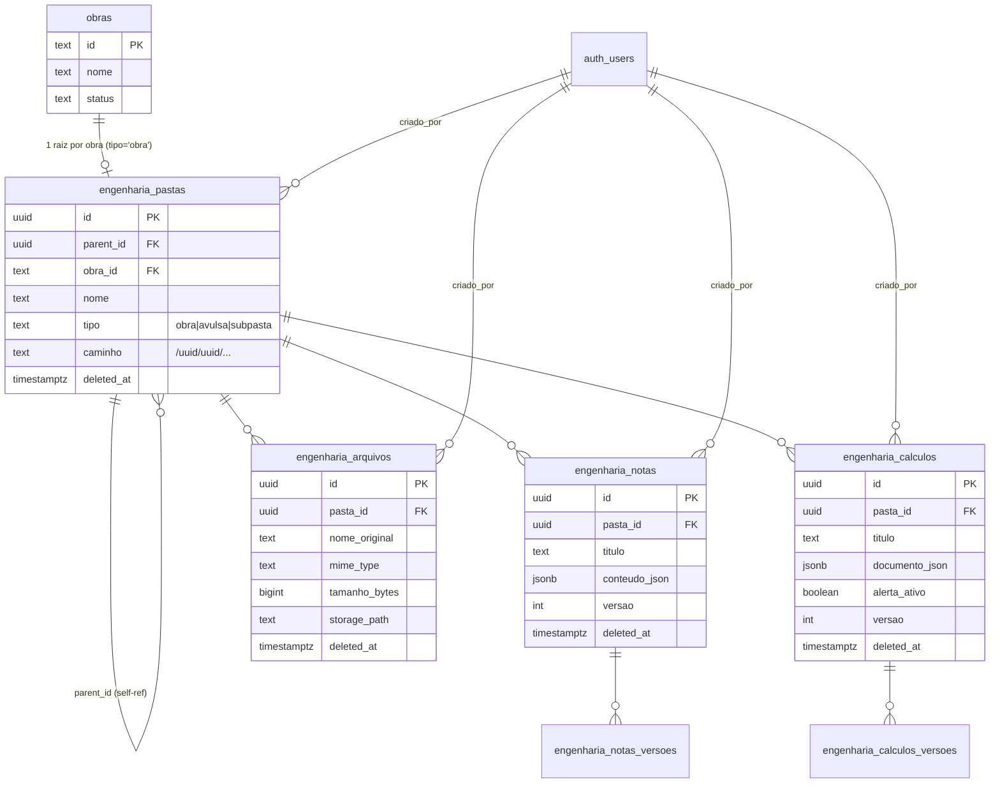

# Engenharia Module — Master Implementation Plan

> **For agentic workers:** este é o **plano-mestre (roadmap)** do módulo Engenharia, não um plano TDD passo-a-passo. O módulo cobre 80–140h em ~9 ondas. Cada onda ganha seu próprio plano TDD detalhado em `docs/superpowers/plans/<data>-engenharia-onda-N-<slug>.md`, escrito **imediatamente antes** da execução daquela onda. Para executar uma onda específica, use superpowers:writing-plans para o plano daquela onda e depois superpowers:subagent-driven-development ou superpowers:executing-plans para rodar.
>
> Este plano-mestre fica como contrato vivo: critério de aceitação de cada onda + decisões arquiteturais já travadas.

**Goal:** Workspace estilo SharePoint/Notion para engenheiros da EMT — pastas hierárquicas por obra (criadas automaticamente), notas rich-text estilo Word, blocos de cálculo livres (sintaxe Soulver/Calca com variáveis numéricas + string), e arquivos (PDF/Excel/Word/imagens) com preview.

**Architecture:** Módulo React em `src/modules/engenharia/`, lazy-loaded por rota, com 5 tabelas Postgres (pastas hierárquicas via materialized path, notas e cálculos com versionamento JSONB, arquivos no bucket privado `engenharia-arquivos`). Pasta raiz de cada obra é criada por trigger SQL SECDEF no `INSERT` em `obras`. Permissões pelo sistema flat moderno (`ACOES_PLATAFORMA` + `temAcao` no frontend; `private.current_has_action` na RLS). Parser de cálculo usa math.js sandboxed (imports/createUnit/etc. desabilitados).

**Tech Stack:** React 19, Vite, TS 5.9, Tailwind 4, shadcn (radix-nova), @tanstack/react-query 5, react-hook-form 7 + zod 4, Tiptap (editor), math.js (parser), @dnd-kit + @floating-ui/react (interações), react-data-grid (mini-grid), @tanstack/react-virtual (listas grandes), file-type (validação MIME), Supabase Postgres + Storage, Playwright + Vitest.

**Discovery:** [`docs/superpowers/discovery/engenharia-discovery.md`](../discovery/engenharia-discovery.md) — leia antes de qualquer onda.

**Prompt original:** [`prompt-modulo-engenharia.md`](../../../prompt-modulo-engenharia.md) na raiz do repo.

---

## 1. Visão executiva (3 parágrafos)

O módulo Engenharia é um workspace híbrido para engenheiros civis da EMT Construtora gerenciarem documentação técnica de obras (memoriais, cálculos estruturais/hidráulicos/de pavimentação, plantas, planilhas, fotos). A entrada principal é uma árvore de pastas: cada obra cadastrada no sistema ganha automaticamente uma pasta raiz na seção "Obras"; usuários criam livremente pastas "Avulsas" para temas transversais (templates, normas, estudos). Dentro de qualquer pasta o engenheiro pode criar **subpastas**, **blocos de nota** (editor estilo Word com formatação, listas, tabelas, imagens), **blocos de cálculo** (quadros livres com sintaxe `=` automática, variáveis nomeadas inclusive com aspas, spinner em números, mini-grids Excel-like) e **arquivos** (upload de PDF/XLSX/DOCX/imagens com preview inline).

O coração — e a parte mais arriscada — é o **bloco de cálculo**. Funciona como um Soulver/Calca embutido: o usuário digita `1+1=` e o app resolve sozinho; digita `x = 2*2` e cria variável `x`; digita `"Brita 4" = 110` e cria uma variável string que aceita ser referenciada como `brita4`, `Brita4`, `BRITA 4` etc.; seleciona um número e ganha um spinner que recalcula tudo em cascade. Para isso usamos **math.js** com sandbox apertado (sem `import`, `createUnit`, `evaluate` etc. disponíveis dentro de expressões — só funções matemáticas puras). Cada bloco mantém escopo próprio de variáveis; alterações disparam reavaliação em cascade das linhas seguintes.

A entrega segue **ondas curtas** (cada uma fecha com migrations aplicadas, código em produção e testes Playwright verdes), totalizando ~9 ondas. **Cada onda futura ganhará seu próprio plano TDD detalhado** (subagent-driven ou inline) escrito na transição entre ondas. Este plano-mestre é o contrato de critérios de aceitação e amarra arquitetural.

---

## 2. Stack final (decidido — aprovado em bloco em 2026-05-26)

| Decisão | Escolha | Motivo |
|---|---|---|
| Editor rich-text | **Tiptap** (`@tiptap/react` + `@tiptap/starter-kit` + extensões) | Já provado, baseado em ProseMirror, extensível, comunidade ativa |
| Edição simultânea | **Lock pessimista** (1 editor por vez, sem Yjs/CRDT) | Decisão D-4 revisada 2026-05-26: zero infra extra, comportamento previsível. Tabela `engenharia_locks` + função SQL `engenharia_acquire_lock`. Outros usuários veem em read-only com banner "Em uso por X". |
| Parser cálculo | **math.js** com sandbox (`import` desabilitado) | Lida sozinho com variáveis, escopo, funções, AST. Escrever parser custom = projeto à parte |
| DnD / sortable | **@dnd-kit/core** + **@dnd-kit/sortable** | API moderna React 19-compatible, leve, acessível |
| Floating UI (spinner sobre número) | **@floating-ui/react** | Padrão moderno para popover/tooltip dinâmico |
| Mini-grid Excel | **react-data-grid** | MIT, ~40 KB gzip, suficiente para SUM/AVERAGE básico |
| Virtualização | **@tanstack/react-virtual** | Family fit (já usa tanstack), só carrega se necessário |
| Validação MIME | **file-type** | Bloqueia bypass por extensão renomeada |
| State | @tanstack/react-query (já no projeto) | Idem padrão do resto |
| Forms | react-hook-form + zod (já no projeto) | Idem |

**Total bundle novo gzip estimado:** ~395 KB. **Mitigação:** lazy-load por rota — `/engenharia/calculo/:id` é o único que puxa math.js + react-data-grid + floating-ui; `/engenharia/nota/:id` puxa Tiptap; a home `/engenharia` puxa só dnd-kit e tanstack/react-virtual.

**Aprovação em bloco:** confirmada em 2026-05-26. Posso instalar conforme cada onda precisa, sem pausa adicional. Plano detalhado de cada onda lista o `npm i` correspondente.

---

## 3. Mapa de rotas

```
/engenharia                    # Home: 2 seções (Obras, Avulsas)
/engenharia/pasta/:id          # Conteúdo de uma pasta
/engenharia/nota/:id           # Editor Tiptap fullscreen
/engenharia/calculo/:id        # Quadro de cálculo fullscreen
/engenharia/lixeira            # Items soft-deletados (gated)
```

`PAGINAS_FALLBACK` no `App.tsx` ganha: `{ acao: 'ver_engenharia', rota: '/engenharia' }`.

`Header.tsx` ganha link entre `Obras` e `Cadastros`: `{ to: '/engenharia', label: 'Engenharia', acao: 'ver_engenharia' }` + regra de active-match prefix.

---

## 4. Schema preliminar

> Tipos consistentes com o repo: `obras.id` é **text**, `funcionarios.id` é text, `auth.users.id` é uuid. Para `criado_por` usamos `auth.users.id` (uuid) — simpler e bate com `auth.uid()` direto.

### Tabelas

```sql
-- 1) Pastas hierárquicas
-- NOTA: obra_id usa ON DELETE SET NULL (decisão 2026-05-26): quando uma obra
-- é deletada, a pasta raiz não some — ela é convertida pelo trigger
-- engenharia_after_delete_obra() para tipo='avulsa', mantendo todo o conteúdo
-- como "documentos órfãos" acessíveis na seção Avulsas.
create table public.engenharia_pastas (
  id              uuid primary key default gen_random_uuid(),
  parent_id       uuid null references public.engenharia_pastas(id) on delete cascade,
  obra_id         text null references public.obras(id) on delete set null,
  nome            text not null,
  tipo            text not null check (tipo in ('obra','avulsa','subpasta')),
  caminho         text not null,                    -- materialized path: /obra-id/sub1/sub2
  criado_por      uuid references auth.users(id),
  criado_em       timestamptz not null default now(),
  atualizado_em   timestamptz not null default now(),
  deleted_at      timestamptz null
);
create index on public.engenharia_pastas (parent_id);
create index on public.engenharia_pastas (obra_id);
create index on public.engenharia_pastas (caminho);
create unique index engenharia_pastas_unique_nome_por_parent
  on public.engenharia_pastas (parent_id, lower(nome))
  where deleted_at is null and parent_id is not null;
-- Pastas raiz (parent_id IS NULL) podem repetir nome porque trigger de
-- conversão obra→avulsa prefixa com "[Arquivada YYYY-MM-DD] " evitando
-- colisão. Em criação manual de pasta avulsa, app valida unicidade no front
-- (case-insensitive) por questão de UX, mas DB não impõe.
create unique index engenharia_pastas_uma_raiz_por_obra
  on public.engenharia_pastas (obra_id)
  where tipo = 'obra' and obra_id is not null and deleted_at is null;

-- 2) Notas (Tiptap)
create table public.engenharia_notas (
  id              uuid primary key default gen_random_uuid(),
  pasta_id        uuid not null references public.engenharia_pastas(id) on delete cascade,
  titulo          text not null,
  conteudo_json   jsonb not null default '{}'::jsonb,
  versao          int not null default 1,
  criado_por      uuid references auth.users(id),
  criado_em       timestamptz not null default now(),
  atualizado_em   timestamptz not null default now(),
  deleted_at      timestamptz null
);
create index on public.engenharia_notas (pasta_id);

-- 3) Versões de nota
create table public.engenharia_notas_versoes (
  id              uuid primary key default gen_random_uuid(),
  nota_id         uuid not null references public.engenharia_notas(id) on delete cascade,
  versao          int not null,
  conteudo_json   jsonb not null,
  autor_id        uuid references auth.users(id),
  criado_em       timestamptz not null default now()
);
create unique index on public.engenharia_notas_versoes (nota_id, versao);

-- 4) Cálculos
create table public.engenharia_calculos (
  id              uuid primary key default gen_random_uuid(),
  pasta_id        uuid not null references public.engenharia_pastas(id) on delete cascade,
  titulo          text not null,
  documento_json  jsonb not null default '{}'::jsonb,
  alerta_ativo    boolean not null default true,
  versao          int not null default 1,
  criado_por      uuid references auth.users(id),
  criado_em       timestamptz not null default now(),
  atualizado_em   timestamptz not null default now(),
  deleted_at      timestamptz null
);
create index on public.engenharia_calculos (pasta_id);

-- 5) Versões de cálculo
create table public.engenharia_calculos_versoes (
  id              uuid primary key default gen_random_uuid(),
  calculo_id      uuid not null references public.engenharia_calculos(id) on delete cascade,
  versao          int not null,
  documento_json  jsonb not null,
  autor_id        uuid references auth.users(id),
  criado_em       timestamptz not null default now()
);
create unique index on public.engenharia_calculos_versoes (calculo_id, versao);

-- 6) Arquivos
create table public.engenharia_arquivos (
  id              uuid primary key default gen_random_uuid(),
  pasta_id        uuid not null references public.engenharia_pastas(id) on delete cascade,
  nome_original   text not null,
  extensao        text not null,
  mime_type       text not null,
  tamanho_bytes   bigint not null,
  storage_path    text not null unique,
  checksum_sha256 text,
  criado_por      uuid references auth.users(id),
  criado_em       timestamptz not null default now(),
  deleted_at      timestamptz null
);
create index on public.engenharia_arquivos (pasta_id);

-- 7) Locks pessimistas de edição (decisão D-4 revisada 2026-05-26)
-- Sem CRDT/Yjs: apenas 1 usuário edita por vez uma nota ou cálculo.
-- Outros veem em read-only com banner "Em uso por X, expira em Y".
create table public.engenharia_locks (
  id              uuid primary key default gen_random_uuid(),
  recurso_tipo    text not null check (recurso_tipo in ('nota','calculo')),
  recurso_id      uuid not null,                 -- ref polimórfica para nota ou cálculo
  usuario_id      uuid not null references auth.users(id),
  expira_em       timestamptz not null,
  criado_em       timestamptz not null default now()
);
-- Único lock ativo por recurso. Locks expirados são removidos pela função
-- engenharia_acquire_lock antes de tentar adquirir (ver abaixo).
create unique index engenharia_locks_unique_recurso
  on public.engenharia_locks (recurso_tipo, recurso_id);
create index on public.engenharia_locks (expira_em);

-- Função SECDEF para adquirir/renovar lock
create or replace function public.engenharia_acquire_lock(
  p_recurso_tipo text,
  p_recurso_id uuid,
  p_ttl_segundos int default 300        -- 5 min default
)
returns table (
  adquirido boolean,
  dono_usuario_id uuid,
  expira_em timestamptz
)
language plpgsql security definer set search_path = public, pg_temp as $$
declare v_user uuid := auth.uid();
begin
  -- Limpa locks expirados desse recurso
  delete from public.engenharia_locks
   where recurso_tipo = p_recurso_tipo
     and recurso_id = p_recurso_id
     and engenharia_locks.expira_em <= now();

  -- Tenta inserir (ou renovar se já tem dele)
  insert into public.engenharia_locks (recurso_tipo, recurso_id, usuario_id, expira_em)
  values (p_recurso_tipo, p_recurso_id, v_user, now() + make_interval(secs => p_ttl_segundos))
  on conflict (recurso_tipo, recurso_id) do update
    set expira_em = excluded.expira_em
   where engenharia_locks.usuario_id = v_user;

  -- Retorna estado atual
  return query
  select (l.usuario_id = v_user) as adquirido,
         l.usuario_id,
         l.expira_em
    from public.engenharia_locks l
   where l.recurso_tipo = p_recurso_tipo
     and l.recurso_id = p_recurso_id;
end $$;

create or replace function public.engenharia_release_lock(
  p_recurso_tipo text,
  p_recurso_id uuid
) returns void
language plpgsql security definer set search_path = public, pg_temp as $$
begin
  delete from public.engenharia_locks
   where recurso_tipo = p_recurso_tipo
     and recurso_id = p_recurso_id
     and usuario_id = auth.uid();
end $$;
```

### Triggers automáticos (Onda 1)

Três triggers em `obras`. Todos `SECURITY DEFINER` com `search_path = public, pg_temp` fixo e owner `postgres` (aprovado em 2026-05-26 — D-2 era a decisão).

```sql
-- A) INSERT obra → cria pasta raiz
create or replace function public.engenharia_after_insert_obra()
returns trigger language plpgsql security definer set search_path = public, pg_temp as $$
begin
  insert into public.engenharia_pastas (obra_id, nome, tipo, caminho)
  values (new.id, new.nome, 'obra', '/' || new.id)
  on conflict do nothing;
  return new;
end $$;

create trigger trg_engenharia_after_insert_obra
  after insert on public.obras
  for each row execute function public.engenharia_after_insert_obra();

-- B) UPDATE obras.nome → sincroniza pasta raiz
create or replace function public.engenharia_after_update_obra_nome()
returns trigger language plpgsql security definer set search_path = public, pg_temp as $$
begin
  if new.nome is distinct from old.nome then
    update public.engenharia_pastas
       set nome = new.nome, atualizado_em = now()
     where obra_id = new.id and tipo = 'obra' and deleted_at is null;
  end if;
  return new;
end $$;

create trigger trg_engenharia_after_update_obra_nome
  after update of nome on public.obras
  for each row execute function public.engenharia_after_update_obra_nome();

-- C) BEFORE DELETE obra → converte pasta raiz em avulsa (não cascade!)
-- IMPORTANTE: BEFORE DELETE, não AFTER. No AFTER, o ON DELETE SET NULL do FK
-- já teria zerado obra_id antes do trigger ver — perdemos o nome original
-- da obra. Em BEFORE, OLD.nome ainda está disponível.
create or replace function public.engenharia_before_delete_obra()
returns trigger language plpgsql security definer set search_path = public, pg_temp as $$
declare
  v_data_hoje text := to_char(now(), 'YYYY-MM-DD');
begin
  -- Converte a pasta raiz e todas as descendentes em "avulsas órfãs"
  -- (mas mantém a hierarquia interna intacta).
  update public.engenharia_pastas
     set tipo  = case when tipo = 'obra' then 'avulsa' else tipo end,
         nome  = case when tipo = 'obra'
                      then '[Arquivada ' || v_data_hoje || '] ' || nome
                      else nome end,
         atualizado_em = now()
   where obra_id = old.id and deleted_at is null;

  -- Limpa obra_id depois (na pasta raiz). O FK ON DELETE SET NULL faria isso
  -- automaticamente, mas explicitar evita race e deixa o efeito claro.
  update public.engenharia_pastas
     set obra_id = null
   where obra_id = old.id;

  return old;
end $$;

create trigger trg_engenharia_before_delete_obra
  before delete on public.obras
  for each row execute function public.engenharia_before_delete_obra();
```

**Comportamento resultante** (decisão D-3 de 2026-05-26):
- Criar obra → pasta raiz aparece automaticamente na seção "Obras".
- Renomear obra → pasta raiz renomeia.
- Deletar obra → pasta raiz vira `tipo='avulsa'` com nome `"[Arquivada 2026-05-26] Ramal do Gama"` e migra para a seção "Avulsas". Subpastas, notas, cálculos e arquivos continuam acessíveis sob ela. Engenheiro pode renomear/mover/limpar conforme quiser. **Zero perda de documento.**

### RLS (Onda 1)

Padrão moderno: per-command policies + `private.current_has_action(...)`. Estrutura por tabela em `engenharia_rls_fix.sql`. Exemplo para `engenharia_pastas`:

```sql
alter table public.engenharia_pastas enable row level security;

create policy engenharia_pastas_select on public.engenharia_pastas
  for select to authenticated
  using (private.current_has_action('ver_engenharia') and deleted_at is null);

create policy engenharia_pastas_select_lixeira on public.engenharia_pastas
  for select to authenticated
  using (private.current_has_action('ver_lixeira_engenharia') and deleted_at is not null);

create policy engenharia_pastas_insert on public.engenharia_pastas
  for insert to authenticated
  with check (private.current_has_action('criar_engenharia_pasta'));

create policy engenharia_pastas_update on public.engenharia_pastas
  for update to authenticated
  using (private.current_has_action('editar_engenharia_pasta')
         or private.current_has_action('restaurar_lixeira_engenharia'))
  with check (private.current_has_action('editar_engenharia_pasta')
              or private.current_has_action('restaurar_lixeira_engenharia'));

create policy engenharia_pastas_delete on public.engenharia_pastas
  for delete to authenticated
  using (private.current_has_action('excluir_permanente_engenharia'));
```

(Análogos para notas, cálculos, versões, arquivos — detalhe vem no plano da Onda 1.)

---

## 5. Diagrama de relacionamento



---

## 6. Riscos e mitigações

| # | Risco | Mitigação |
|---|---|---|
| R1 | math.js permite `import('algo')` em expressões → RCE via input do usuário | Criar instância isolada com `math.create(all)` + `math.import({ import: () => throw, evaluate: () => throw, createUnit: () => throw, parse: () => throw, simplify: () => throw, derivative: () => throw }, { override: true })`. Testar com expressão maliciosa em Playwright. |
| R2 | Variáveis string podem mascarar funções math.js (`"sin" = 5` quebra `sin(x)`) | Lista de palavras reservadas (`sin, cos, tan, log, ln, exp, pi, e, true, false, null, sum, average, ...`). Validação na definição, erro inline. |
| R3 | Canvas com >100 linhas trava UI | `@tanstack/react-virtual` desde a Onda 5. Auto-save com debounce 5s + cascade reavalia só linhas dependentes (não tudo). |
| R4 | Conflito de edição simultânea (2 engenheiros) | **Lock pessimista** (D-4 revisada 2026-05-26). Tabela `engenharia_locks` + funções `engenharia_acquire_lock(tipo, id, ttl)` e `engenharia_release_lock`. Cliente faz heartbeat a cada 60s renovando o TTL de 5min. Quem entra depois vê read-only com banner "Em uso por <nome>, expira em <tempo>". Risco menor: usuário fecha aba sem release → outro espera até 5min pro lock expirar (ou admin com `gerenciar_locks_engenharia` força liberação — adicionar chave de ação). |
| R5 | Trigger SECDEF expõe `engenharia_pastas` a quem cria obra | `search_path = public, pg_temp` fixo; owner = `postgres`; só faz `INSERT ON CONFLICT DO NOTHING` (idempotente). Security review valida. |
| R6 | Upload de `.exe` renomeado para `.pdf` | Lib `file-type` valida bytes reais; bloqueia extensões executáveis mesmo com MIME legítimo (defesa em profundidade). |
| R7 | Bundle estoura com Tiptap + math.js + react-data-grid | Lazy-load por rota (decisão da seção 2). Medir com `vite build --mode analyze` ao final da Onda 6. Se >250 KB initial → fragmentar mais. |
| R8 | Recursão infinita de pastas (parent_id → ele mesmo) | Validação no UPDATE de `parent_id`: recursive CTE no Postgres detecta ciclo (function `private.engenharia_check_no_cycle(pasta_id, new_parent_id)`). |
| R9 | Histórico de versões cresce sem limite | Limite 50 versões por entidade; cron diário (cria-se em onda futura) deleta o excedente mais antigo, preservando os 50 mais recentes + os marcados como "milestone" pelo usuário. |
| R10 | Arquivos no Storage ficam órfãos após soft-delete da pasta | Soft-delete só marca DB. Cron (separado, futuro) limpa Storage após 30 dias do `deleted_at`. Pasta deletada por CASCADE quando obra é apagada → arquivos órfãos no bucket → cron limpa. |
| R11 | `obras` não tem `deleted_at` → quando obra é deletada, conteúdo da Engenharia some | **Resolvido (D-3 2026-05-26):** FK `on delete set null` + trigger `engenharia_before_delete_obra` converte pasta raiz em avulsa. Documentos viram órfãos acessíveis, não somem. |
| R12 | PermissionGate desatualizado e usado em outros lugares | **Não consertar aqui** (D-5 2026-05-26); gates inline com `temAcao`. Documentar em `tech-debt.md` no final do módulo. |

---

## 7. Roadmap de ondas

> Cada onda fecha com: (a) migrations aplicadas no Supabase prod (pares fix+rollback como convenção do projeto); (b) código no `main` ou branch curta; (c) testes Playwright verdes; (d) entrada no `docs/modulos/engenharia/CHANGELOG.md`; (e) plano TDD da próxima onda escrito.

### Onda 1 — Schema, RLS, trigger de pasta automática (8–12h) ✅ CONCLUÍDA 2026-05-26

**Plano TDD próprio:** [`2026-05-26-engenharia-onda-1-schema.md`](2026-05-26-engenharia-onda-1-schema.md) — 8 tasks executadas inline.

**CHANGELOG:** [`docs/modulos/engenharia/CHANGELOG.md`](../../modulos/engenharia/CHANGELOG.md).

**Resultado:** 5 migrations pareadas aplicadas no projeto Supabase prod (`gunyitwrbxbmnezokgjq`), 7 tabelas + 11 índices + 26 policies + 3 triggers + 2 funções de lock + perf fix. 14 testes Vitest verdes. 6 commits.

**Entregas:**
- 5 migrations pareadas (fix + rollback) seguindo workflow do user:
  1. `engenharia_tables_fix.sql` — 6 tabelas + indexes + checks (sem RLS).
  2. `engenharia_rls_fix.sql` — `ENABLE ROW LEVEL SECURITY` + policies per-command.
  3. `engenharia_trigger_pasta_obra_fix.sql` — funções SECDEF + triggers.
  4. `engenharia_acoes_plataforma_seed_fix.sql` — adiciona 16 chaves novas em `ACOES_PLATAFORMA` (frontend) e atualiza `acoesPadraoDoCargo()` para Engenheiro/Sênior/Admin. (Sem migration — só código frontend.)
  5. (Storage bucket vem na Onda 2 — separado.)
- `supabase/schema.sql` regenerado para refletir as novas tabelas (manualmente, padrão do projeto).
- `src/types/database.ts` ou equivalente regenerado.

**Critério de aceitação:**
- [ ] Migrations aplicadas no projeto Supabase com confirmação manual de cada apply.
- [ ] `select * from engenharia_pastas where obra_id = '<id-existente>'` retorna 0 linhas inicialmente.
- [ ] Criar uma obra (qualquer caminho — UI atual de Obras) → query acima retorna 1 linha (tipo='obra', nome=nome da obra).
- [ ] Renomear obra → pasta sincroniza (`nome` atualizado).
- [ ] Tentar `insert into engenharia_pastas` sem permissão → erro RLS.
- [ ] Security review (skill `security-review`) sem HIGH/CRITICAL.
- [ ] Test SQL (vitest? ou script standalone): trigger é idempotente (rodar `obras` insert duas vezes não cria 2 pastas).

---

### Onda 2 — Storage de arquivos + serviço de upload (6–8h) ✅ CONCLUÍDA 2026-05-26

**Plano TDD próprio:** [`2026-05-26-engenharia-onda-2-storage.md`](2026-05-26-engenharia-onda-2-storage.md) — 6 tasks executadas inline + Onda 2.2 (security fix) extra.

**CHANGELOG:** [`docs/modulos/engenharia/CHANGELOG.md`](../../modulos/engenharia/CHANGELOG.md#onda-2--storage-de-arquivos-2026-05-26).

**Resultado:** Bucket privado `engenharia-arquivos` + 4 policies storage.objects + service completo (3 arquivos: path/mime/service) + REVOKE EXECUTE security hardening em 5 funções SECDEF. 23 testes Vitest, dep `file-type@^22.0.1`. 6 commits.

**Entregas:**
- Bucket `engenharia-arquivos` (privado) criado via Supabase Skill.
- Policies do bucket: SELECT/INSERT/DELETE atadas às chaves `ver_engenharia`, `upload_engenharia_arquivo`, `excluir_engenharia_arquivo`.
- `src/modules/engenharia/services/arquivosService.ts`:
  - `uploadArquivo(pastaId, file)` — gera UUID, calcula sha256, valida MIME via `file-type`, bloqueia executáveis, limita 50 MB, faz upload, INSERT em `engenharia_arquivos`.
  - `getSignedUrl(arquivoId, expiresInSec=300)`.
  - `softDeleteArquivo(arquivoId)`.
- Path determinístico: `pastas/<pasta_id>/<arquivo_id>-<slug>.<ext>`.
- Lib nova: `npm i file-type` (aprovar antes — ~30 KB).

**Critério de aceitação:**
- [ ] Playwright: upload de PDF (5MB) → aparece na listagem + signed URL abre.
- [ ] Playwright: upload de JPG → idem.
- [ ] Playwright: upload de XLSX → idem.
- [ ] Playwright: upload de arquivo renomeado de `malware.exe` → `malware.pdf` é REJEITADO (file-type detecta).
- [ ] Playwright: upload de 60 MB é REJEITADO.
- [ ] Signed URL expira após 5 min (teste com clock mock).
- [ ] Soft-delete não apaga do bucket; arquivo continua acessível por admin via path.

---

### Onda 3 — UI de pastas (FolderTree + Breadcrumb + CRUD) (8–10h)

**Plano TDD próprio:** `2026-XX-XX-engenharia-onda-3-pastas-ui.md`.

**Entregas:**
- Rotas `/engenharia` e `/engenharia/pasta/:id` no `App.tsx`.
- `EngenhariaPage.tsx`: home com 2 seções (Obras / Avulsas), grid de cards de pasta raiz.
- `PastaPage.tsx`: árvore lateral (lazy) + breadcrumb + listagem de filhos (pastas + notas + cálculos + arquivos) + drop zone para upload.
- `FolderTree.tsx`: recursivo com lazy-loading de filhos via `useQuery`; usa `@dnd-kit` para mover.
- Ações no menu de contexto (shadcn `ContextMenu`): nova subpasta, nova nota, novo cálculo, upload, renomear, mover (com validação anti-ciclo via function postgres `private.engenharia_check_no_cycle`), soft-delete.
- Hooks: `useEngenhariaPastas` (list por parent), `useCriarPasta`, `useMoverPasta`, `useExcluirPasta`.
- Link no `Header.tsx` (com active match prefix).
- Empty states (sem pastas avulsas ainda, pasta vazia, etc.) com shadcn + lucide-react.
- Skeleton (memória do user — bloco 3 modernização) durante loading.

**Critério de aceitação:**
- [ ] Playwright: criar obra nova → `/engenharia` mostra pasta na seção Obras.
- [ ] Playwright: clicar na pasta → entra em `/engenharia/pasta/:id`, breadcrumb correto.
- [ ] Playwright: criar subpasta dentro → aparece na árvore + na listagem.
- [ ] Playwright: criar pasta avulsa → aparece na home seção Avulsas.
- [ ] Playwright: renomear pasta avulsa → persiste.
- [ ] Playwright: renomear pasta de obra → BLOQUEADO (sincroniza com `obras.nome`, não editável aqui).
- [ ] Playwright: mover subpasta para outra pasta → muda; tentar mover pasta para descendente dela mesma → erro.
- [ ] Playwright: soft-delete com confirmação dupla → some da listagem; aparece na lixeira.
- [ ] Dark mode visualmente ok em todas as telas (test manual + screenshot Playwright).

---

### Onda 4 — Bloco de Nota (Tiptap + lock pessimista) (12–15h, +2h vs original pela UX de lock)

**Plano TDD próprio:** `2026-XX-XX-engenharia-onda-4-bloco-nota.md`.

**Entregas:**
- Libs novas (já aprovadas em bloco):
  - `@tiptap/react`, `@tiptap/starter-kit`
  - Extensões: `Heading`, `BulletList`, `OrderedList`, `TaskList`, `Table`, `Image`, `Link`, `CodeBlock`, `Highlight`, `TextAlign`
- Rota `/engenharia/nota/:id` lazy-loaded.
- `NotaPage.tsx`: editor Tiptap fullscreen + toolbar fixa (shadcn buttons + lucide icons).
- **Lock pessimista (D-4):**
  - Ao abrir a nota em modo edição, hook `useLockRecurso('nota', notaId)` chama `engenharia_acquire_lock`.
  - Se `adquirido=true` → editor habilitado, hook dispara heartbeat a cada 60s renovando o TTL.
  - Se `adquirido=false` → banner amarelo no topo: "Em uso por <nome do dono>, libera em <countdown>". Editor entra em read-only. Polling de 15s tenta readquirir; quando expira, hook avisa e re-tenta.
  - `useEffect` cleanup chama `engenharia_release_lock` ao desmontar o componente; `beforeunload` faz best-effort também.
  - Admin com a nova chave `gerenciar_locks_engenharia` vê botão "Forçar liberação" no banner (deleta o lock).
- Auto-save debounce 5s + Cmd/Ctrl+S manual (só se tiver o lock).
- Versionamento: snapshot em `engenharia_notas_versoes` a cada save manual + a cada 2 min de auto-save (se mudou).
- Painel lateral "Histórico" com diff visual (`diff` lib — ~5 KB).
- Paste de imagem do clipboard → upload pro bucket → URL inline no documento.
- Modo leitura (read-only) se faltar `editar_engenharia_nota` OU se outro usuário tem o lock.
- Slash menu (`/`) para inserir blocos (heading, list, table, divider).
- Hooks: `useEngenhariaNota(id)`, `useLockRecurso(tipo, id)`, `useSalvarNota`, `useVersoesNota`, `useRestaurarVersao`.
- **Nova chave em `ACOES_PLATAFORMA`:** `gerenciar_locks_engenharia` (admin do módulo).

**Critério de aceitação:**
- [ ] Playwright: criar nota dentro de pasta → abre editor vazio com lock adquirido.
- [ ] Playwright: digitar parágrafo, formatar negrito/itálico/lista, salvar → fecha e reabre → conteúdo persiste.
- [ ] Playwright: editar, esperar 6s sem digitar → auto-save dispara (toast de "Salvo").
- [ ] Playwright: criar 3 versões manuais → painel histórico lista 3 → restaurar v1 → conteúdo volta.
- [ ] Playwright: colar imagem do clipboard → upload faz aparecer inline.
- [ ] Playwright: user sem `editar_engenharia_nota` → editor em read-only.
- [ ] **Playwright (2 contextos, núcleo da decisão D-4):** Usuário A abre nota → editor habilitado. Usuário B abre a mesma nota → vê banner "Em uso por A, expira em 5:00" + read-only. A fecha aba → ~15s depois B vê banner sumir e ganha o lock.
- [ ] Playwright: heartbeat — A edita por 6 min sem fechar → B continua vendo lock ativo (TTL renova).
- [ ] Playwright: admin com `gerenciar_locks_engenharia` vê botão "Forçar liberação"; clica → lock libera; B ganha o lock.

---

### Onda 5 — Bloco de Cálculo, parte 1: parser, linhas, alerta (10–16h)

**Plano TDD próprio:** `2026-XX-XX-engenharia-onda-5-calculo-parser.md`.

**Entregas:**
- Lib nova: `mathjs` com sandbox (aprovar antes — ~150 KB):
  ```ts
  // src/modules/engenharia/services/calcEngine.ts
  import { create, all } from 'mathjs';
  const mathInstance = create(all);
  mathInstance.import(
    {
      import: () => { throw new Error('disabled'); },
      createUnit: () => { throw new Error('disabled'); },
      reviver: () => { throw new Error('disabled'); },
      simplify: () => { throw new Error('disabled'); },
      derivative: () => { throw new Error('disabled'); },
      resolve: () => { throw new Error('disabled'); },
      parse: () => { throw new Error('disabled'); },
    },
    { override: true },
  );
  export function evalSafe(expr: string, scope: Record<string, unknown>) {
    return mathInstance.evaluate(expr, scope);
  }
  ```
- Rota `/engenharia/calculo/:id` lazy-loaded.
- `CalculoPage.tsx`: canvas (bg-card) com linhas (`LinhaCalculo`) + barra superior (título, switch global de alerta, botão histórico).
- Modelo `documento_json`:
  ```json
  {
    "linhas": [
      { "id": "uuid", "tipo": "calculo", "expressao": "1+1=", "resultado": "2", "alerta": "ok", "ordem": 0 }
    ],
    "variaveis_definidas": [],
    "aliases": {},
    "config": { "alerta_ativo": true }
  }
  ```
- Comportamentos da Fase 5 do prompt:
  - Linha termina com `=` sem resposta → app preenche.
  - Linha com resposta certa → cor neutra.
  - Linha com resposta errada → vermelho + ⚠ + botão "Alerta revisado".
  - Switch global "Verificação automática" → liga/desliga comparação (parser continua resolvendo `=` vazio).
- Auto-save + versionamento idêntico à Onda 4.

**Critério de aceitação (do prompt original, seção 5.5):**
- [ ] Playwright: `1+1=` → vê `2`.
- [ ] Playwright: `2*5=20` → ok, sem alerta.
- [ ] Playwright: `2*5=11` → vermelho + ⚠.
- [ ] Playwright: clicar "Alerta revisado" → cor volta, valor `11` persiste.
- [ ] Playwright: desligar verificação → `2*5=99` sem vermelho.
- [ ] Vitest: `evalSafe('import("foo")', {})` throws (sandbox).
- [ ] Vitest: `evalSafe('createUnit("xyz")', {})` throws.

**⛔ Pausa obrigatória aqui** (do prompt original: "Pare aqui. Faça commit. Mostre ao usuário. Só siga para 5.6 se aprovado.") — apresentar ao user antes da Onda 6.

---

### Onda 6 — Bloco de Cálculo, parte 2: variáveis + spinner + caixas + grid (16–24h)

**Plano TDD próprio:** `2026-XX-XX-engenharia-onda-6-calculo-avancado.md`.

**Entregas (sub-fases, cada uma commit + teste antes da próxima):**

> Cálculo também usa o **lock pessimista** introduzido na Onda 4 (D-4): `useLockRecurso('calculo', calculoId)` no canvas. Mesma UX: 1 editor por vez, banner para os outros, heartbeat 60s.

- **6.1 Variáveis numéricas** (`x = 2*2`): scope por bloco, reuso, cascade re-eval.
- **6.2 Variáveis string** (`"Brita 4" = 110`): pré-processamento de aliases (`brita 4`, `brita4`, `BRITA 4`), greedy longest-match. **Palavras reservadas (decisão D-6 2026-05-26)**: bloquear com erro inline + tooltip listando reservadas. Lista: `sin, cos, tan, asin, acos, atan, atan2, log, ln, log10, log2, exp, sqrt, abs, min, max, sum, mean, median, std, floor, ceil, round, pi, e, i, true, false, null, NaN, Infinity, mod, gcd, lcm, sign`. Constante em `services/calcReservedWords.ts`.
- **6.3 Spinner em número**: detectar token numérico via AST do math.js, popover `@floating-ui/react`, stepper ▲/▼ com Shift=×10, Alt=÷10. Lib nova: `@floating-ui/react` (~15 KB).
- **6.4 Caixas de texto livres**: nova `tipo: "texto"` no `documento_json`, mini-Tiptap inline (negrito/itálico só).
- **6.5 Mini-grid Excel-like**: `tipo: "grid"` no `documento_json`, `react-data-grid` (~40 KB), fórmulas básicas (`=A1+B1`, `=SUM(A1:A3)`). Escopo separado — variáveis do bloco NÃO entram nas células (documentar).

**Critério de aceitação (do prompt original, seção 6.8):**
- [ ] Playwright: `x=4`, depois `x*2=` → `8`.
- [ ] Playwright: `"Brita 4" = 110`, depois `brita4 + 5 =` → `115`.
- [ ] Playwright: `x=4`, `y=3`, `"Brita 4"=110`, `x+y+brita4=` → `117`. ⭐ **Cenário canônico.**
- [ ] Playwright: selecionar número, clicar ▲ → valor sobe, linhas seguintes recalculam.
- [ ] Playwright: inserir grid 3×3, preencher, `=SUM(A1:A3)` → resultado correto.
- [ ] Playwright: caixa de texto persiste após reload.
- [ ] Vitest: `"sin" = 5` rejeitado com erro inline; tooltip mostra lista de reservadas.
- [ ] Vitest: `"log10" = 100` rejeitado.
- [ ] Vitest: `"viga_principal" = 5` aceito (não é reservada).
- [ ] **Playwright (2 contextos, decisão D-4 lock pessimista):** A abre cálculo → editor habilitado. B abre o mesmo cálculo → banner "Em uso por A" + read-only do canvas. A fecha → B ganha o lock após heartbeat expirar.
- [ ] Performance: cálculo com 100 linhas, editar a 1ª → reavaliação cascade <200ms (medir com Playwright trace).

---

### Onda 7 — Integração com Obras + Permissões granulares (4–6h)

**Plano TDD próprio:** `2026-XX-XX-engenharia-onda-7-integracao-permissoes.md`.

**Entregas:**
- Botão "Abrir workspace de engenharia" no detalhe da obra (página de Obras existente).
- Widget na home `/engenharia`: "Últimas obras com atividade" (query cruzada de `engenharia_notas` e `engenharia_calculos` ordenado por `atualizado_em`).
- `acoesPadraoDoCargo()` atualizado para Engenheiro Civil, Engenheiro Civil Sênior, Administrador, Gerente, Supervisor (conforme matriz da seção 2.5 do discovery).
- Validação E2E com 3 usuários (cargos distintos): Engenheiro Sênior cria/edita; Gerente só lê; Operador 403.

**Critério de aceitação:**
- [ ] Playwright (3 contextos): Engenheiro cria nota → ok; Gerente abre nota → read-only, sem botão salvar; Operador acessa `/engenharia` → redireciona para AcessoNegado.
- [ ] Playwright: criar obra → ir pra `/engenharia` → ver pasta da obra no topo da seção Obras.
- [ ] RLS no banco: tentativa de SELECT em `engenharia_pastas` com usuário sem permissão (via supabase-js) → erro/zero linhas.

---

### Onda 8 — Lixeira + Histórico admin + Polish UI/UX (6–10h)

**Plano TDD próprio:** `2026-XX-XX-engenharia-onda-8-lixeira-polish.md`.

**Entregas:**
- Rota `/engenharia/lixeira` (gated por `ver_lixeira_engenharia`).
- Lista de itens soft-deletados com botões "Restaurar" (gated por `restaurar_lixeira_engenharia`) e "Excluir permanente" (gated por `excluir_permanente_engenharia`).
- Restaurar: limpa `deleted_at`. Excluir permanente: DELETE físico + remove do Storage (arquivos).
- Atalhos de teclado em modal `?`: Cmd+S (save), Cmd+N (nova nota), Cmd+Shift+N (novo cálculo), `/` (slash menu), etc.
- A11y: foco visível, navegação por teclado completa em árvore de pastas (use `aria-tree` semantics ou role="tree").
- Empty states ilustrados em todas as listagens (lucide-react illustrations).
- Toasts (existing `ToastProvider`) em todas as ações async.
- Responsivo: desktop primeiro, tablet ok, mobile read-only (nota/cálculo mostra mas não edita).

**Critério de aceitação:**
- [ ] Playwright: deletar nota → aparece na lixeira; restaurar → volta pra pasta original.
- [ ] Playwright: excluir permanentemente arquivo → some do Storage (verificar via supabase storage list).
- [ ] Lighthouse Accessibility ≥ 90 nas páginas `/engenharia` e `/engenharia/pasta/:id`.
- [ ] Lighthouse Performance ≥ 85 nas mesmas.
- [ ] Test manual mobile (DevTools): nota abre em read-only sem botões de edição.

---

### Onda 9 — E2E completos + Security review + Docs (4–6h)

**Plano TDD próprio:** `2026-XX-XX-engenharia-onda-9-finalizacao.md`.

**Entregas:**
- Suite Playwright completa: ≥30 testes cobrindo CRUDs, permissões (3 papéis), upload/download/delete arquivos, versionamento, lixeira, cenário canônico do cálculo, dark mode, soft-delete + restore.
- Security review com a skill `security-review` cobrindo:
  - Migrations (RLS, triggers SECDEF, search_path fixo).
  - `arquivosService` (validação MIME, tamanho, path traversal).
  - Signed URLs (TTL).
  - `calcEngine` (sandbox math.js — expressões maliciosas).
  - Aliases de variáveis string (slugify sem injeção).
- Docs:
  - `docs/modulos/engenharia/README.md` (overview + screenshots).
  - `docs/modulos/engenharia/calculo-bloco.md` (sintaxe completa, exemplos, limitações).
  - `docs/modulos/engenharia/CHANGELOG.md` (entradas por onda).
- Atualizar README raiz com link pro módulo.
- Atualizar `tech-debt.md` com pendências: refatorar `PermissionGate.tsx`, criar cron de retenção de versões, criar cron de limpeza de Storage soft-deleted.

**Critério de aceitação ("pronto" do módulo):**
- [ ] ≥30 testes Playwright verdes (gravar saída do `npx playwright test`).
- [ ] Security review sem HIGH/CRITICAL pendente.
- [ ] Lighthouse Performance ≥ 85 nas 3 páginas principais.
- [ ] Bundle initial route `/engenharia` < 250 KB gzip.
- [ ] Docs completos.
- [ ] Cenário canônico `x=4, y=3, "Brita 4"=110, x+y+brita4=117` passa.
- [ ] Criar obra → pasta automática aparece.

---

## 8. Estimativa total

| Onda | h min | h max | Acumulado max |
|---|---|---|---|
| 1 | 8 | 12 | 12 |
| 2 | 6 | 8 | 20 |
| 3 | 8 | 10 | 30 |
| 4 | **12** | **15** | 45 (+2h pela UX do lock vs original) |
| 5 | 10 | 16 | 61 |
| 6 | 16 | 24 | 85 |
| 7 | 4 | 6 | 91 |
| 8 | 6 | 10 | 101 |
| 9 | 4 | 6 | 107 |
| **Total** | **74** | **107** | |

Dentro do range do prompt original (80–140h). Decisão D-4 (lock pessimista vs Yjs) economizou ~10h frente à versão Yjs e zerou requisitos de infra extra.

**Sem pré-requisito de infra extra** (sem Hocuspocus, sem servidor adicional). Tudo roda no Supabase Postgres + Storage + auth que já existem.

---

## 9. Decisões — log de respostas (2026-05-26)

| # | Decisão | Resposta | Impacto no plano |
|---|---|---|---|
| D-2 | Trigger com SECURITY DEFINER | ✅ Aprovado: SECDEF + `search_path = public, pg_temp` + owner `postgres` | Seção 4 atualizada com 3 triggers SECDEF |
| D-3 | Comportamento ao deletar obra | ✅ Converter pasta raiz em avulsa (não cascade) | Seção 4: FK `on delete set null` + trigger `engenharia_before_delete_obra` que prefixa `[Arquivada YYYY-MM-DD]` no nome |
| D-4 | Edição concorrente | ✅ **Lock pessimista** (1 editor por vez, sem CRDT, sem servidor novo) — revisão 2026-05-26 | Seção 2 lib row simplificado; seção 4 ganha tabela `engenharia_locks` + funções `acquire_lock`/`release_lock`; Onda 4 ganha hook `useLockRecurso`, banner read-only e botão admin "Forçar liberação"; nova chave `gerenciar_locks_engenharia` |
| D-5 | PermissionGate desatualizado | ✅ Não refatorar; gates inline com `temAcao` | Risco R12 marcado; pendência registrada em `tech-debt.md` no fim |
| D-6 | Variáveis string reservadas no cálculo | ✅ Bloquear com erro inline + tooltip lista completa | Seção 7 Onda 6.2 com lista canonizada |
| D-7 | Tamanho máx arquivo | ✅ 50 MB | Onda 2 cravado em 50 MB |
| D-8 | Aprovação de libs | ✅ Em bloco, instalar conforme cada onda | Seção 2 cabeçalho atualizado |
| D-9 | Limites de versionamento | (default) 50 versões/entidade; snapshot save manual + 2min auto-save | Aplicado por padrão — se quiser mudar, abrir nova decisão |
| D-10 | Sidebar vs top-bar | (default) Link no `Header.tsx` entre Obras e Cadastros | Aplicado por padrão |

### Decisões abertas restantes

**Nenhuma.** D-4 revisada de Yjs para lock pessimista também eliminou o D-1 (sync server) — sem Yjs, sem servidor extra. Plano pronto pra Onda 1.

---

## 10. Self-review (writing-plans skill)

**Spec coverage:** Cada fase do prompt original (0 a 12) está mapeada para uma onda:
- Fase 0 (briefing) → este documento.
- Fase 1 (schema) → Onda 1.
- Fase 2 (storage) → Onda 2.
- Fase 3 (UI pastas) → Onda 3.
- Fase 4 (bloco nota) → Onda 4.
- Fase 5 (cálculo simples) → Onda 5.
- Fase 6 (cálculo avançado) → Onda 6.
- Fase 7 (integração obras) → Onda 7 (parte) + Onda 1 (trigger).
- Fase 8 (permissões) → Onda 1 (RLS+chaves) + Onda 7 (E2E permissões).
- Fase 9 (UI premium) → Onda 8.
- Fase 10 (E2E completos) → Onda 9.
- Fase 11 (security review) → Onda 9.
- Fase 12 (docs) → Onda 9.

**Placeholders:** Nenhum "TBD/TODO/preencher depois" — todos os pontos abertos estão na seção 9 (decisões pendentes), explicitamente reconhecidos.

**Type consistency:** `engenharia_pastas.obra_id` é `text` em todos os lugares (bate com `obras.id`); UUIDs em todas as PKs novas; `criado_por` sempre `uuid references auth.users(id)`. `documento_json` do cálculo tem schema definido na Onda 5 e estende (não muda) na Onda 6.

**Granularidade:** Este plano-mestre intencionalmente NÃO tem steps `- [ ]` por arquivo — cada onda é um plano TDD próprio (escrito just-in-time) seguindo writing-plans rigoroso. Critério de aceitação por onda é o checkpoint.

---

## 11. Próximo passo

**Antes de qualquer código:**
1. User revisa este plano + o [discovery](../discovery/engenharia-discovery.md).
2. User responde as 10 decisões abertas (seção 9).
3. Se aprovado, escrever o plano TDD detalhado da **Onda 1** (`2026-XX-XX-engenharia-onda-1-schema.md`) usando writing-plans skill.
4. Executar Onda 1 via subagent-driven-development (recomendado) ou executing-plans.
