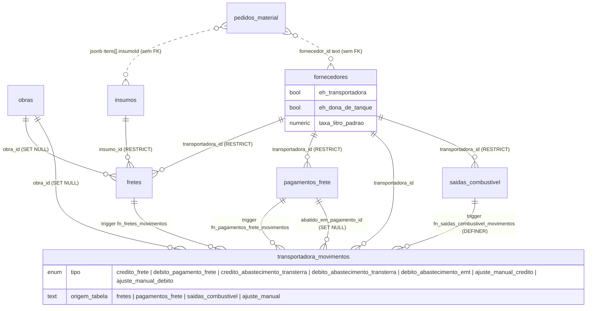
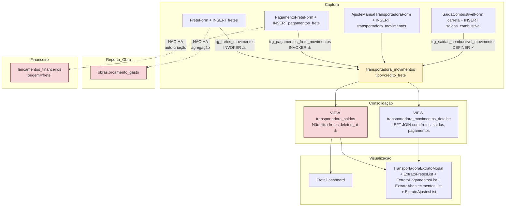

# Auditoria — Módulo Frete

**Projeto:** Gestao_Obras (`emtconstrutora.com` · Supabase project `gunyitwrbxbmnezokgjq` · Postgres 17.6.1.063)
**Data:** 2026-05-22
**Branch ativo:** `feat/frete-foto-chegada-drawer` (provável — última migration `20260521120500_fix_movimentos_trigger_secdef.sql`)
**Escopo:** Análise read-only do módulo de Frete — formulários, permissões, schema, fluxos, integrações cross-módulo, custo, UI/UX, segurança. Nenhum código modificado.
**Método:** mapeamento de arquivos → schema do banco via Supabase MCP → 18 perguntas × 5 formulários → 12 perguntas × 9 fluxos → integrações cross-módulo → rastreamento de custos → UI/UX → segurança → recomendações priorizadas.
**Baselines de referência:** `combustivel-audit.md` (830 linhas, 7 problemas HIGH) e `frota-manutencao-audit.md` (946 linhas, 22 advisors). Cada finding desta auditoria é comparado contra os padrões já catalogados (soft-delete não filtrado, RLS faltando, SECURITY DEFINER sem `search_path`, policies blanket, triggers legacy duplicados, mobile inserindo lixo, custo médio vitalício, integrações ilha).

---

## Sumário Executivo

Frete é um módulo **operacionalmente maduro** (381 fretes, 79 pagamentos, 911 movimentos, 37 pedidos de material em produção) mas com **inconsistência de segurança séria**: a tabela principal `fretes` ganhou RLS granular em `20260520180000_tighten_rls_fretes.sql`, mas as quatro tabelas satélites do mesmo módulo — `pagamentos_frete`, `pedidos_material`, e indiretamente `fornecedores` e `obras` — continuam com policy blanket `Authenticated full access` (`USING true`). Pior: a migration `20260521120500_fix_movimentos_trigger_secdef.sql` corrigiu apenas `fn_saidas_combustivel_movimentos` para `SECURITY DEFINER`, mas esqueceu `fn_fretes_movimentos` e `fn_pagamentos_frete_movimentos`, que continuam `INVOKER` e tentam inserir em uma `transportadora_movimentos` que agora exige `gerenciar_permissoes` (admin). Qualquer usuário com apenas `criar_frete` ou `editar_pagamento_frete` terá o trigger silenciosamente quebrado.

**Os 3 piores problemas de PERMISSÃO**

1. **`fn_fretes_movimentos` e `fn_pagamentos_frete_movimentos` são INVOKER mas policy `transportadora_movimentos_insert` exige `gerenciar_permissoes`** — Operador com `criar_frete` cria frete OK, mas o trigger `trg_fretes_movimentos` falha porque o usuário não pode inserir em `transportadora_movimentos`. Saldo da transportadora deixa de ser atualizado → conta-corrente fica errada sem rastro. Migration `20260521120500` corrigiu `fn_saidas_combustivel_movimentos` mas esqueceu as 2 do frete. **HIGH crítico.**
2. **`pagamentos_frete`, `pedidos_material`, `fornecedores`, `obras` ainda com policy `Authenticated full access (USING true)`** — qualquer authenticated (incl. Operador) faz `DELETE FROM pagamentos_frete WHERE 1=1` direto via PostgREST, burlando soft-delete e UI. Pior: `pagamentos_frete` carrega informação financeira sensível (valor pago, NF, método PIX). 78 advisors `rls_policy_always_true` no projeto, com essas tabelas confirmadas pelo lint.
3. **`transportadora_movimentos.delete` exige `gerenciar_permissoes`, mas qualquer admin pode silenciosamente apagar entradas histórias do livro razão** — não há trilha de auditoria separada para essa tabela (`audit_log` registra apontamentos mas não há trigger `audit_*` em `transportadora_movimentos`). Sem `deleted_at` (não é soft-delete) → exclusão é irreversível.

**Os 3 piores problemas de FORMULÁRIO**

1. **Todos os 5 formulários usam `useState` manual + `isValid` boolean** — sem zod/yup. `FreteForm.tsx:269` aceita `pesoToneladas = "0"` (string truthy) — viola `peso > 0` implícito do CHECK do DB. `PagamentoFreteForm.tsx:311` testa `valor` truthy só nas parcelas, não no caminho single-payment, então aceita pagamento `"0.0000001"` via step=0.0001. **HIGH operacional** — registros zerados poluem extrato e conta-corrente.
2. **`AjusteManualTransportadoraForm` é o único ponto onde Operador pode alterar saldo sem trilha de auditoria estruturada** — `AjusteManualTransportadoraForm.tsx:68` checa `temAcao('ajustar_saldo_transportadora')` no client, mas o INSERT vai direto em `transportadora_movimentos` que agora exige `gerenciar_permissoes` no RLS. Mismatch: client mostra botão se `ajustar_saldo_transportadora`, server bloqueia se não for admin. Confusão de UX: usuário pensa que pode mas operação falha. Além disso, sem two-step approval nem limite de valor.
3. **`ImportAtualizacaoFretesModal.tsx:183` aceita `.xlsx,.xls,.csv` por `accept`** mas não valida MIME real, não limita tamanho, não sanitiza fórmulas (CSV injection via `=cmd|...`), e o XLSX.read no client roda parsing pesado sem cap de células → DoS via planilha grande. O parse roda em main thread, congelando UI. Não há preview de "vai mudar de R$ X pra R$ Y" antes do commit em massa.

**Os 2 piores bugs de CÁLCULO DE CUSTO**

1. **Frete não entra no custo da obra** — `FreteDashboard` (`src/components/frete/FreteDashboard.tsx`) consome `useTodosSaldosTransportadora()` mas **não há agregação `frete.valor_total → obras.custo_total`** em lugar nenhum (grep em `src/`). Custo de frete é só rastreado como passivo da transportadora; relatório de obra **ignora completamente** o que foi gasto em frete pra aquela obra. Risco contábil de subestimação de custo total.
2. **Pagamento de frete com desconto não tem campo estruturado** — `PagamentoFreteForm.tsx` tem só campo `valor`. Pra registrar "Frete de R$ 3.200, paguei R$ 3.000 com R$ 200 de desconto", o usuário registra R$ 3.000 no pagamento e o saldo (R$ 200 a favor) **fica registrado pra sempre como dívida da EMT à transportadora**, ou exige ajuste manual em `AjusteManualTransportadoraForm` (ver problema #2 acima). Não há campo `desconto`, `juros`, `multa`. O modelo de pagamento é "tudo-ou-nada".

---

## Quantitativos

| Item | Valor |
|---|---|
| Arquivos `src/components/frete/` | **22** (incl. 4 em `extrato/`) |
| Página | **1** (`src/pages/Frete.tsx` — 1049 LOC, 6 abas) |
| Hooks específicos de frete | **3** (`useFretes`, `usePagamentosFrete`, `usePedidosMaterial` — inferido de imports) |
| Utils específicos | **3** (`freteExport.ts`, `freteFotoChegada.ts`, `parseFreteQrUrl.ts`) + 2 testes |
| Migrations relacionadas | **18+** (entre `20260216000000` e `20260521120500`) |
| Tabelas do módulo | **6** (`fretes`, `pagamentos_frete`, `pedidos_material`, `transportadora_movimentos`, `saidas_combustivel` referenciada, `fornecedores` flag) |
| RLS granular | **3 de 6** (`fretes` ✅, `transportadora_movimentos` ✅, `saidas_combustivel` ✅) |
| RLS blanket `USING true` | **3 de 6** (`pagamentos_frete` ❌, `pedidos_material` ❌, `fornecedores` ❌) |
| Linhas em produção | `fretes`=381, `pagamentos_frete`=79, `pedidos_material`=37, `transportadora_movimentos`=911 |
| `fn_*_movimentos` INVOKER (deveriam ser DEFINER) | **2** (`fn_fretes_movimentos`, `fn_pagamentos_frete_movimentos`) |
| `fn_*_movimentos` DEFINER corrigida | **1** (`fn_saidas_combustivel_movimentos`) |
| Advisors HIGH/WARN no projeto | **78** `rls_policy_always_true` + 1 `public_bucket_allows_listing` + 10 `security_definer_function_executable` (incluindo `fn_saidas_combustivel_movimentos`) |

---

## Fase 1 — Mapeamento

### 1.1 Estrutura de arquivos

#### Página

- `src/pages/Frete.tsx` (1049 LOC) — orquestra 6 abas (`dashboard`, `fretes`, `pagamentos`, `conta_corrente`, `pedidos`, `lixeira`), filtros via querystring, modal/drawer state, mutations em batch. Usa `Tabs` da `shadcn/tabs` (já migrado!) e `useToast` global.

#### Hooks específicos

- `src/hooks/useFretes.ts` (106 LOC) — query + mutações + soft-delete. **Filtra `.is('deleted_at', null)` em listagem (linha 16) — padrão F1 correto.**
- `src/hooks/usePagamentosFrete.ts` (102 LOC) — espelho de `useFretes`. **Filtra `deleted_at` (linha 15) — correto.**
- `src/hooks/usePedidosMaterial.ts` (não auditado em detalhe, importado em `Frete.tsx:8`) — provavelmente similar.
- `src/hooks/useTransportadoraSaldo.ts` (importado em `Frete.tsx:15`) — query da view `transportadora_saldos`.
- `src/hooks/useTransportadoraMovimentos.ts` (inferido pelo agent C) — `useCriarAjusteManualTransportadora` em ~linha 79.

#### Componentes (22)

| Arquivo | LOC aprox | Função |
|---|---|---|
| `FreteForm.tsx` | ~620 | Form principal (registro/edição de frete) — 18 campos, isValid weak |
| `FreteListV2.tsx` | 367 | Lista principal com `@tanstack/react-table` v8, expand inline, paginação localStorage |
| `FreteRowExpanded.tsx` | 96 | Row expandida — fotos + financeiro + cálculo TKM demonstrativo |
| `FreteDetalhesDrawer.tsx` | 372 | Drawer read-only com upload de foto de chegada (Fase A) + timeline |
| `FreteDashboard.tsx` | 1879 | Super-componente analítico cross-filter Power-BI-like, lê `useSaidasCombustivel` |
| `FreteAnalyticsOverview.tsx` | ~100 | Sub-componente de charts Recharts |
| `FreteFotoChegadaBlock.tsx` | 125 | Upload integrado de fotos + auto-preenche `dataChegada` |
| `FretePresets.tsx` | ~120 | Presets de range de data + top 5 transportadoras 90d |
| `FilterBar.tsx` | ~120 | Barra reutilizável (busca + combobox + date) |
| `PagamentoFreteForm.tsx` | ~560 | Form de pagamento — combobox custom, parcelas dinâmicas |
| `PagamentoFreteList.tsx` | ~150 | Tabela simples sem `react-table` — `map()` inline; **timezone risk na linha 114** |
| `PagamentoFreteDetalhesDrawer.tsx` | ~120 | Drawer read-only análogo a FreteDetalhesDrawer |
| `PagamentoAbatimentoCard.tsx` | n/v | Mostra abatimento de pagamento em movimentos |
| `PedidoMaterialForm.tsx` | ~420 | Form de pedido — itens dinâmicos, fornecedor + insumo selects |
| `PedidoMaterialList.tsx` | ~120 | Tabela simples; mesmo padrão de timezone risk |
| `PedidoMaterialDetalhesDrawer.tsx` | n/v | Drawer read-only |
| `AjusteManualTransportadoraForm.tsx` | ~210 | Form de ajuste manual (crédito/débito) — sem two-step approval |
| `TransportadoraExtratoList.tsx` | n/v | Lista de transportadoras com saldo |
| `TransportadoraExtratoModal.tsx` | n/v | Modal de extrato — alert() ao deletar ajuste (linhas 74-75, 82) |
| `LixeiraFreteTab.tsx` | 259 | Aba admin (cargo='Administrador') com 3 sections — **4× `alert()` / `window.confirm()` (linhas 74-77, 82, 85)** |
| `MaterialAnalyticsOverview.tsx` | ~100 | Sub-componente analítico de pedidos de material |
| `ImportAtualizacaoFretesModal.tsx` | ~230 | Import Excel para atualização em lote de NF/valor |
| `extrato/ExtratoAbastecimentosList.tsx` | n/v | Sub-lista do extrato (abastecimentos da transportadora) |
| `extrato/ExtratoAjustesList.tsx` | n/v | Sub-lista do extrato (ajustes manuais) |
| `extrato/ExtratoFretesList.tsx` | n/v | Sub-lista do extrato (fretes da transportadora) |
| `extrato/ExtratoPagamentosList.tsx` | n/v | Sub-lista do extrato (pagamentos da transportadora) |
| `extrato/extratoShared.ts` | n/v | Tipos compartilhados |
| `crossFilterTypes.ts` | 26 | Tipos puros para cross-filter |

#### Utils

- `src/utils/freteExport.ts` (348 LOC) — export PDF/Excel; **`filtrarFretes()` (linhas 41-62) não checa `deleted_at`** — seguro só se dados vêm pré-filtrados de `useFretes()`.
- `src/utils/freteFotoChegada.ts` (31 LOC) — função pura de auto-preencher data de chegada na 1ª foto.
- `src/utils/parseFreteQrUrl.ts` — parsing de URL de QR de frete.
- `src/utils/pedidosMaterialExport.ts` — export de pedidos.

### 1.2 Estrutura do banco

> Detalhamento via Supabase MCP. Projeto `gunyitwrbxbmnezokgjq`, Postgres 17.6.1.

#### Tabela `fretes` (381 rows)

| Coluna | Tipo | Nullable | Default | Origem |
|---|---|---|---|---|
| `id` | text | NO | — | PK |
| `data` | **text** | NO | — | ⚠️ não é `date`/`timestamptz`. Risco timezone |
| `obra_id` | text | YES | — | FK `obras(id)` ON DELETE SET NULL |
| `origem` | text | NO | `''` | Local origem |
| `destino` | text | NO | `''` | Local destino |
| `transportadora` | text | NO | `''` | ⚠️ legado, em transição |
| `transportadora_id` | text | YES | — | FK `fornecedores(id)` ON DELETE RESTRICT (`20260505030000`) |
| `insumo_id` | text | NO | — | FK `insumos(id)` ON DELETE RESTRICT |
| `peso_toneladas` | numeric | NO | `0` | Peso |
| `km_rodados` | numeric | NO | `0` | KM |
| `valor_tkm` | numeric | NO | `0` | R$/t.km |
| `valor_total` | numeric | NO | `0` | Valor total |
| `nota_fiscal` | text | NO | `''` | NF |
| `nota_fiscal2` | text | NO | `''` | NF secundária (`20260328000000`) |
| `observacoes` | text | NO | `''` | — |
| `placa_carreta` | text | NO | `''` | ⚠️ texto livre, sem FK |
| `motorista` | text | NO | `''` | ⚠️ texto livre, sem FK |
| `data_chegada` | **text** | NO | `''` | ⚠️ string vazia como sentinel |
| `created_at` | timestamptz | YES | — | Auditoria |
| `created_by` | text | YES | — | Auditoria |
| `updated_at` | timestamptz | YES | — | Auditoria |
| `deleted_at` | timestamptz | YES | — | Soft-delete |
| `deleted_by` | text | YES | — | Soft-delete |

**Triggers:**
1. `trg_fretes_autopopulate_transportadora_id` (BEFORE INSERT/UPDATE of transportadora) → `fn_autopopulate_transportadora_id` (INVOKER, search_path correto)
2. `trg_fretes_movimentos` (AFTER INSERT/UPDATE/DELETE) → `fn_fretes_movimentos` (**INVOKER** ⚠️ — ver fase 3)

**RLS:** ✅ habilitado · ✅ granular (4 policies via `private.current_has_action`):
- `fretes_select_authorized` → SELECT requer `ver_frete`
- `fretes_insert_authorized` → INSERT requer `criar_frete`
- `fretes_update_authorized` → UPDATE requer `editar_frete`
- `fretes_delete_authorized` → DELETE requer `excluir_frete`

#### Tabela `pagamentos_frete` (79 rows)

| Coluna | Tipo | Nullable | Default |
|---|---|---|---|
| `id` | text | NO | — |
| `data` | **text** | NO | — |
| `transportadora` | text | NO | `''` |
| `transportadora_id` | text | YES | — (FK `fornecedores(id)`) |
| `mes_referencia` | text | NO | `''` |
| `valor` | numeric | NO | `0` |
| `metodo` | text | NO | `'pix'` (CHECK em `'pix'\|'boleto'\|'cheque'\|'dinheiro'\|'transferencia'\|'combustivel'`) |
| `quantidade_combustivel` | numeric | NO | `0` |
| `responsavel` | text | NO | `''` |
| `pago_por` | text | NO | `''` (sentinel sem FK — `20260217150708`) |
| `nota_fiscal` | text | NO | `''` |
| `observacoes` | text | NO | `''` |
| `created_at`, `created_by`, `updated_at`, `deleted_at`, `deleted_by` | — | YES | Auditoria + soft-delete |

**Triggers:**
1. `trg_pagamentos_frete_autopopulate_transportadora_id` (BEFORE INSERT/UPDATE) → `fn_autopopulate_transportadora_id`
2. `trg_pagamentos_frete_movimentos` (AFTER INSERT/UPDATE/DELETE) → `fn_pagamentos_frete_movimentos` (**INVOKER** ⚠️)

**RLS:** ✅ habilitado · ❌ **BLANKET** · única policy `Authenticated full access` `FOR ALL TO authenticated USING(true) WITH CHECK(true)`. Confirmado pelo advisor `rls_policy_always_true`.

#### Tabela `pedidos_material` (37 rows)

| Coluna | Tipo | Nullable | Default |
|---|---|---|---|
| `id` | text | NO | — |
| `data` | text | NO | — |
| `fornecedor_id` | text | NO | `''` | ⚠️ sem FK formal |
| `itens` | jsonb | NO | `'[]'` |
| `observacoes` | text | NO | `''` |
| `criado_por` | text | NO | `''` |
| `created_at`, `updated_at`, `deleted_at`, `deleted_by`, `created_by` | — | YES | Auditoria + soft-delete |

**Triggers:** nenhum no momento (campos `itens` como jsonb não disparam validação).
**RLS:** ✅ habilitado · ❌ **BLANKET** · `Authenticated full access`.

#### Tabela `transportadora_movimentos` (911 rows)

Conta-corrente cronológica de cada transportadora (livro razão).

| Coluna | Tipo | Nullable | Default | Notas |
|---|---|---|---|---|
| `id` | text | NO | — | PK (base36 via `fn_gerar_id_text`) |
| `transportadora_id` | text | NO | — | FK `fornecedores(id)` |
| `data` | timestamptz | NO | — | |
| `tipo` | text | NO | — | CHECK em 7 valores: `credito_frete`, `debito_pagamento_frete`, `credito_abastecimento_transterra`, `debito_abastecimento_transterra`, `debito_abastecimento_emt`, `ajuste_manual_credito`, `ajuste_manual_debito` |
| `valor` | numeric(14,2) | NO | — | CHECK > 0 (sinal vem do tipo) |
| `origem_tabela` | text | NO | — | CHECK em `fretes\|pagamentos_frete\|saidas_combustivel\|ajuste_manual` |
| `origem_id` | text | NO | — | ID na tabela de origem |
| `descricao` | text | YES | — | |
| `obra_id` | text | YES | — | FK `obras(id)` ON DELETE SET NULL |
| `mes_referencia` | date | YES | — | |
| `abatido_em_pagamento_id` | text | YES | — | FK `pagamentos_frete(id)` ON DELETE SET NULL |
| `created_at` | timestamptz | NO | `now()` | |
| `created_by` | text | YES | — | ⚠️ **NULL em 11 dos 11 últimos** registros desde 2026-05-21 |

**Índices:**
- `(transportadora_id, data DESC)`
- `(origem_tabela, origem_id)`
- `(abatido_em_pagamento_id) WHERE abatido_em_pagamento_id IS NOT NULL`

**Triggers:** nenhum (é tabela escrita por triggers de outras tabelas).
**RLS:** ✅ habilitado · ✅ granular após `20260521120400_tighten_rls_combustivel.sql`:
- SELECT requer `ver_frete`
- INSERT/UPDATE/DELETE exigem `gerenciar_permissoes` — **só admin**

> ⚠️ **Mismatch crítico:** triggers `trg_fretes_movimentos` e `trg_pagamentos_frete_movimentos` rodam como INVOKER → inserir em `transportadora_movimentos` só funciona se invocador for admin. **Operador com apenas `criar_frete` cria frete OK, mas o movimento de saldo não é gerado.** Ver Fase 3.

#### Tabela `saidas_combustivel` (1139 rows) — referenciada por frete

Não é tabela do módulo frete, mas trigger `trg_saidas_combustivel_movimentos` cria entries em `transportadora_movimentos` quando `tipo_consumidor = 'carreta_transportadora'`. Coluna `placa` é texto livre (sem FK pra `equipamentos.placa`).

**RLS:** ✅ granular após `20260521120400`.
**Trigger:** `fn_saidas_combustivel_movimentos` — **DEFINER** (corrigido em `20260521120500`).

#### Tabela `fornecedores` (11 rows) — host de transportadoras

Flag `eh_transportadora` boolean (`20260505010000`) diferencia fornecedor de transportadora. Coluna `taxa_litro_padrao` numeric(10,4) padrão R$/L cobrado quando transportadora abastece em tanque externo.

**RLS:** ✅ habilitado · ❌ **BLANKET** `Authenticated full access`. Qualquer authenticated pode flipar `eh_transportadora` ou `taxa_litro_padrao`.

#### Views

| View | Função | `security_invoker`? | Status |
|---|---|---|---|
| `transportadora_saldos` | Agrega saldo, débito combustível, crédito frete, pago frete por transportadora | ❌ **não declarado** | OK na prática porque RLS está ativa em `transportadora_movimentos`; mas qualquer `CREATE OR REPLACE` futuro sem a flag pode regredir |
| `transportadora_movimentos_detalhe` | LEFT JOIN com `fretes`, `saidas_combustivel`, `pagamentos_frete` pra expor campos (peso/km/tkm, litros/preco/taxa) | ❌ **não declarado** | Idem |

#### Tabelas de backup esquecidas em prod

| Tabela | Rows | Comentário |
|---|---|---|
| `abastecimentos_backup_20260505` | 756 | DROP planejado em 2026-07-04 (60 dias) — **vence em ~6 semanas** |
| `abastecimentos_carreta_backup_20260505` | 167 | Idem |
| `etapas_obra_backup_20260505_obra009` | 135 | Idem |

Estas tabelas têm RLS habilitado mas com policy blanket → potencial vazamento de dados antigos via PostgREST. Comentário diz "DBA only" mas o RLS não impõe isso.

### 1.3 Mapa visual

> Views `transportadora_saldos` e `transportadora_movimentos_detalhe` consolidam: `saldos = Σ créditos − Σ débitos` agrupado por transportadora.

---

## Fase 2 — Auditoria dos 5 Formulários

### 2.A `FreteForm.tsx`

> Caminho: `src/components/frete/FreteForm.tsx` (~620 LOC). É o form mais carregado do módulo — 18+ campos, calc de TKM/valor em runtime, suporte a edição via `initial?.id`.

| # | Pergunta | Achado |
|---|---|---|
| 1 | **Campos** | Data Saída (date, req.), Data Chegada (date, opt., auto-fill quando 1ª foto), Obra (select, opt.), Origem (select, req.), Destino (select, req.), Transportadora (select, req.), Motorista (text, req.), Material/Insumo (select, req.), Peso ton. (number `min=0`, req.), KM (number `min=0`, req.), R$/TKM (number `min=0`, req.), Valor Total (readonly calc), Valor Unit. Material (number, opt.), Preço Material (readonly calc), NF (text, opt.), NF2 (text, opt.), Placa (text placeholder "ABC-1234", opt.), Observações (textarea, opt.), Foto Chegada (AnexosUploader, opt.), Anexos (AnexosUploader, opt.). **Sem máscara**. |
| 2 | **Validação client** | `isValid = data && origem && destino && transportadora && motorista && insumoId && pesoToneladas && kmRodados && valorTkm` (linha 269). String "0" é truthy → **`pesoToneladas="0"` ou `kmRodados="0"` ou `valorTkm="0"` passam**. Sem zod/yup. Parse Excel é mais rigoroso (linha 100). |
| 3 | **Validação server** | Sem CHECK explícito `peso > 0`, `km > 0`, `tkm > 0` no DB. FK em `obra_id`, `transportadora_id`, `insumo_id`. RLS bloqueia INSERT se `criar_frete` não tem. Trigger `trg_fretes_movimentos` quebra silenciosamente para não-admin. |
| 4 | **Formatação BR** | Data: `type="date"` HTML5 (YYYY-MM-DD, picker nativo). Moeda: `toLocaleString('pt-BR', { style:'currency', currency:'BRL' })` no display (linhas 496, 515). Input numérico aceita ponto, não vírgula. Placa: apenas placeholder "ABC-1234", **sem regex**. CNPJ não existe no form. |
| 5 | **Valores padrão** | Data saída vazia. Data chegada auto-preenchida quando foto adicionada (`freteFotoChegada.ts:20-31`). Demais campos vazios em criação; em edição vêm de `initial`. |
| 6 | **Upload arquivos** | `AnexosUploader` 2× (foto chegada: `pastaId='frete-chegada/{id}'`; anexos gerais: `'frete/{id}'`). **Bucket: `abastecimento-fotos`** (compartilhado). Limites bucket: 20MB, MIME imagens + PDF + Excel + Word + CSV + plain. Preview: dentro do AnexosUploader (não inspecionado). |
| 7 | **Feedback inline** | **Zero**. Só desabilita botão se `!isValid`. Sem `aria-invalid`, sem mensagem por campo. |
| 8 | **Loading state** | Botão `disabled={!isValid}` (linha 595). **Sem `isPending` aqui** — `handleSubmit` (linha 239) chama callback do parent sem await. Submit duplo é POSSÍVEL em clique rápido. |
| 9 | **Conflito/duplicata** | Zero proteção. Mesmo data+origem+destino+motorista pode duplicar livremente. |
| 10 | **Rascunho** | Zero. Sair = perde tudo. |
| 11 | **Mobile** | `grid-cols-1 md:grid-cols-2` (linha 280). `type="date"` abre picker nativo. Inputs `type="number"` ativam teclado numérico. Textarea 3 linhas. Foto chegada via `AnexosUploader` provavelmente cobre captura câmera. |
| 12 | **Acessibilidade** | `<label htmlFor>` em Input/Select. Foco `focus:ring-2 focus:ring-emt-verde` em textareas. Tab order natural. Sem `aria-describedby` para erros. Sem `aria-required`. |
| 13 | **Auto-fill DANFE** | **Não existe parsing de DANFE no form.** Único auto-fill é data de chegada na 1ª foto (`freteFotoChegada.ts:20-31`). |
| 14 | **Edge cases** | Data futura: sem validação. Peso/km/tkm = 0 ou negativo: HTML5 `min="0"` mas JS não checa. Placa inválida: sem validação. CNPJ: não existe. Transportadora desativada: filtro `ativo !== false` em opções, mas não bloqueia se já estava selecionada e foi desativada depois. Pedido cancelado: form não conhece pedidos. |
| 15 | **Side effects no submit** | `onSubmit()` (prop) — INSERT em `fretes` via mutation pai. Trigger `trg_fretes_movimentos` deveria criar entry em `transportadora_movimentos` mas é INVOKER → falha pra não-admin. Trigger `trg_fretes_autopopulate_transportadora_id` resolve `transportadora_id` a partir do nome. |
| 16 | **Undo/exclusão** | Editar via `initial?.id` (linha 243, 269). Excluir não fica no form — fica em `Frete.tsx` (botões em FreteListV2/Detalhes). Soft-delete preenchendo `deleted_at` + `deleted_by`. |
| 17 | **Auditoria** | `criadoPor` preservado em edição, vazio em novo (linha 261). Sem `editadoPor`, `editadoEm`. Coluna DB `updated_at` existe mas não é exposta no form. |
| 18 | **Baseline** | **NÃO alinhado**. Não usa RHF+Zod (mesmo problema do baseline). Anexos via `AnexosUploader` sobem antes do submit — órfãos se INSERT falhar (E2 do baseline). String "0" passa (E1 do baseline). Sem feedback inline. |

### 2.B `PagamentoFreteForm.tsx`

> `src/components/frete/PagamentoFreteForm.tsx` (~560 LOC). Suporta pagamento único OU dividir entre meses. Combobox custom `PagoPorCombobox` (sem shadcn).

| # | Pergunta | Achado |
|---|---|---|
| 1 | **Campos** | Data (date, req.), Transportadora (select, req.), Mês Referência (select `type="month"`, req. se não dividir), Valor (number step=0.0001 `min=0`, req. se não dividir), Método (select, req., default `'pix'`), Qtd Combustível (number, req. condicional se método=`combustivel`), Responsável (text, readOnly, pre-fill `nomeUsuario`, req.), NF (text, opt.), Pago Por (combobox custom, req.), Observações (textarea, opt.), Dividir checkbox (toggle abre grid de parcelas), Parcelas (array de {mesReferencia, valor}). |
| 2 | **Validação client** | Caso simples: `data && transportadora && mesReferencia && valor && responsavel && pagoPor` (linha 315). String "0.00000001" passa por `valor` truthy. Caso dividir: `data && transportadora && responsavel && pagoPor && parcelasValidas` (linha 313). `parcelasValidas = parcelas.every(p => p.mesReferencia && p.valor && parseFloat(p.valor) > 0)` (linha 311). **Mismatch: parcelas validam `> 0`, caminho single não — pagamento "zerado" é aceito.** |
| 3 | **Validação server** | Método: CHECK em `'pix'\|'boleto'\|'cheque'\|'dinheiro'\|'transferencia'\|'combustivel'`. FK em `transportadora_id`. Mas **RLS blanket** — qualquer authenticated insere. |
| 4 | **Formatação BR** | Data `type="date"`. Moeda display `toLocaleString('pt-BR', ...)` (linha 495). Mês `type="month"` (YYYY-MM ISO). Sem máscara PIX/cheque. |
| 5 | **Valores padrão** | Data vazia, Método `'pix'` (linha 130), Responsável `nomeUsuario` (linha 134), Dividir `false` (linha 143), Parcelas 2 strings vazias (linha 144-147). |
| 6 | **Upload arquivos** | `AnexosUploader` com `pastaId='pagamento-frete/{id}'` (linha 523). Limite herdado do bucket `abastecimento-fotos`. Em dividir=true, mesmo comprovante compartilhado entre parcelas (comentário linha 260). |
| 7 | **Feedback inline** | Zero. Combobox PagoPor (linhas 11-66): `onFocus` abre menu, `onMouseDown` fecha — **sem `onKeyDown`** (sem Enter/Escape). |
| 8 | **Loading state** | `isPending = criarMut.isPending \|\| atualizarMut.isPending` (linha 65). Botão disabled + label "Salvando..." (linhas 201-202). ✅ proteção double-submit. |
| 9 | **Conflito/duplicata** | Zero. Mesma transportadora + mesReferencia + valor pode duplicar. |
| 10 | **Rascunho** | Zero. |
| 11 | **Mobile** | `grid-cols-1 md:grid-cols-2` (linha 326). **Combobox custom com `z-50` dropdown pode ficar fora da tela em 360px.** Parcelas `flex items-end gap-2` (linha 434) quebra em mobile. |
| 12 | **Acessibilidade** | Labels OK. Combobox sem `role="combobox"`, sem `aria-expanded`, sem teclado. |
| 13 | **Auto-fill DANFE** | N/A. |
| 14 | **Edge cases** | Data futura: sem validação. Valor `"0.0000001"`: passa no caminho single. Método inválido bloqueado por CHECK. Combustível com qtd=0 não bloqueia se método≠combustivel. Transportadora desativada: sem check. |
| 15 | **Side effects no submit** | `handleSubmit` (linha 243): se `dividir && !initial`, `onSubmitBatch` cria N pagamentos (linhas 246-264), senão `onSubmit` único (linhas 268-290). Trigger `trg_pagamentos_frete_movimentos` cria `transportadora_movimentos` tipo `debito_pagamento_frete` — **mas é INVOKER, falha pra não-admin**. View `transportadora_saldos` atualiza no SELECT seguinte. |
| 16 | **Undo/exclusão** | Edição via `initial`. Exclusão fora do form. |
| 17 | **Auditoria** | `criadoPor` preservado em edição (linha 281), vazio em novo. `created_at`/`updated_at` no DB mas não exposto no form. |
| 18 | **Baseline** | NÃO alinhado. Combobox custom em vez de shadcn Combobox/Popover. Validação mismatch entre caminhos. Mesma classe de gap E1/E2 do baseline. |

### 2.C `PedidoMaterialForm.tsx`

> `src/components/frete/PedidoMaterialForm.tsx` (~420 LOC). Itens dinâmicos `ItemPedidoMaterial[]` em jsonb.

| # | Pergunta | Achado |
|---|---|---|
| 1 | **Campos** | Data Pedido (date, req.), Fornecedor (select, req.), **Itens (array dinâmico)**: Material (select, req.), Unidade (readonly do insumo), Quantidade (number step=0.0001 `min=0`, req.), Valor Unitário (number step=0.0001 `min=0`, req.), Subtotal (readonly calc), Observações (textarea, opt.), Valor Total (readonly calc), Anexos. |
| 2 | **Validação client** | `isValid = data && fornecedorId && itens.length > 0 && itens.every(item => item.insumoId && item.quantidade > 0 && item.valorUnitario > 0)` (linhas 183-187). **✅ `> 0` strict — melhor que `FreteForm`.** Sem zod. |
| 3 | **Validação server** | **`fornecedor_id` é texto sem FK formal** — fornecedor pode não existir. Sem CHECK em `itens` (jsonb). RLS blanket → qualquer authenticated insere. |
| 4 | **Formatação BR** | Data `type="date"`. Moeda display `toLocaleString('pt-BR', ...)`. Sem máscara para unidade (texto livre). |
| 5 | **Valores padrão** | Data vazia, Fornecedor vazio, Itens `[EMPTY_ITEM]` com `quantidade:0, valorUnitario:0`. |
| 6 | **Upload arquivos** | `AnexosUploader` `pastaId='pedido-material/{id}'` (linha 372). |
| 7 | **Feedback inline** | Zero. Toast só no Excel import (linha 401-405). |
| 8 | **Loading state** | **Sem `isPending` visível**. Botão só checa `isValid`. |
| 9 | **Conflito/duplicata** | Zero. |
| 10 | **Rascunho** | Zero. Remover item errado e sair = perde tudo. |
| 11 | **Mobile** | Header `grid-cols-1 md:grid-cols-2`. Itens `grid-cols-[2fr_80px_1fr_1fr_1fr_32px]` (linha 254) — **6 colunas fixas, quebra em 360px**. |
| 12 | **Acessibilidade** | Botão remover item `X` sem `aria-label` (linhas 327-328). |
| 13 | **Auto-fill DANFE** | N/A. |
| 14 | **Edge cases** | Quantidade `0.00000001`: passa em `> 0`. Fornecedor desativado: filtro `ativo !== false` (linha 160) em opções mas não bloqueia se já estava selecionado. Insumo desativado: idem. Remover último item: form valida `itens.length > 0` mas botão remover não previne descer pra 0 (revisar lógica). |
| 15 | **Side effects no submit** | `onSubmit` (prop) — INSERT em `pedidos_material`. **Nenhum trigger.** Saldo de fornecedor não atualiza (pedido não vira movimento financeiro). |
| 16 | **Undo/exclusão** | Remover item: button sem confirmação. Soft-delete do pedido inteiro fica fora do form. |
| 17 | **Auditoria** | `criadoPor` preservado em edição (linha 199). `created_at`/`updated_at`/`deleted_at` no DB. |
| 18 | **Baseline** | **PARCIALMENTE alinhado.** Validação `> 0` é melhor que `FreteForm`. Mas restante (sem zod, sem feedback inline, fire-and-forget anexos) replica baseline. |

### 2.D `AjusteManualTransportadoraForm.tsx`

> `src/components/frete/AjusteManualTransportadoraForm.tsx` (~210 LOC). Único form que escreve direto em `transportadora_movimentos` (origem_tabela=`ajuste_manual`).

| # | Pergunta | Achado |
|---|---|---|
| 1 | **Campos** | Tipo (toggle 2-botão Crédito/Débito, req.), Valor R$ (number step=any `min=0`, req., aceita vírgula via `.replace(',', '.')`), Data (datetime-local, req., padrão "agora"), Mês Referência (`type="month"`, opt.), Obra (select, opt.), Descrição (textarea, req.). **Sem AnexosUploader** (único form do módulo sem upload). |
| 2 | **Validação client** | `isValid = valorNum > 0 && data.length >= 16 && descricao.trim().length > 0` (linha 63). **✅ strict `> 0`.** Permissão `temAcao('ajustar_saldo_transportadora')` em linha 68 — mas RLS server exige `gerenciar_permissoes`. **Mismatch.** |
| 3 | **Validação server** | CHECK em `tipo` (7 valores). `valor > 0`. RLS exige `gerenciar_permissoes` — **mais restritivo que client** (que só pede `ajustar_saldo_transportadora`). Operador com a ação `ajustar_saldo_transportadora` vê o botão mas o INSERT falha. |
| 4 | **Formatação BR** | datetime-local nativo. Moeda display `toLocaleString('pt-BR')` (linha 192). Input numérico aceita vírgula via replace (linha 62). |
| 5 | **Valores padrão** | Tipo: Crédito (linha 48). Data: now (`new Date()...slice(0,16)`, linha 53). Demais vazios. |
| 6 | **Upload arquivos** | Nenhum. |
| 7 | **Feedback inline** | Zero. Catch genérico (linha 94): `alert('Falha ao ${editing ? 'atualizar' : 'criar'} ajuste manual. Veja o console.')` — **uso de `alert()` violando padrão DS**. |
| 8 | **Loading state** | `isPending = criarMut.isPending \|\| atualizarMut.isPending` (linha 65). Botão disabled durante pending. ✅ |
| 9 | **Conflito/duplicata** | Zero. Mesma transportadora+tipo+valor+data+descrição duplica. |
| 10 | **Rascunho** | Zero. |
| 11 | **Mobile** | `grid-cols-1 md:grid-cols-2` (linha 138). Toggle Tipo 2 botões em grid 2-col — OK em 360px. |
| 12 | **Acessibilidade** | Botão Tipo sem `aria-pressed`/`aria-selected` — só className visual. |
| 13 | **Auto-fill DANFE** | N/A. |
| 14 | **Edge cases** | Valor 0: bloqueia. Valor negativo: `min="0"`. Data futura: sem validação. Mês sem dia: `type="month"` → auto-completa dia 01 (linha 80). Obra desativada: sem check. **Sem limite de valor** — qualquer admin pode lançar R$ 999.999.999 sem aprovação. |
| 15 | **Side effects no submit** | `await criarMut.mutateAsync(...)` (linha 86). INSERT direto em `transportadora_movimentos`. Saldo recalcula via view no próximo SELECT. **Sem `audit_log`** específico para essa operação destrutiva financeira. |
| 16 | **Undo/exclusão** | Edição via `initial`. Excluir ajuste: feito em `TransportadoraExtratoModal` via `alert('Sem permissão')` e `window.confirm()` (linhas 74-82). **Hard-delete** (`transportadora_movimentos` não tem `deleted_at`) — irreversível. |
| 17 | **Auditoria** | `created_by` no DB mas **`NULL` em 11 dos 11 últimos registros** (verificado via MCP). Nenhum log dedicado. |
| 18 | **Baseline** | **MELHOR que baseline em validação `> 0`** e await mutateAsync. **PIOR que baseline em uso de `alert()`** e ausência de two-step approval. **Mismatch client/server de permissão** é único do módulo frete. |

### 2.E `ImportAtualizacaoFretesModal.tsx`

> `src/components/frete/ImportAtualizacaoFretesModal.tsx` (~230 LOC). Update em lote de NF/valor via Excel.

| # | Pergunta | Achado |
|---|---|---|
| 1 | **Campos** | File input (`accept=".xlsx,.xls,.csv"`, linha 183). Colunas extraídas: ID (req), Nota Fiscal (opt), Nota Fiscal 2 (opt), Preço Material (R$) ou Preço Unit. Material (R$/t) (opt). Tipo `UpdateRow` com `{id, notaFiscal?, notaFiscal2?, valorMaterial?, resumo, erros, valido}`. |
| 2 | **Validação client** | XLSX.read sem cap de tamanho (linha 43). Lookup coluna ID case-insensitive (linhas 50-52). Validações inline: "ID não encontrado" (linha 76), "Valor material inválido" (linha 97), "Valor unit. material inválido" (linha 106). Comparação antes/depois para mostrar mudança (linhas 112-115). **Sem MIME-sniff real, sem cap de células.** |
| 3 | **Validação server** | Cada UPDATE passa por RLS `editar_frete`. Trigger não tem para UPDATE NF/valor. |
| 4 | **Formatação BR** | Valor aceita vírgula (`replace(',', '.')`, linha 95). Display `toFixed(2)`. Sem `toLocaleString` no preview. |
| 5 | **Valores padrão** | N/A. |
| 6 | **Upload arquivos** | Apenas Excel/CSV. **`accept` só sugere — não valida**. Sem max size. FileReader read em ArrayBuffer (linha 42). |
| 7 | **Feedback inline** | Rows mostradas em verde/vermelho (linha 205, `bg-green-50` / `bg-red-50`). Mensagens português OK. Sem preview "vai aplicar X mudanças, OK?". |
| 8 | **Loading state** | `importando` state (linha 29). Botão disabled (linha 223) + label "Atualizando..." (linha 225). ✅ |
| 9 | **Conflito/duplicata** | Mesmo ID em 2 linhas: aplica 2 updates sequenciais. Última ganha. |
| 10 | **Rascunho** | Rows em state — perde se modal fecha. |
| 11 | **Mobile** | Modal `size="xl"` (linha 167) — provavelmente width-fixed. Rows `max-h-72 overflow-y-auto` (linha 201). Texto `text-xs` pode ser pequeno demais. |
| 12 | **Acessibilidade** | File input hidden + button text "Selecionar arquivo" (linha 188) — OK. Sem `aria-live` no preview de rows. |
| 13 | **Auto-fill DANFE** | N/A (é update, não cria). |
| 14 | **Edge cases** | ID inexistente: erro inline. Valor não-number: erro inline. Nenhuma mudança: skip (linha 117). Coluna ID ausente: erro único (linha 54). **Fórmula maliciosa CSV `=cmd|...`**: não sanitizada. **Planilha gigante**: sem limite, trava UI. |
| 15 | **Side effects no submit** | `onUpdate(updates)` callback (linha 153). UPDATE em `fretes` via mutation pai. Trigger `trg_fretes_movimentos` dispara em UPDATE → tenta atualizar `transportadora_movimentos` → **INVOKER falha pra não-admin**. |
| 16 | **Undo/exclusão** | N/A — só update. **Sem undo do batch**. Se aplicou errado, restaurar é manual. |
| 17 | **Auditoria** | Sem registro de batch. `updated_at` do row é atualizado. Sem `updated_by`. |
| 18 | **Baseline** | Excel parsing é mais rigoroso que outros forms. Mas falta: MIME-sniff, cap de tamanho, sanitização anti-injection, preview de mudanças, dry-run, undo batch. **Mesmo padrão do `EntradaForm` Excel import do baseline** — não evoluiu. |

### Resumo crítico dos 5 formulários

| Aspecto | FreteForm | PagamentoFreteForm | PedidoMaterialForm | AjusteManualTransp | ImportAtualizFretes |
|---|---|---|---|---|---|
| Validação `> 0` strict | ❌ "0" passa | ⚠️ só parcelas | ✅ strict | ✅ strict | n/a |
| zod/yup | ❌ | ❌ | ❌ | ❌ | ❌ |
| RHF | ❌ useState | ❌ useState | ❌ useState | ❌ useState | n/a |
| Feedback inline | ❌ | ❌ | ❌ | ❌ | parcial |
| isPending button | ❌ | ✅ | ❌ | ✅ | ✅ |
| Anexos via uploader | ✅ órfãs | ✅ órfãs | ✅ órfãs | n/a | n/a |
| `alert()` no catch | — | — | — | ✅ ⚠️ | — |
| Auto-fill DANFE | ❌ (só foto-chegada) | n/a | n/a | n/a | n/a |
| Duplicata bloqueada | ❌ | ❌ | ❌ | ❌ | parcial |
| Auditoria `editado_por` | ❌ | ❌ | ❌ | ❌ | ❌ |
| Mobile 360px OK | ⚠️ | ⚠️ combobox | ❌ grid 6 col | ✅ | ⚠️ modal xl |

---

## Fase 3 — Permissões

### 3.1 Mapa de RLS por tabela

| Tabela | RLS hab. | Policies | Granularidade | Padrão F6? | Risco |
|---|---|---|---|---|---|
| `fretes` | ✅ | 4 granulares (`ver_frete`, `criar_frete`, `editar_frete`, `excluir_frete`) | ✅ granular | ✅ corrigido em `20260520180000` | 🟢 OK |
| `pagamentos_frete` | ✅ | 1 blanket `Authenticated full access` | ❌ blanket | ❌ presente | 🔴 **HIGH** |
| `pedidos_material` | ✅ | 1 blanket `Authenticated full access` | ❌ blanket | ❌ presente | 🔴 **HIGH** |
| `transportadora_movimentos` | ✅ | 4 granulares (SELECT=`ver_frete`, INSERT/UPDATE/DELETE=`gerenciar_permissoes`) | ✅ granular | ✅ corrigido em `20260521120400` | 🟡 quebra trigger INVOKER |
| `saidas_combustivel` | ✅ | 4 granulares (SELECT=`ver_frota`, INSERT=`criar_saida_combustivel` OR `criar_abastecimento_carreta`, UPDATE=`editar_combustivel`, DELETE=`excluir_combustivel`) | ✅ granular | ✅ corrigido em `20260521120400` | 🟢 OK |
| `fornecedores` | ✅ | 1 blanket `Authenticated full access` | ❌ blanket | ❌ presente | 🟡 MÉDIA — qualquer authenticated flipa `eh_transportadora` ou `taxa_litro_padrao` |
| `obras` | ✅ | 1 blanket `Authenticated full access` | ❌ blanket | ❌ presente | 🟡 MÉDIA — fora do escopo de frete mas referenciada |
| Backup `abastecimentos_*_backup_20260505` | ✅ | blanket | ❌ blanket | ❌ presente | 🟡 MÉDIA — dados antigos vazam |

### 3.2 SECURITY DEFINER scan

| Function | Security | `search_path` | Anon executável? | Risco |
|---|---|---|---|---|
| `private.current_funcionario_id` | DEFINER | ✅ `public, pg_temp` | NÃO (schema private) | 🟢 |
| `private.current_has_action` | DEFINER | ✅ `public, pg_temp` | NÃO | 🟢 |
| `fn_autopopulate_transportadora_id` | INVOKER | ✅ `pg_catalog, public, extensions` | n/a | 🟢 |
| `fn_fretes_movimentos` | **INVOKER** | ✅ `pg_catalog, public` | n/a | 🔴 **HIGH** — quebra com RLS atual |
| `fn_pagamentos_frete_movimentos` | **INVOKER** | ✅ `pg_catalog, public` | n/a | 🔴 **HIGH** — quebra com RLS atual |
| `fn_saidas_combustivel_movimentos` | DEFINER | ✅ `public, pg_temp` | ✅ via REST | 🟡 advisor `security_definer_function_executable` |
| `recalcular_nivel_deposito` | DEFINER | ❌ ainda mutable em advisors | ✅ via REST | 🟡 baseline F1 |
| `calcular_estoque_combustivel_na_data` | DEFINER | ❌ ainda mutable | ✅ via REST | 🟡 baseline F1 |

> **Crítico — bug ativo no momento da auditoria:** `transportadora_movimentos.insert` policy exige `gerenciar_permissoes`. As 2 functions que INSERTam via trigger (`fn_fretes_movimentos`, `fn_pagamentos_frete_movimentos`) são INVOKER. Migration `20260521120500_fix_movimentos_trigger_secdef.sql` corrigiu **apenas** `fn_saidas_combustivel_movimentos`, esquecendo as duas do frete. Operador com `criar_frete` cria o frete, mas o `INSERT INTO transportadora_movimentos` dentro do trigger é bloqueado por RLS → **conta-corrente da transportadora deixa de receber crédito de frete sem rastro**.

> **Evidência indireta:** os 11 `transportadora_movimentos` criados desde 2026-05-21 têm `created_by = NULL` (verificado via MCP). Não é possível distinguir se foram criados por admins ou se a coluna não está sendo populada.

### 3.3 Papéis de usuário

Inferidos dos imports e usos de `temAcao()`:

| Role | Ações típicas | Como representado |
|---|---|---|
| `Administrador` | Tudo + `gerenciar_permissoes` + `aba_frete_lixeira` | Coluna `cargo` em `funcionarios` (linha `cargo === 'Administrador'` em `Frete.tsx:754` para Lixeira) |
| Operacional / Logística | `criar_frete`, `editar_frete`, `aba_frete_fretes`, `aba_frete_pagamentos`, `criar_pedido_material_frete` | Via `acoes_permitidas` em `funcionarios` ou perfil em `perfis_permissao` |
| Financeiro | `criar_pagamento_frete`, `editar_pagamento_frete`, `ajustar_saldo_transportadora` | idem |
| Diretoria/Visualizador | `ver_frete`, `aba_frete_dashboard`, `aba_frete_conta_corrente` | idem |

Tabela `perfis_permissao` (9 rows) hospeda perfis com `acoes_permitidas` jsonb. Tabela `funcionarios` referencia perfil ou tem `acoes_permitidas` próprias. Função `private.current_has_action` resolve via `private.current_funcionario_id()`.

#### Matriz role × operação (módulo frete)

| Ação / Role | Admin | Logística | Financeiro | Operador | Visualizador |
|---|---|---|---|---|---|
| Ver lista de fretes (`ver_frete`) | ✅ | ✅ | ✅ | ⚠️ depende | ✅ |
| Criar frete (`criar_frete`) | ✅ | ✅ | ❌ | ❌ | ❌ |
| Editar frete (`editar_frete`) | ✅ | ✅ | ❌ | ❌ | ❌ |
| Excluir frete (soft) (`excluir_frete`) | ✅ | ⚠️ depende | ❌ | ❌ | ❌ |
| Criar pagamento (`criar_pagamento_frete`) | ✅ | ❌ | ✅ | ❌ | ❌ |
| Ajuste manual (`ajustar_saldo_transportadora`) | ✅ | ❌ | ✅ | ❌ | ❌ |
| INSERT em `transportadora_movimentos` (RLS) | ✅ | ❌ via RLS | ❌ via RLS | ❌ | ❌ |
| Aba Lixeira (`aba_frete_lixeira` + `cargo='Administrador'`) | ✅ | ❌ | ❌ | ❌ | ❌ |
| Restaurar lixeira (`restaurar_lixeira_frete`) | ✅ | ❌ | ❌ | ❌ | ❌ |

> **A célula crítica** é "INSERT em `transportadora_movimentos`": só admin passa o RLS, mas o trigger é chamado por todos que criam frete/pagamento. **Inconsistência grave.**

### 3.4 Storage / Uploads

Bucket único: **`abastecimento-fotos`** (compartilhado entre combustível, frete, pagamento, pedido).

| Atributo | Valor |
|---|---|
| Visibilidade | privada |
| `file_size_limit` | 20 MB (20.971.520 bytes) |
| `allowed_mime_types` | image/jpeg, image/png, image/webp, image/heic, image/heif, application/pdf, .xlsx, .xls, .docx, .doc, text/csv, text/plain |

**Policies em `storage.objects` para este bucket:**

| Policy | Cmd | Condição |
|---|---|---|
| `abastecimento_fotos_authenticated_read` | SELECT | `bucket_id = 'abastecimento-fotos'` |
| `abastecimento_fotos_authenticated_write` | INSERT | `bucket_id = 'abastecimento-fotos'` |
| `abastecimento_fotos_authenticated_delete` | DELETE | `bucket_id = 'abastecimento-fotos'` |

⚠️ **Issues:**
1. **Sem policy UPDATE** — re-upload de mesmo arquivo (overwrite) falha silenciosamente. Já documentado no baseline combustível.
2. **Read aberto pra qualquer authenticated** — operador pode ver fotos de frete de uma obra que não opera, NF de pagamento de outra empresa, etc. Sem segmentação por obra/empresa.
3. **DELETE aberto** — qualquer authenticated pode `DELETE FROM storage.objects WHERE bucket_id='abastecimento-fotos'` (pastaIds não restringidos). Operador apaga foto de chegada de frete que não é dele.
4. **Bucket `financeiro-anexos` é PÚBLICO** (advisor `public_bucket_allows_listing` para esse bucket) — se algum pagamento de frete encostar nesse bucket, fica indexável.

### 3.5 Gaps de permissão

| # | Gap | Severidade |
|---|---|---|
| G1 | `pagamentos_frete` blanket → operador faz `DELETE FROM pagamentos_frete WHERE 1=1` via API direto, ignorando RLS, ignorando soft-delete (`deleted_at`), ignorando UI | 🔴 HIGH |
| G2 | `pedidos_material` blanket → idem | 🔴 HIGH |
| G3 | `fornecedores` blanket → qualquer operador flipa `eh_transportadora` (cria/deleta transportadora-fantasma) ou ajusta `taxa_litro_padrao` (zera taxa) | 🟡 MÉDIA |
| G4 | `obras` blanket → operador altera nomes/datas/orçamento de obras | 🟡 MÉDIA (fora escopo direto mas afeta frete via FK) |
| G5 | `transportadora_movimentos.delete` exige `gerenciar_permissoes`, mas a tabela **não tem `deleted_at`** → hard-delete irreversível. Admin pode apagar histórico de movimentos pra esconder fraude | 🔴 HIGH |
| G6 | `transportadora_movimentos.update` permite admin reescrever `valor` retroativamente sem audit_log dedicado | 🔴 HIGH |
| G7 | **`ajustar_saldo_transportadora` no client vs `gerenciar_permissoes` no server** → UI mostra botão "Ajuste Manual" pra usuários com a ação mas falha no INSERT. UX ruim + risco de confiar em mensagem de erro vaga | 🟡 MÉDIA |
| G8 | Storage `abastecimento-fotos.SELECT` aberto a authenticated → operador vê foto de chegada de frete que não é dele | 🟡 MÉDIA |
| G9 | Storage `abastecimento-fotos.DELETE` aberto → operador apaga foto de outro | 🟡 MÉDIA |
| G10 | Bucket `financeiro-anexos` PÚBLICO → arquivos listáveis (relevante se pagamento de frete usa esse bucket) | 🟡 MÉDIA |
| G11 | `abastecimentos_backup_20260505` + `abastecimentos_carreta_backup_20260505` ainda com RLS blanket — dados antigos vazam até 2026-07-04 | 🟢 BAIXA |
| G12 | LixeiraFreteTab valida cargo='Administrador' no client (`Frete.tsx:754`), mas backend só checa `excluir_frete`/`restaurar_lixeira_frete`. Operador sênior com `restaurar_lixeira_frete` poderia restaurar via API sem ser admin | 🟢 BAIXA |

### 3.6 Multi-tenant

**Não aplicável.** O app não é multi-tenant — todos os usuários autenticados pertencem à mesma EMT Construtora. Não há `empresa_id` em `fretes` ou `pagamentos_frete`. Tabela `empresas` existe (4 rows) mas não é usada como tenant.

### 3.7 Ações destrutivas

| Ação | RLS | Confirmação UI | Soft/Hard | Auditoria | Reversível |
|---|---|---|---|---|---|
| Excluir frete | `excluir_frete` (granular) | `ConfirmDialog` (`Frete.tsx:947`, mensagem "não pode ser desfeita" ⚠️ enganosa pois é soft) | Soft (`deleted_at`) | created_by/deleted_by | ✅ via LixeiraFreteTab |
| Excluir pagamento frete | **blanket — operador faz via API** | ConfirmDialog (parcial) | Soft (`deleted_at`) | created_by/deleted_by | ✅ via LixeiraFreteTab |
| Excluir pedido material | **blanket** | ConfirmDialog (parcial) | Soft | created_by/deleted_by | ✅ via LixeiraFreteTab |
| Excluir ajuste manual (em `transportadora_movimentos`) | `gerenciar_permissoes` | `window.confirm()` (`TransportadoraExtratoModal:74-82`) ⚠️ | **Hard** (sem `deleted_at`) | nenhuma | ❌ irreversível |
| Restaurar do lixo | `restaurar_lixeira_frete` | `window.confirm()` (`LixeiraFreteTab:77`) ⚠️ | UPDATE `deleted_at=NULL` | nenhum log dedicado | n/a |
| Import batch via Excel | `editar_frete` | sem preview/dry-run | UPDATE inplace | `updated_at` apenas | ❌ sem undo batch |

---

## Fase 4 — Fluxos Principais

> 12 perguntas por fluxo. Onde a evidência repete a Fase 3, abreviar.

### 4.1 Criação de Frete (manual)

1. **Quem dispara:** Usuário com `criar_frete` clica botão "+ Novo Frete" em `Frete.tsx`.
2. **Pré-condições:** Aba `fretes` visível (`aba_frete_fretes`); obras/insumos/transportadoras carregados (~4 obras + 15 insumos + 11 fornecedores).
3. **Dados capturados:** ~18 campos (ver Fase 2.A).
4. **Validações server:** RLS `criar_frete`; FK obra_id/insumo_id/transportadora_id; trigger `trg_fretes_autopopulate_transportadora_id` resolve `transportadora` text → `transportadora_id`.
5. **Onde pousa:** `INSERT INTO fretes`.
6. **Side effects:** Trigger `trg_fretes_movimentos` → tenta `INSERT INTO transportadora_movimentos (tipo='credito_frete', valor=frete.valor_total)` → **falha silenciosa para não-admin (bug G1+SECDEF)**. Anexos sobem em `storage://abastecimento-fotos/frete/{id}/` antes do INSERT (órfãos possíveis).
7. **Edge cases não tratados:** peso/km/tkm = "0" passa; data futura passa; placa inválida passa; transportadora desativada passa se já selecionada; frete sem obra é permitido (não é validação, é design).
8. **Bugs:** baseline E1 (string "0"), E2 (órfãos de upload), G1 (cascata RLS).
9. **Performance:** N+1: `fornecedores`, `obras`, `insumos`, `localidades`, `funcionarios` puxados separadamente em `Frete.tsx:80-86` — OK porque cacheados via React Query e dataset pequeno.
10. **Logs/auditoria:** `created_at`, `created_by`. Sem `audit_log` específico de frete.
11. **Reversibilidade:** soft-delete via `deleted_at`. Restaurável via Lixeira.
12. **Baseline:** padrão F1 OK (soft-delete filtrado em useFretes), padrão E1/E2 replicados.

### 4.2 Importação em lote (Excel/CSV)

1. **Quem dispara:** Usuário com `editar_frete` em `ImportAtualizacaoFretesModal`.
2. **Pré-condições:** Modal aberto via botão "Atualizar via Excel" (provavelmente em `Frete.tsx`).
3. **Dados capturados:** Excel parseado in-browser; colunas ID, NF, NF2, Preço Material.
4. **Validações server:** `editar_frete` por linha. Sem CHECK adicional.
5. **Onde pousa:** UPDATE em `fretes` por linha.
6. **Side effects:** `trg_fretes_movimentos` dispara em UPDATE → **mesma falha INVOKER** se `valor_total` muda; mas se só NF muda, movimento não muda.
7. **Edge cases:** fórmula CSV `=cmd|...` não sanitizada; planilha gigante trava UI; mesmo ID duplicado processa 2×; nenhuma mudança skip (correto).
8. **Bugs:** sem MIME-sniff; sem cap de tamanho; sem dry-run; sem undo batch.
9. **Performance:** Parse XLSX no main thread. ~1000 rows trava 1-3s. Sem Web Worker.
10. **Logs/auditoria:** `updated_at` por linha. Sem batch log (1 import = N updates separados, perde a noção de batch).
11. **Reversibilidade:** **Sem undo do batch.** Cada linha precisa ser revertida manualmente.
12. **Baseline:** mesmo nível do EntradaForm Excel import — não evoluiu.

### 4.3 Auto-fill DANFE (PDF da nota fiscal)

> **Não existe parsing de DANFE no módulo frete.** Único auto-fill é foto de chegada → data de chegada.

1. **Quem dispara:** Usuário em `FreteForm` ou `FreteDetalhesDrawer` adiciona 1ª foto.
2. **Pré-condições:** `dataChegada` vazia.
3. **Dados capturados:** apenas timestamp `new Date()`.
4. **Validações server:** UPDATE em `fretes.data_chegada`.
5. **Onde pousa:** `fretes.data_chegada` (text).
6. **Side effects:** `trg_fretes_movimentos` UPDATE dispara → mesma falha INVOKER se admin não logado.
7. **Edge cases:** se a foto é antiga (subida agora mas tirada ontem), `dataChegada` reflete agora, não a foto real. Não há leitura de EXIF.
8. **Bugs:** sem leitura de EXIF; sem validação de "data não pode ser futura" nem "não pode ser anterior à data de saída".
9. **Performance:** OK (1 update).
10. **Logs:** `updated_at`.
11. **Reversibilidade:** usuário pode editar a data manualmente; foto fica subida.
12. **Baseline:** lógica isolada em util puro com teste (`freteFotoChegada.test.ts`) — bom padrão.

### 4.4 Registro de chegada (foto + data via `FreteFotoChegadaBlock`)

1. **Quem dispara:** Usuário no `FreteDetalhesDrawer` ou `FreteForm` em modo edição (`Frete.tsx`).
2. **Pré-condições:** `editar_frete`.
3. **Dados capturados:** array de fotos + data chegada (auto-preenchida).
4. **Validações server:** RLS `editar_frete`.
5. **Onde pousa:** Storage `abastecimento-fotos/frete-chegada/{id}/` + UPDATE `fretes.foto_urls` (text[]) e `data_chegada`.
6. **Side effects:** trigger fretes_movimentos UPDATE.
7. **Edge cases:** foto sobe antes do save → órfã se UPDATE falhar; signed URL TTL 1h salvo no DB (problema replicado do baseline E3).
8. **Bugs:** E2/E3 do baseline replicados.
9. **Performance:** OK.
10. **Logs:** `updated_at`.
11. **Reversibilidade:** usuário pode apagar foto manualmente (DELETE em storage); sem botão "limpar data de chegada".
12. **Baseline:** padrão replicado.

### 4.5 Pagamento de frete

1. **Quem dispara:** Usuário com `criar_pagamento_frete` em `PagamentoFreteForm`.
2. **Pré-condições:** aba `pagamentos` aberta; transportadora selecionável (de `fornecedores.eh_transportadora=true`).
3. **Dados capturados:** ver Fase 2.B.
4. **Validações server:** RLS BLANKET (qualquer authenticated insere!). CHECK em `metodo`. FK em `transportadora_id`.
5. **Onde pousa:** `INSERT INTO pagamentos_frete`. Se `dividir=true && !initial`, N inserts via `onSubmitBatch`.
6. **Side effects:** `trg_pagamentos_frete_movimentos` → tenta `INSERT INTO transportadora_movimentos (tipo='debito_pagamento_frete')` → **falha INVOKER para não-admin**.
7. **Edge cases:** valor "0.0000001" passa (single payment); duplicata aceita; método=combustivel + qtd=0 passa silenciosamente.
8. **Bugs:** validação mismatch single vs parcelas; G1 cascata; sem campo desconto/juros/multa.
9. **Performance:** Combobox `PagoPor` custom em vez de shadcn → re-render pesado em lista grande.
10. **Logs:** created_at, created_by. Sem dedicated log financeiro.
11. **Reversibilidade:** soft-delete; restaurável.
12. **Baseline:** padrão dos forms replicado.

### 4.6 Ajuste manual na transportadora

1. **Quem dispara:** Usuário com `ajustar_saldo_transportadora` (client) **+ `gerenciar_permissoes` (server, mismatch!)**.
2. **Pré-condições:** transportadora selecionada (passada como prop).
3. **Dados capturados:** Tipo, Valor, Data, Mês, Obra, Descrição.
4. **Validações server:** RLS exige `gerenciar_permissoes`. CHECK em `tipo`, `valor > 0`.
5. **Onde pousa:** `INSERT INTO transportadora_movimentos (origem_tabela='ajuste_manual')`.
6. **Side effects:** Saldo recalcula via view. Sem trigger adicional. `created_by` deveria popular mas está NULL nos últimos 11.
7. **Edge cases:** sem limite de valor; sem two-step; data futura aceita; obra desativada aceita.
8. **Bugs:** G6 (admin reescreve histórico); `alert()` em catch; mismatch client/server.
9. **Performance:** OK.
10. **Logs:** `created_at`, `created_by` (NULL!).
11. **Reversibilidade:** **HARD-DELETE via TransportadoraExtratoModal:74-82** — irreversível.
12. **Baseline:** padrão pior que baseline (auditoria mais fraca; sem soft-delete).

### 4.7 Extrato da transportadora (consolidação)

1. **Quem dispara:** Usuário com `ver_frete` + `aba_frete_conta_corrente` abre `TransportadoraExtratoModal`.
2. **Pré-condições:** Saldo carregado de `useTodosSaldosTransportadora` (`Frete.tsx:95`).
3. **Dados capturados:** apenas leitura.
4. **Validações server:** RLS `ver_frete` na view.
5. **Onde pousa:** nenhuma escrita.
6. **Side effects:** nenhuma (read-only).
7. **Edge cases:** `transportadora_saldos` é VIEW agregada; se row count em movimentos crescer pra 10k+, query lenta (sem materialização).
8. **Bugs:** view sem `WITH (security_invoker = true)` — OK na prática mas risco de regressão em `CREATE OR REPLACE`.
9. **Performance:** N+1 risco se 100+ transportadoras × loop client.
10. **Logs:** n/a (read-only).
11. **Reversibilidade:** n/a.
12. **Baseline:** padrão F3 do baseline aplicado parcialmente (RLS protege as tabelas subjacentes).

### 4.8 Exclusão / Lixeira (soft-delete)

1. **Quem dispara:** Usuário com `excluir_frete` em FreteListV2 ou Detalhes.
2. **Pré-condições:** frete não-deletado.
3. **Dados capturados:** apenas confirmação.
4. **Validações server:** `excluir_frete` (fretes); para pagamentos/pedidos é **blanket** — qualquer authenticated.
5. **Onde pousa:** `UPDATE fretes SET deleted_at = now(), deleted_by = current_user`.
6. **Side effects:** `trg_fretes_movimentos` em DELETE-lógico (UPDATE soft) → comportamento depende de implementação. Provavelmente NÃO dispara `fn_fretes_movimentos` porque é UPDATE de `deleted_at`, não DELETE real. **Movimento de saldo continua ativo no extrato.**
7. **Edge cases:** soft-delete não estorna o crédito de frete no saldo da transportadora.
8. **Bugs:** baseline F1 — funções de saldo (`transportadora_saldos`) **não filtram `deleted_at IS NULL`** em `fretes`/`pagamentos_frete`. Frete soft-deletado continua aparecendo no saldo. (Verificar SQL da view em migration `20260505075000`.)
9. **Performance:** OK.
10. **Logs:** `deleted_at`, `deleted_by`.
11. **Reversibilidade:** ✅ via LixeiraFreteTab.
12. **Baseline:** **PROBLEMA F1 REPLICADO** — view `transportadora_saldos` não filtra deleted_at.

### 4.9 Restauração de frete excluído

1. **Quem dispara:** Admin (`cargo='Administrador'` no client + `restaurar_lixeira_frete` ação) em `LixeiraFreteTab`.
2. **Pré-condições:** `deleted_at IS NOT NULL`.
3. **Dados capturados:** apenas confirmação via `window.confirm()` ⚠️.
4. **Validações server:** `restaurar_lixeira_frete` ação — **gap: client checa cargo, server não checa.**
5. **Onde pousa:** `UPDATE fretes SET deleted_at = NULL, deleted_by = NULL`.
6. **Side effects:** nenhuma (movimentos continuam ativos no extrato — ver bug F1 replicado em 4.8).
7. **Edge cases:** restaurar frete cuja transportadora foi soft-deletada (não há proteção).
8. **Bugs:** `alert()` em sucesso/erro (4× em `LixeiraFreteTab:74-85`).
9. **Performance:** OK.
10. **Logs:** nenhum log de restauração.
11. **Reversibilidade:** novo soft-delete.
12. **Baseline:** padrão pior (`alert()`, sem log).

---

## Fase 5 — Integrações cross-módulo

### 5.1 Frete ↔ Materiais / Pedidos

- `fretes.insumo_id` → `insumos.id` (RESTRICT). FK direta.
- `pedidos_material` é tabela **separada**, mora visualmente em `src/components/frete/` mas não tem FK reversa em `fretes`. Form de pedido protegido por ação `criar_pedido_material_frete` / `editar_pedido_material_frete`.
- **Frete pode existir sem pedido de material** (deslocamento puro). Comum.
- **Quantidade do frete (toneladas) vs quantidade do pedido (em unidade do insumo)**: sem reconciliação. Nenhuma validação de "frete entregou 28t mas pedido era 30t".
- Discrepância de entrega não é tratada em código.

### 5.2 Frete ↔ Transportadoras / Fornecedores

- `fornecedores.eh_transportadora` flag (`20260505010000`).
- `fretes.transportadora_id` e `pagamentos_frete.transportadora_id` → `fornecedores(id)` (RESTRICT, `20260505030000`).
- Migração de `transportadora` (text) → `transportadora_id` (FK) com trigger `trg_*_autopopulate_transportadora_id` resolvendo automaticamente.
- `transportadora_saldos` VIEW: `Σ créditos − Σ débitos` agrupado por `transportadora_id` em `transportadora_movimentos`. **Filtro de `deleted_at` não há** nas tabelas-fonte (`fretes`, `pagamentos_frete`) — bug F1.
- `ajustes_manuais_transportadora` **não é tabela separada** — é um TIPO em `transportadora_movimentos` (`origem_tabela='ajuste_manual'`, `tipo IN ('ajuste_manual_credito','ajuste_manual_debito')`).
- Auditoria de ajuste manual: hard-delete via `TransportadoraExtratoModal`. Sem trilha.

### 5.3 Frete ↔ Obras

- `fretes.obra_id` → `obras(id)` (SET NULL). FK direta.
- **Custo do frete NÃO entra no custo total da obra.** `FreteDashboard` agrupa por obra mas não escreve em `obras.orcamento_gasto` ou similar.
- Frete sem obra é aceito (`obra_id NULL`) — usado pra deslocamento genérico.
- `obras` ainda com RLS blanket (advisor) — frete pode referenciar obra que operador não deveria ver.

### 5.4 Frete ↔ Veículos / Frota

- `fretes.placa_carreta` (text livre, sem FK pra `equipamentos`).
- `fretes.motorista` (text livre, sem FK pra `funcionarios`).
- Quilometragem do frete (`km_rodados`) **NÃO sincroniza** com `medicoes_equipamento`.
- Veículo em manutenção (`equipamentos.status='manutencao_corretiva'`) pode ser alocado em frete novo sem aviso.
- **Ilha completa** (mesma observação do `frota-manutencao-audit.md`).

### 5.5 Frete ↔ Combustível

- `saidas_combustivel` com `tipo_consumidor='carreta_transportadora'` gera `transportadora_movimentos` automaticamente via `fn_saidas_combustivel_movimentos` (DEFINER).
- Tipos: `credito_abastecimento_transterra` + `debito_abastecimento_transterra` (proprietária terceiro) ou `debito_abastecimento_emt` (tanque EMT).
- **Frete NÃO é vinculado a `saida_combustivel`** — não há `frete.saida_combustivel_id` nem `saidas_combustivel.frete_id`.
- Matching por placa é manual/inexistente. `saidas_combustivel.placa` é text livre também.

### 5.6 Frete ↔ Medições / Faturamento

- **Sem integração.** grep "frete" em `src/pages/Medicoes*` e `src/components/medicoes/*` retornou vazio (pasta `medicoes` não existe).
- Frete chegando ≠ disparo de medição automática.

### 5.7 Frete ↔ Financeiro / Contas a pagar

- `LancamentoFinanceiro.origem` aceita valor `'frete'` (tipo `'oc' | 'avulso' | 'folha' | 'frete'` em `src/types/index.ts:1093`).
- **Sem auto-geração.** Pagamento de frete não cria `lancamento_financeiro` automaticamente.
- Usuário precisa criar manualmente no módulo Financeiro. Risco de divergência.
- Boletos / banco / integração externa: nenhuma.

### 5.8 Sistemas ilha — campos texto livre que duplicam outros módulos

| Campo | Tabela | Tipo | Deveria ser |
|---|---|---|---|
| `transportadora` | `fretes` | text | (já tem `transportadora_id` paralelo — em transição) |
| `placa_carreta` | `fretes` | text | FK `equipamentos.id` ou `equipamentos.placa` |
| `motorista` | `fretes` | text | FK `funcionarios.id` |
| `transportadora` | `pagamentos_frete` | text | (paralelo) |
| `pago_por` | `pagamentos_frete` | text sentinel | FK `funcionarios.id` (ou tabela de bancos) |
| `fornecedor_id` | `pedidos_material` | text **sem FK** | FK `fornecedores.id` |
| `placa` | `saidas_combustivel` | text | FK `equipamentos.placa` |
| `motorista_id` | `saidas_combustivel` | text com FK | OK (única FK adequada) |

---

## Fase 6 — Rastreamento de Custos

### 6.1 "Recebi frete de R$ 3.200 da Transportadora XYZ"

1. `INSERT INTO fretes (transportadora_id='XYZ', valor_total=3200, ...)` via FreteForm.
2. Trigger `trg_fretes_movimentos` (INVOKER!) tenta `INSERT INTO transportadora_movimentos (tipo='credito_frete', valor=3200, origem_tabela='fretes', origem_id=frete.id)`.
3. **Se invocador não tem `gerenciar_permissoes` → falha silenciosa.** Saldo da XYZ **não cresce** em R$ 3.200.
4. Se invocador é admin: saldo cresce.
5. **Não vira `lancamento_financeiro`** (sem auto-geração).
6. **Não entra no custo da obra** (sem agregação).
7. Visível: `FreteListV2`, `FreteDashboard`, `transportadora_saldos` (parcial — depende do trigger).

### 6.2 "Paguei R$ 3.000 (com desconto de R$ 200)"

1. Usuário registra R$ 3.000 no `PagamentoFreteForm`. Não há campo desconto.
2. `INSERT INTO pagamentos_frete (transportadora_id='XYZ', valor=3000, ...)`.
3. Trigger `trg_pagamentos_frete_movimentos` (INVOKER!) tenta `INSERT INTO transportadora_movimentos (tipo='debito_pagamento_frete', valor=3000)`.
4. Saldo após 6.1 + 6.2 (se admin): R$ 200 **a favor da transportadora**.
5. **Os R$ 200 ficam "pendurados" no saldo.** Pra zerar: ajuste manual `ajuste_manual_debito = 200` (mas exige `gerenciar_permissoes` — só admin) ou cadastrar o desconto como nota fiscal de outro frete.
6. Visível: `PagamentoFreteList`, extrato.

### 6.3 "Ajuste manual de +R$ 500 a favor da transportadora"

1. Admin (apenas) abre `AjusteManualTransportadoraForm` via TransportadoraExtratoModal.
2. Tipo=Crédito, Valor=500, Descrição obrigatória.
3. `INSERT INTO transportadora_movimentos (origem_tabela='ajuste_manual', tipo='ajuste_manual_credito', valor=500)`.
4. Saldo da XYZ +500.
5. **Sem two-step approval, sem limite.** Admin malicioso lança R$ 999.999.999 e fica.
6. **`created_by` NULL** em 11 dos 11 últimos (bug de captura).
7. **Hard-delete via TransportadoraExtratoModal** — irreversível.

### 6.4 Diagrama final do fluxo de custo

> Legenda: **amarelo** = ponto com bug ativo · **vermelho** = ausência crítica de integração.

---

## Fase 7 — UI/UX

> Avaliando contra padrão Linear/Stripe/Vercel + shadcn/blocks.

### 7.1 Resumo transversal

| Item Bloco 3 | Status |
|---|---|
| Skeleton de loading | ⚠️ apenas em algumas listas |
| Forms RHF + Zod | ❌ todos com `useState` (5 forms) |
| Tabelas com `@tanstack/react-table` | ⚠️ apenas `FreteListV2` (`PagamentoFreteList`, `PedidoMaterialList` usam `map()` inline) |
| Drawers com Sheet shadcn | ⚠️ misturado (provável Drawer custom em `src/components/ui/`) |
| Modais com Dialog shadcn | ⚠️ misturado |
| **Tabs shadcn** | ✅ `Frete.tsx:43` importa de `shadcn/tabs` |
| Totais visíveis no topo | ⚠️ em `FreteDashboard` sim, em listagens parcial |
| Filtros com presets | ✅ `FretePresets` (3 períodos + top 5 transportadoras) |
| Date range picker visual | ❌ `<input type="date">` |
| Empty states | ⚠️ não verificado em todos |
| Error state | ✅ `useToast` global em `Frete.tsx:49` + `reportError` helper |
| Toast global | ✅ usado em página principal, ❌ ignorado em LixeiraFreteTab e TransportadoraExtratoModal (usam `alert()`) |
| `window.confirm/prompt` | ❌ 4× em `LixeiraFreteTab` + 2× em `TransportadoraExtratoModal` |

### 7.2 Por tela

#### `FreteListV2` (lista principal)
- ✅ **`@tanstack/react-table` v8** com expand inline, paginação localStorage, sorting+filtering client-side
- ✅ Inline edit de `data_chegada` por linha
- ⚠️ Inline edit usa `mutate()` fire-and-forget sem `isPending` — clique duplo POSSÍVEL
- ⚠️ Inconsistência: `FreteRowExpanded` (linhas 30-41) tem `disabled={atualizarMutation.isPending}` mas `FreteListV2:60-70` não tem
- ⚠️ Tabela em desktop tem 7-9 colunas; mobile (320-360px) faz scroll horizontal — sem modo card

#### `FreteForm` (criação/edição)
- ✅ Grid 1-col mobile / 2-col desktop
- ❌ 18+ inputs em 1 modal — usuário rola muito; sem step/wizard
- ❌ `useState` em vez de RHF (mais código, validação fraca)
- ❌ Botão sem `isPending`

#### `FreteDetalhesDrawer`
- ✅ Drawer com upload integrado de foto chegada (Fase A)
- ✅ Timeline histórico
- ✅ Botões Editar/Excluir delegam para pai
- ⚠️ `mutate()` fire-and-forget em `linha 79-90`

#### `FreteDashboard`
- ✅ Cross-filter Power-BI-like (filtros por dimensão — transportadora, obra, etc.)
- ✅ Comparação de períodos
- ✅ KPIs + charts Recharts
- ⚠️ **1879 LOC em um único componente** — difícil manter
- ⚠️ Adaptor inline `useSaidasCombustivel → AbastecimentoCarreta` (linhas 261-290) — sem error handling

#### `PagamentoFreteList` + `Form`
- ❌ `map()` inline sem react-table
- ⚠️ **Timezone risk** (`linha 114`): `new Date(pag.data + 'T00:00:00').toLocaleDateString()` pode mostrar dia errado em TZ negativa
- ⚠️ Combobox `PagoPor` custom em vez de shadcn

#### `LixeiraFreteTab`
- ❌ **4× `alert()` / `window.confirm()` (linhas 74-85)** — viola DS
- ⚠️ Cargo='Administrador' no client (linha 754 do Frete.tsx) sem reforço backend
- ✅ 3 sections (fretes, pagamentos, pedidos) — clareza visual

#### `ImportAtualizacaoFretesModal`
- ✅ Preview de mudanças em verde/vermelho
- ❌ Sem cap de tamanho de arquivo
- ❌ Sem CSV injection sanitization
- ❌ Modal size "xl" sem responsive específico mobile

### 7.3 Velocidade percebida
- `useFretes()` retorna 381 rows — `@tanstack/react-table` lida bem
- `FreteDashboard` consome `useSaidasCombustivel` (1139 rows) — provável re-render caro a cada filter change

### 7.4 Mensagens de erro
- ✅ Toast com mensagem do PostgreSQL (`reportError` em `Frete.tsx:56-59`)
- ❌ `alert(...)` em LixeiraTab e TransportadoraExtratoModal — mensagens menos amigáveis e bloqueantes
- ❌ Catch de `AjusteManualTransportadoraForm:94`: `alert('Falha ao... Veja o console.')` — péssimo UX

### 7.5 Estados vazios
- Não totalmente inspecionado. `Frete.tsx` provavelmente tem empty state ("Nenhum frete encontrado") mas não foi verificado código.

---

## Fase 8 — Segurança

### 8.1 Findings priorizados (estilo /security-review)

#### HIGH severity

**Finding F-S1 — `fn_fretes_movimentos` e `fn_pagamentos_frete_movimentos` INVOKER vs policy gerenciar_permissoes**
- **Localização:** `fn_fretes_movimentos`, `fn_pagamentos_frete_movimentos` (INVOKER) + `transportadora_movimentos_insert/update/delete` policies (requer `gerenciar_permissoes`)
- **Migration faltando:** `20260521120500_fix_movimentos_trigger_secdef.sql` corrigiu **apenas** `fn_saidas_combustivel_movimentos`, esqueceu as 2 do frete
- **Risco:** Não-admin cria frete/pagamento OK; trigger falha silenciosamente; saldo da transportadora fica errado
- **Fix:** `ALTER FUNCTION public.fn_fretes_movimentos() SECURITY DEFINER SET search_path = public, pg_temp;` e mesmo para `fn_pagamentos_frete_movimentos`

**Finding F-S2 — `pagamentos_frete`, `pedidos_material`, `fornecedores`, `obras` ainda com blanket RLS**
- **Localização:** policies `Authenticated full access` `FOR ALL TO authenticated USING(true) WITH CHECK(true)`
- **Risco:** Operador faz `DELETE FROM pagamentos_frete WHERE 1=1` via REST direto, ignorando soft-delete e UI. Pode também flipar `eh_transportadora` em fornecedores ou alterar obras
- **Fix:** Extender migration `20260520180000_tighten_rls_fretes.sql` pra cobrir essas 4 tabelas com policies granulares (padrão `private.current_has_action`)

**Finding F-S3 — `transportadora_movimentos` permite hard-delete e update retroativo de valor por admin sem audit**
- **Localização:** policies `transportadora_movimentos_delete/update` (requer `gerenciar_permissoes` mas sem audit trigger)
- **Risco:** Admin reescreve histórico financeiro pra esconder fraude. Sem trilha.
- **Fix:** Adicionar `deleted_at` + soft-delete; adicionar trigger `audit_log` para INSERT/UPDATE/DELETE; considerar imutabilidade (rejeitar UPDATE se created_at > 24h)

#### MEDIUM severity

**Finding F-S4 — Bucket `financeiro-anexos` é PÚBLICO**
- **Localização:** advisor `public_bucket_allows_listing` apontando `financeiro-anexos` com policy `financeiro_anexos_select` muito ampla
- **Risco:** Se pagamento de frete tocar esse bucket (provável via origem='frete'), arquivos listáveis publicamente
- **Fix:** `UPDATE storage.buckets SET public=false WHERE id='financeiro-anexos'` + revisar policies

**Finding F-S5 — Storage `abastecimento-fotos` sem segmentação por owner**
- **Localização:** policies `abastecimento_fotos_authenticated_*` checam apenas `bucket_id`
- **Risco:** Operador A lista/baixa/deleta fotos de frete do Operador B
- **Fix:** Adicionar `WHERE (storage.foldername(name))[1] = 'frete-chegada/' || private.current_funcionario_id() || ...` ou similar

**Finding F-S6 — `created_by` NULL em transportadora_movimentos**
- **Evidência:** 11 dos 11 últimos rows (desde 2026-05-21) com `created_by = NULL`
- **Risco:** Forensics impossível — não dá pra rastrear quem causou o movimento
- **Fix:** Trigger `BEFORE INSERT` para popular `created_by = (private.current_funcionario_id())::text` automaticamente

**Finding F-S7 — `transportadora_saldos` view não filtra `deleted_at` em `fretes`/`pagamentos_frete`**
- **Localização:** view criada em `20260505070000` + fix em `20260505075000`
- **Risco:** Soft-delete não estorna saldo → frete deletado continua contando como crédito
- **Fix:** Recriar a view com JOIN filtrando `WHERE deleted_at IS NULL` nas tabelas-fonte

**Finding F-S8 — `ImportAtualizacaoFretesModal` sem sanitização CSV injection**
- **Localização:** `linha 95: parseFloat(String(row[valorMatCol]).replace(',', '.'))` — não detecta `=cmd|...` em outras células
- **Risco:** Se exportar para Excel depois, fórmula maliciosa executa em outro cliente
- **Fix:** Sanitizar células com prefixo `=`, `+`, `-`, `@` antes de armazenar e antes de exportar

**Finding F-S9 — `accept=".xlsx,.xls,.csv"` sem MIME-sniff real**
- **Localização:** `ImportAtualizacaoFretesModal.tsx:183`
- **Risco:** Usuário renomeia `.exe` pra `.csv` — o XLSX.read crasha mas sem mensagem amigável
- **Fix:** Verificar MIME real via `file.type` + magic bytes; mostrar erro claro

**Finding F-S10 — `parseFreteQrUrl` (não inspecionado em detalhe) pode aceitar URL maliciosa**
- **Localização:** `src/utils/parseFreteQrUrl.ts`
- **Risco:** Se URL vinda do QR code é usada em redirect ou href, possível XSS/open-redirect
- **Fix:** Validar host/scheme; usar lista permitida

#### LOW severity

**Finding F-S11 — Backup tables com RLS blanket vencem 2026-07-04**
- **Localização:** `abastecimentos_backup_20260505`, `abastecimentos_carreta_backup_20260505`, `etapas_obra_backup_20260505_obra009`
- **Risco:** Dados antigos vazam via PostgREST até serem dropados
- **Fix:** Aplicar RLS granular (`gerenciar_permissoes`) ou dropar antes do prazo

**Finding F-S12 — Views sem `WITH (security_invoker = true)` declarado**
- **Localização:** `transportadora_saldos`, `transportadora_movimentos_detalhe`
- **Risco:** Recriação futura sem a flag pode regredir
- **Fix:** Incluir flag nas declarações inline

### 8.2 PII / dados sensíveis

- CNPJ: não há coluna `cnpj` em `fornecedores` (não inspecionado) — provavelmente em outra coluna
- CPF de motorista: campo `motorista` é text livre — usuário pode digitar CPF (não validado, não criptografado)
- Placa: text livre
- Valor pago: visível em logs PostgreSQL se query falha (mensagem incluiria parameter values) → `reportError` (`Frete.tsx:57`) propaga `err.message` ao usuário via Toast — pode incluir valor; seria capturado em screenshot/error tracking sem filtro

### 8.3 Injeção via importação (Excel/CSV)

- ✅ XLSX.read é seguro contra macro
- ❌ CSV injection (`=cmd|...`) não sanitizada
- ❌ Tamanho de arquivo não limitado — DoS via planilha gigante
- ❌ Sem cap de células processadas

### 8.4 PDF parsing (DANFE)

- N/A — não há parsing de PDF no módulo frete. Único upload é via `AnexosUploader` que apenas faz POST pro Storage sem ler conteúdo.

---

## Fase 9 — Recomendações priorizadas

| # | Área | Prioridade | Problema | Esforço | Ref |
|---|---|---|---|---|---|
| 1 | Permissão | 🔴 **ALTA** | `fn_fretes_movimentos` e `fn_pagamentos_frete_movimentos` INVOKER quebram com policy `gerenciar_permissoes` em `transportadora_movimentos`. Saldo da transportadora fica errado pra todo frete/pagamento criado por não-admin sem rastro | 30 min | F-S1 |
| 2 | Permissão | 🔴 **ALTA** | `pagamentos_frete`, `pedidos_material` ainda com `Authenticated full access` — operador faz DELETE direto via API ignorando soft-delete e UI | 2-3h | F-S2 |
| 3 | Custo | 🔴 **ALTA** | View `transportadora_saldos` não filtra `deleted_at IS NULL` em `fretes`/`pagamentos_frete` → soft-delete não estorna saldo (padrão F1 do baseline replicado) | 1-2h | F-S7 |
| 4 | Custo | 🔴 **ALTA** | Frete não entra no custo da obra (sem agregação `Σ valor_total GROUP BY obra_id` consumida em `obras.orcamento_gasto` ou dashboard de obra) | 6-8h | 6.x |
| 5 | Formulário | 🔴 **ALTA** | `FreteForm.tsx:269` valida `peso/km/tkm` como truthy — string `"0"` passa. Registra frete com peso/km/tkm zerados que poluem extrato | 2-3h | 2.A |
| 6 | Permissão | 🔴 **ALTA** | `transportadora_movimentos` permite hard-delete e update por admin sem audit_log; tabela não tem `deleted_at`. Admin pode reescrever histórico financeiro | 3-4h | F-S3, G5/G6 |
| 7 | Permissão | 🔴 **ALTA** | `fornecedores`, `obras` com blanket RLS — operador flipa `eh_transportadora` ou edita orçamento de obra | 2-3h | F-S2, G3/G4 |
| 8 | Formulário | 🟡 **MÉDIA** | `AjusteManualTransportadoraForm` mismatch: client checa `ajustar_saldo_transportadora`, server exige `gerenciar_permissoes`. UX confusa | 1h | 2.D, G7 |
| 9 | Formulário | 🟡 **MÉDIA** | `PagamentoFreteForm` validação mismatch: parcelas validam `> 0`, single payment não. Valor `"0.0000001"` aceito | 1h | 2.B |
| 10 | UI | 🟡 **MÉDIA** | `LixeiraFreteTab` 4× `alert()/window.confirm()` (linhas 74-85) + `TransportadoraExtratoModal` 2× — violação DS | 2-3h | 3.7 |
| 11 | UI | 🟡 **MÉDIA** | `AjusteManualTransportadoraForm:94` `alert('Falha... veja o console')` — replace por toast com mensagem amigável + sem exigir console | 30 min | 2.D |
| 12 | Permissão | 🟡 **MÉDIA** | Storage `abastecimento-fotos` SELECT/DELETE aberto a todo authenticated — sem segmentação por owner/pasta | 3-4h | F-S5 |
| 13 | Custo | 🟡 **MÉDIA** | `PagamentoFreteForm` sem campos desconto/juros/multa — pagamento com desconto deixa "saldo a favor" pendurado, exige ajuste manual | 4-6h | 6.2 |
| 14 | Custo | 🟡 **MÉDIA** | Pagamento de frete não gera `lancamento_financeiro` automaticamente (origem='frete' existe no enum mas não é criado) | 6-8h | 5.7 |
| 15 | Permissão | 🟡 **MÉDIA** | `created_by` NULL em 11 dos 11 últimos `transportadora_movimentos` — falta trigger BEFORE INSERT pra popular | 1h | F-S6 |
| 16 | Formulário | 🟡 **MÉDIA** | Forms usam `useState` manual em vez de RHF + zod — 5 forms, mesmo gap do baseline | 8-12h por form (40-60h total) | 2.A-E |
| 17 | UI | 🟡 **MÉDIA** | `PagamentoFreteList` + `PedidoMaterialList` com `map()` inline + timezone risk em `new Date(string + 'T00:00:00')` | 3-4h | 1.1 / 7.2 |
| 18 | Integração | 🟢 **BAIXA** | `fretes.placa_carreta`, `motorista`, `pedidos_material.fornecedor_id` são text livre — duplicação de cadastro + dados ruins | 8-12h | 5.4, 5.8 |
| 19 | Segurança | 🟢 **BAIXA** | Bucket `financeiro-anexos` público; ImportModal sem MIME-sniff + cap de tamanho + sanitização CSV injection; backup tables ainda com blanket até 2026-07-04 | 3-4h | F-S4, F-S8, F-S9, F-S11 |
| 20 | UI/Cleanup | 🟢 **BAIXA** | `FreteDashboard` 1879 LOC em um componente; `FreteForm` 18+ campos sem wizard; Mensagem "não pode ser desfeita" em soft-delete (`Frete.tsx:947`) | 6-8h | 7.2 |

---

## Apêndice — Padrões do baseline confirmados no Frete

| Padrão do baseline | Status em Frete |
|---|---|
| F1 — soft-delete não filtrado em queries de saldo | 🔴 **REPLICADO** em `transportadora_saldos` |
| F2 — RLS faltando (esvaziamentos_tanque) | ✅ Não replicado — todas as tabelas do frete têm RLS habilitado |
| F3 — SECURITY DEFINER sem search_path | 🟡 PARCIAL — helpers `private.*` ok, mas `recalcular_nivel_deposito` advisor ainda |
| F4 — Storage bucket sem limites | ✅ Não replicado — `abastecimento-fotos` agora tem limites |
| F5 — Mobile inserindo dados inválidos (CHECK violation) | ⚠️ Não aplicável diretamente, mas mismatch client/server em `AjusteManualTransportadoraForm` é análogo |
| F6 — Policies blanket "Authenticated full access" | 🔴 **REPLICADO** em `pagamentos_frete`, `pedidos_material`, `fornecedores`, `obras` |
| F7 — Triggers legacy duplicados | ✅ Não detectado em frete |
| Custo médio vitalício / ignora deleted_at | 🔴 **REPLICADO** no cálculo do saldo da transportadora |
| `alert()` / `window.confirm()` / `window.prompt()` | 🔴 **REPLICADO** em `LixeiraFreteTab` + `TransportadoraExtratoModal` + `AjusteManualTransportadoraForm` |
| Forms `useState` manual | 🔴 **REPLICADO** em todos os 5 forms |
| Auditoria fraca (created_by NULL) | 🔴 **REPLICADO** em `transportadora_movimentos` |
| Sistemas ilha (texto livre em vez de FK) | 🔴 **REPLICADO** em `placa_carreta`, `motorista`, `fornecedor_id` |

---

*Auditoria gerada via subagent-driven analysis (Superpowers). Fontes:*
- *4 agentes paralelos: forms (5 × 18 perguntas), file structure + hooks, migrations + RLS, integrações cross-módulo*
- *Supabase MCP: list_tables, execute_sql (policies, functions, triggers, storage, advisors), get_advisors*
- *Síntese e validação direta do schema/RLS pelo controlador da sessão*
- *Baseline: `combustivel-audit.md` (830 linhas) + `frota-manutencao-audit.md` (946 linhas)*
