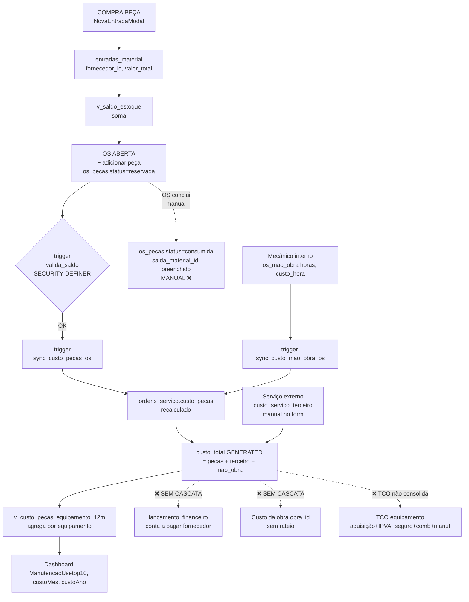

# Auditoria — Módulos Frota e Manutenção

**Projeto:** Gestao_Obras (`emtconstrutora.com` · Supabase project `gunyitwrbxbmnezokgjq` · Postgres 17.6)
**Data:** 2026-05-21
**Branch:** `feat/combustivel-high-risk-fixes`
**Escopo:** Análise read-only dos módulos de Frota (equipamentos/veículos) e Manutenção (OS, planos preventivos, almoxarifado, checklists), e das integrações cross-módulo. Nenhum código modificado.
**Método:** Mapeamento de arquivos → schema do banco via Supabase MCP → 12 perguntas por sub-fluxo (8 frota + 7 manutenção) → integrações cross-módulo → rastreamento de custos → UI/UX vs shadcn baseline → segurança → recomendações priorizadas.
**Baseline:** `combustivel-audit.md` (831 linhas, 7 problemas HIGH). Cada finding desta auditoria é comparado contra os padrões que o baseline já catalogou (soft-delete não filtrado, RLS faltando, SECURITY DEFINER sem `search_path`, policies blanket, triggers legacy duplicados, mobile insertindo lixo, custo médio vitalício).

---

## Sumário Executivo

Frota e Manutenção têm boa cobertura funcional (cadastro, OS com estados, peças com validação de saldo, planos preventivos com periodicidade tripla, checklists versionados), mas herdam dois problemas estruturais do baseline e adicionam outros próprios.

Os 3 piores problemas:

1. **RLS blanket nas 19 tabelas dos dois módulos** (`FOR ALL TO authenticated USING(true) WITH CHECK(true)`). Confirmado pelos advisors (22 warnings `rls_policy_always_true`). Qualquer usuário autenticado pode `DELETE FROM ordens_servico`, `DELETE FROM os_transicoes` (audit log!), `UPDATE custo_total` direto via PostgREST, fraudar `medicoes_equipamento` ou apagar `historico_status_equipamento`. **Mesmo padrão F6 do baseline**, replicado.
2. **Mudança de status do equipamento é 2 calls não-transacionais no cliente.** `useChangeStatusEquipamento` (`useHistoricoStatusEquipamento.ts:59-66`) faz `UPDATE equipamentos.status` + `INSERT historico_status_equipamento` em 2 roundtrips com o comentário "< 100ms, aceitamos falha parcial". Se o segundo falha, o status muda mas o audit trail some — silenciosamente, console.error apenas. Combinado com a policy blanket, qualquer Operador pode burlar.
3. **Sem automação de fluxo OS ↔ Equipamento.** Abrir uma OS não muda `equipamentos.status` para `manutencao_corretiva`; fechar não volta para `ativa`. Não há trigger, nem hook. Resultado: equipamento pode estar fisicamente parado e o sistema mostra `ativa` (continua sendo abastecido, alocado em frete, recebendo apontamento de horas).

As 2 piores integrações cross-módulo:

A. **Fretes ↔ Frota não conversa.** `fretes.placaCarreta` é texto livre; não existe FK para `equipamentos.id`. Quilometragem do frete não atualiza `medicoes_equipamento`. Veículo em manutenção pode ser alocado em frete novo sem aviso. Custo do frete não soma combustível/manutenção do veículo no período. **Ilha completa.**
B. **OS ↔ Lançamento Financeiro não existe.** Quando OS conclui com R$ 25.000 de oficina externa + R$ 3.000 de peças, nenhum `lancamento_financeiro` é criado automaticamente. Fornecedor cadastrado, NF anexada como arquivo, mas o financeiro precisa lançar manualmente — risco de divergência permanente entre custo de manutenção do dashboard e contas a pagar.

Quantitativos:
- **19 tabelas** mapeadas (7 frota + 12 manutenção).
- **22 advisors HIGH/WARN** em segurança, todas relacionadas a policies blanket; 1 storage bucket público listável (`financeiro-anexos`).
- **0 funções SECURITY DEFINER sem search_path** nos dois módulos (avanço sobre o baseline, que tinha várias) — `tg_os_pecas_valida_saldo` e `registra_execucao_atividade_em_conclusao` têm `search_path` configurado.
- **7 views** todas com `security_invoker=true` (já corrigido no Bloco 4 housekeeping).
- **Soft-delete inconsistente:** apenas 6 das 19 tabelas têm `deleted_at` (equipamentos, especificacoes, financeiro_equipamento, historico_status_equipamento, equipamento_plano e várias OS satélites NÃO têm).
- **2 tabelas-pessoa duplicadas** para o mesmo conceito: `colaboradores` (usado por `os_mao_obra`) e `funcionarios` (usado por `checklist_execucoes.operador_funcionario_id`).

---

## Fase 1 — Mapeamento

### 1.1 Estrutura de Arquivos

> Inventário com base em leitura direta. LOC aproximado. Função em 1 frase.

#### Páginas / rotas (Frota)
- `pages/Frota.tsx` (598) — Page master: filtros, busca, grid/lista, modal novo/editar, export PDF/Excel/QR
- `pages/mobile/MEquipamentosPage.tsx` (~200) — Lista mobile com filter/busca, cards
- `pages/mobile/MEquipamentoHubPage.tsx` (~250) — Hub do equipamento mobile (medicao, documento, abrir OS)
- `pages/mobile/MEquipamentoInfoPage.tsx` (~150) — Info operacional mobile
- `pages/mobile/MMedicaoPage.tsx` (~200) — Apontamento de horímetro/odômetro
- `pages/mobile/MScanPage.tsx` (~100) — QR scan de equipamento

#### Componentes UI — Frota
- `components/frota/FrotaList.tsx` (182) — Tabela patrimônio/nome/modelo/marca/ano/empresa/status
- `components/frota/FrotaGrid.tsx` (218) — Grid 4-col agrupado por tipo
- `components/frota/FrotaDetalhe.tsx` (236) — Modal hero + 7 seções (esp/fin/doc/plano/histórico/peças)
- `components/frota/EquipamentoFormFrota.tsx` (~550) — Form 2-col + import Excel
- `components/frota/StatusDropdown.tsx` (224) — Dropdown fixed com 4 status
- `components/frota/StatusChangeMotivoModal.tsx` (176) — Motivo obrigatório se status ≠ ativa
- `components/frota/FotosEquipamentoGaleria.tsx` (~100) — Lightbox/carrossel
- `components/frota/FrotaStats.tsx` (~50), `FrotaCategoryPills.tsx` (~30)
- `components/frota/documentos/DocumentoFormModal.tsx` (199), `DocumentosEquipamentoSection.tsx` (~120)
- `components/frota/especificacoes/EspecificacoesFormModal.tsx` (306), `EspecificacoesEquipamentoSection.tsx` (~100)
- `components/frota/financeiro/FinanceiroFormModal.tsx` (307), `FinanceiroEquipamentoSection.tsx` (~150)
- `components/frota/historico/HistoricoEquipamentoSection.tsx` (~200) — Timeline unificada (5 fontes)
- `components/frota/pecas/CustoPecasEquipamentoSection.tsx` (~100), `planos/PlanoPreventivoEquipamentoSection.tsx` (~150)

#### Páginas / rotas (Manutenção)
- `pages/Manutencao.tsx` (354) — Router de tabs (dashboard / OS / agenda / planos / almoxarifado / checklists)
- `pages/mobile/MAbrirOSPage.tsx`, `MChecklistPage.tsx` — Mobile flows (não inspecionados em profundidade — herdar suspeita de bugs S1-S6 do baseline)

#### Componentes UI — Manutenção
- `components/manutencao/DashboardManutencao.tsx` (465) — KPIs, charts 12m, tops, exports
- `components/manutencao/AgendaPreventivasPage.tsx` (~250) — Agenda consolidada com gerador de OS
- `components/manutencao/AlmoxarifadoPage.tsx` (522) — Catálogo de peças, saldo por depósito
- `components/manutencao/ChecklistsPage.tsx` (~200) — 2 abas (não-conformidades + histórico)
- `components/manutencao/PlanosPreventivosPage.tsx` (95) — Lista de planos
- `components/manutencao/os/OSCard.tsx` (122), `OSDetalhe.tsx` (605), `NovaOSModal.tsx` (297), `AdicionarPecaOSModal.tsx` (~80), `AdicionarMaoObraOSModal.tsx`, `EditarDiagnosticoOSModal.tsx`, `MudarStatusOSModal.tsx`, `styles.ts`
- `components/manutencao/planos/AplicarPlanoModal.tsx`, `NovoPlanoModal.tsx`, `PlanoDetalhePage.tsx`, `AtividadeFormModal.tsx`
- `components/manutencao/almoxarifado/NovaEntradaModal.tsx`, `PecaDetalheModal.tsx`, `PecaFormModal.tsx`
- `components/manutencao/checklists/ChecklistDetalheModal.tsx`

#### Hooks
- `hooks/useEquipamentos.ts` (49), `useTiposEquipamento.ts` (~50)
- `hooks/useHistoricoStatusEquipamento.ts` (94) — UPDATE+INSERT em 2 calls
- `hooks/useMedicoesEquipamento.ts` (139), `useDocumentosEquipamento.ts` (~120)
- `hooks/useFinanceiroEquipamento.ts` (37), `useEspecificacoesEquipamento.ts` (~100)
- `hooks/useHistoricoEquipamento.ts` (~150) — Merge 5 queries (status/saidas/apontamentos/medicoes/docs)
- `hooks/useCustoPecasEquipamento.ts` (~80)
- `hooks/useOrdensServico.ts` (329), `usePlanosPreventivos.ts` (394)
- `hooks/useChecklists.ts` (257), `useChecklistNaoConformidades.ts`, `useChecklistSync.ts`
- `hooks/useDashboardManutencao.ts` (186), `useSaldoEstoque.ts`
- `lib/mappers.ts` (2062 LOC; trechos para `Equipamento`, `OrdemServico`, `OSPeca`, `OSMaoObra`, `PlanoPreventivo`, `Checklist*`, etc.)

---

### 1.2 Estrutura do Banco

> Levantamento direto via Supabase MCP. Todas as 19 tabelas têm RLS habilitado mas com policy blanket (detalhe em Fase 7). Views todas com `security_invoker=true`.

#### Frota

| Tabela | Cols | RLS | Soft-delete | Observações |
|---|---|---|---|---|
| `equipamentos` | 19 | ✅ blanket | ❌ NÃO TEM `deleted_at` | `status` enum 4 valores; `data_aquisicao`/`data_venda` são **TEXT** (não date) |
| `tipos_equipamento` | 5 | ✅ por comando (mas qual=true) | ❌ | `ativo` boolean |
| `documentos_equipamento` | 17 | ✅ blanket | ✅ `deleted_at`+`deleted_by` | `tipo` enum 15 valores; `vencimento` (date nullable) |
| `especificacoes_equipamento` | 24 | ✅ blanket | ❌ | 1:1 com equipamento via PK; capacidades de fluido, pneu, bateria, filtros (jsonb), garantia, consumo esperado |
| `financeiro_equipamento` | 28 | ✅ blanket | ❌ | 1:1; aquisição/locação; `forma_aquisicao` enum; `indexador` enum; **NÃO TEM** `valor_venda`, `data_baixa` nem depreciação calculada (só `valor_mercado_atual` informado) |
| `historico_status_equipamento` | 9 | ✅ blanket | ❌ (correto p/ audit) | `os_id` opcional (links to OS); status enum mesmo de equipamentos |
| `medicoes_equipamento` | 16 | ✅ blanket | ✅ `deleted_at` | `origem` enum 6 valores (`abastecimento`/`checklist`/`ordem_servico`/`apontamento`/`manual`/`import`); CHECK `valor >= 0` (sem monotonicidade) |
| `equipamento_plano` | 8 | ✅ blanket | ❌ | Junction equipamento↔plano_preventivo |

#### Manutenção

| Tabela | Cols | RLS | Soft-delete | Observações |
|---|---|---|---|---|
| `ordens_servico` | 44 | ✅ blanket | ✅ | `status` enum 7 valores; `tipo` 6 (`preventiva/corretiva/preditiva/melhoria/garantia/recall`); `origem` 5 (`plano_preventivo/checklist/anomalia_combustivel/manual/recall`); `custo_total` é generated `(custo_pecas+custo_servico_terceiro+custo_mao_obra_propria)` |
| `os_pecas` | 13 | ✅ blanket | ❌ | `status` enum `reservada/consumida/devolvida`; CHECK `quantidade>0`; FK `insumo_id`→insumos (peças=insumos) |
| `os_mao_obra` | 10 | ✅ blanket | ❌ | FK `colaborador_id`→**colaboradores**; CHECK `horas>0`; `custo_hora` nullable; `custo_total` generated |
| `os_transicoes` | 7 | ✅ blanket | ❌ (correto p/ audit) | Log automático via trigger; ID `trans-<os>-<epoch>` |
| `os_contador` | 2 | ✅ blanket | — | Counter por ano para gerar número de OS |
| `planos_preventivos` | 13 | ✅ blanket | ✅ | "Receita" de manutenção por tipo/fabricante/modelo |
| `plano_atividades` | 18 | ✅ blanket | ❌ | `categoria` enum 9; `periodicidade_horimetro/km/dias` (ao menos um obrigatório); `exige_oficina_externa` bool |
| `plano_atividade_pecas` | 7 | ✅ blanket | ❌ | "BOM" de cada atividade preventiva |
| `execucoes_atividade` | 10 | ✅ blanket | — | Log de quando cada atividade foi executada (gravado por trigger ao concluir OS preventiva) |
| `checklists_template` | 12 | ✅ blanket | ✅ | Por tipo de equipamento; `versao` int |
| `checklist_perguntas` | 9 | ✅ blanket | ❌ | `categoria`, `obrigatoria`, `critica` flags |
| `checklist_execucoes` | 15 | ✅ blanket | ❌ | `status` enum 3 (`concluido/concluido_com_pendencias/bloqueado`); `os_gerada_id` FK opcional; `operador_funcionario_id`→**funcionarios** (não colaboradores!) |
| `checklist_respostas` | 8 | ✅ blanket | ❌ | `pergunta_snapshot` preserva texto da pergunta; `foto_url` singular (só 1 foto/resposta) |

#### Views (todas `security_invoker=true` ✅)

| View | Tabelas-fonte | Função |
|---|---|---|
| `v_equipamento_medicao_atual` | medicoes_equipamento | DISTINCT ON última leitura por equipamento |
| `v_documentos_vencendo` | documentos_equipamento | Categoriza vencido/critico/alerta/atencao |
| `v_equipamento_depreciacao` | financeiro_equipamento | Cálculo linear (valor_aquisicao / vida_util_meses) |
| `v_custo_pecas_equipamento_12m` | os_pecas + ordens_servico | Top peças por custo em janela 12m |
| `v_custo_pecas_equipamento_mensal` | idem | Quebra mensal |
| `v_proximas_preventivas` | plano_atividades + equipamento_plano + execucoes_atividade + medicoes_equipamento | Calcula próxima data/medição por atividade |
| `v_saldo_estoque` / `v_saldo_estoque_total` | entradas/saidas/transferencias_material + os_pecas | Saldo real subtraindo reservas de OS ativas |
| `v_checklists_nao_conformidades` | checklist_execucoes + checklist_respostas + checklist_perguntas | Lista pendências (resposta=`nao` em pergunta crítica) |

#### Funções e Triggers relevantes

| Função | SECURITY | search_path | Disparo / propósito |
|---|---|---|---|
| `gerar_numero_os()` | INVOKER | `pg_catalog, public` ✅ | RPC chamada pelo cliente para gerar `OS-YYYY-NNNN` atomicamente via `os_contador` |
| `tg_os_grava_transicao()` | INVOKER | ✅ | INSERT OR UPDATE em `ordens_servico` → INSERT em `os_transicoes` (audit) |
| `tg_os_pecas_valida_saldo()` | **DEFINER** | ✅ | BEFORE INSERT/UPDATE em `os_pecas` valida `v_saldo_estoque ≥ delta` (skip se `deposito_id IS NULL` ou OS `cancelada/rascunho`) |
| `tg_sync_custo_pecas_os()` | INVOKER | ✅ | AFTER em `os_pecas` recalcula `ordens_servico.custo_pecas` |
| `tg_sync_custo_mao_obra_os()` | INVOKER | ✅ | AFTER em `os_mao_obra` recalcula `ordens_servico.custo_mao_obra_propria` |
| `registra_execucao_atividade_em_conclusao()` | **DEFINER** | ✅ | AFTER UPDATE status em `ordens_servico`; só dispara se `origem='plano_preventivo' AND atividade_id IS NOT NULL AND NEW.status='concluida' AND OLD.status<>'concluida'`. Insere em `execucoes_atividade` com `id = to_char(clock_timestamp(),...) \|\| substr(md5(random()),1,6)` e `ON CONFLICT DO NOTHING` — **id aleatório torna o ON CONFLICT inerte** |
| `tg_saidas_combustivel_sync_medicao()` | INVOKER | ✅ | AFTER em `saidas_combustivel` upsert em `medicoes_equipamento` (`origem='abastecimento'`), id determinístico `med-abast-<saida_id>`. Trata soft-delete e re-edição (zerar leitura → soft-deleta a medição) |

> **Nota:** Os 2 SECURITY DEFINER aqui têm `search_path` setado (`pg_catalog, public`). **Não é o problema F1 do baseline** — neste módulo está OK. O risco é o "F6 blanket policy" abaixo.

#### Storage buckets

| Bucket | Público? | Limite | MIME |
|---|---|---|---|
| `abastecimento-fotos` | privado | 10 MB | imagens + docs |
| `apontamento-fotos` | privado | 20 MB | imagens + docs |
| `checklist-fotos` | privado | 10 MB | só imagens |
| `compras-anexos` | privado | 20 MB | imagens + docs |
| `financeiro-anexos` | **PUBLIC** ⚠️ | 20 MB | imagens + pdf |
| `rodotracker-photos` | privado | 20 MB | só imagens |

> **Advisor warning:** `public_bucket_allows_listing` em `financeiro-anexos`. NFs de aquisição e contratos de locação (FK em `financeiro_equipamento`) podem estar lá → vazamento aberto.

---

### 1.3 Mapa Visual de Entidades (Mermaid)

```mermaid
erDiagram
  empresas ||--o{ equipamentos : "tem"
  tipos_equipamento ||--o{ equipamentos : "classifica"
  equipamentos ||--o| especificacoes_equipamento : "1:1"
  equipamentos ||--o| financeiro_equipamento : "1:1"
  equipamentos ||--o{ documentos_equipamento : "CRLV/IPVA/seguro"
  equipamentos ||--o{ medicoes_equipamento : "horímetro/odômetro"
  equipamentos ||--o{ historico_status_equipamento : "audit status"
  equipamentos ||--o{ equipamento_plano : "aplicado"
  planos_preventivos ||--o{ equipamento_plano : "vincula"
  planos_preventivos ||--o{ plano_atividades : "tem"
  plano_atividades ||--o{ plano_atividade_pecas : "BOM"
  plano_atividades ||--o{ execucoes_atividade : "executa"
  equipamentos ||--o{ ordens_servico : "manutencao"
  ordens_servico ||--o{ os_pecas : "consume"
  ordens_servico ||--o{ os_mao_obra : "tempo"
  ordens_servico ||--o{ os_transicoes : "audit estados"
  ordens_servico ||--o{ execucoes_atividade : "preventiva concluida"
  os_pecas }o--|| insumos : "FK insumo_id"
  os_pecas }o--|| depositos_material : "almoxarifado"
  os_pecas }o--o| saidas_material : "consumo real"
  os_mao_obra }o--|| colaboradores : "mecânico"
  ordens_servico }o--o| obras : "obra (SET NULL)"
  ordens_servico }o--o| fornecedores : "oficina externa"
  fornecedores ||--o{ documentos_equipamento : "seguradora/locadora"
  fornecedores ||--o{ financeiro_equipamento : "fornec_aquisicao/locadora"
  checklists_template ||--o{ checklist_perguntas : "tem"
  checklists_template ||--o{ checklist_execucoes : "registra"
  checklist_execucoes ||--o{ checklist_respostas : "respostas"
  checklist_execucoes }o--|| equipamentos : "executado em"
  checklist_execucoes }o--|| funcionarios : "operador"
  checklist_execucoes }o--o| ordens_servico : "gerou OS"
  saidas_combustivel }o--|| equipamentos : "FK equipamento_id"
  saidas_combustivel ||--o| medicoes_equipamento : "trigger sync"
  fretes }o..o{ equipamentos : "❌ SEM FK (placaCarreta texto)"
  pedidos_compra }o..o{ os_pecas : "❌ SEM integração"
  ordens_servico }o..o{ lancamentos_financeiros : "❌ SEM cascata"
```

> Linhas pontilhadas = integração **ausente** que deveria existir.

---

## Fase 2 — Auditoria do Módulo Frota

> Aplicação das 12 perguntas por sub-fluxo. Onde uma resposta repete o padrão de outro fluxo, é abreviada para "idem 2.1#N".

### 2.1 CADASTRO de Equipamento

1. **Dispara:** `Frota.tsx:206` botão "Novo equipamento" → `EquipamentoFormFrota` (~550 LOC).
2. **Pré-condições:** `temAcao('criar_veiculo')`. Tipos e empresas precisam estar cadastrados (ou criados inline).
3. **Dados capturados:** `nome, tipo, empresaId, codigoPatrimonio (auto p/ EMT), numeroSerie, ano, marca, modelo, propriedade, status (default 'ativa'), tipoMedicao (horimetro|odometro|km), medicaoInicial, dataAquisicao, dataVenda, fotos, arquivos`. Validações client: nome/tipo/empresa/patrimônio obrigatórios.
4. **Server-side:** CHECK `status` ∈ {`ativa`, `manutencao_preventiva`, `manutencao_corretiva`, `fora_funcionamento`}; CHECK `tipo_medicao` ∈ {`horimetro`,`odometro`,`km`}; **nenhuma UNIQUE em codigo_patrimonio** (duplicatas possíveis).
5. **Pousa:** `equipamentos` (INSERT único, atômico). Especificações/financeiro/documentos ficam vazios até preenchimento manual.
6. **Side effects:** Pode criar `tipos_equipamento` inline. Não cria `historico_status_equipamento` (cadastro inicial sem registro). Não cria `medicoes_equipamento` com `medicaoInicial`.
7. **Edge cases:** Duplicata de `codigo_patrimonio` aceita; `data_aquisicao`/`data_venda` como **TEXT** sem validação de formato (vide bug F1); `medicaoInicial=0` para equipamento usado é semanticamente fraco; `propriedade='alugada'` sem `financeiro_equipamento.locadora_id` aceito.
8. **Bugs lidos:** `EquipamentoFormFrota.tsx:157` `ativo = dataVenda ? false : status !== 'fora_funcionamento'` — combinação `status='ativa'` + `dataVenda` preenchido marca `ativo=false`, mas usuário pode editar e ver "Status: Ativa, Ativo: Não" (estado contraditório). Comentário "ativo enquanto não vendido" inconsistente com a expressão.
9. **Performance:** OK (1 INSERT). Lista `Frota.tsx` faz SELECT * sem paginação.
10. **Logs/auditoria:** `criado_por` preenchido. Sem audit de quem disparou o "Novo" nem dos dados antes/depois (edição).
11. **Reversibilidade:** **Hard-delete em `useEquipamentos.ts:42-47`** — não há `deleted_at` na tabela. Excluir equipamento dispara CASCADE em historico_status_equipamento, medicoes, documentos, especificacoes, financeiro, equipamento_plano. **Auditoria perde tudo.** Em prática, FKs `saidas_combustivel.equipamento_id` e `ordens_servico.equipamento_id` são RESTRICT, então DELETE só funciona em equipamento "virgem".
12. **Baseline:** soft-delete **ausente** (não tem `deleted_at`). RLS **blanket** F6 ✓. SECURITY DEFINER não aplicável (sem function). Policies blanket ✓.

### 2.2 MUDANÇA de Status

1. **Dispara:** `StatusDropdown` em FrotaList/Grid (ícone por linha/card) → `StatusChangeMotivoModal` (`StatusChangeMotivoModal.tsx:176`).
2. **Pré-condições:** `temAcao('mudar_status_equipamento')`. `motivoObrigatorio = statusPara !== 'ativa'`.
3. **Dados capturados:** `statusDe, statusPara, motivo (required se ≠ ativa), observacoes (opcional)`.
4. **Server-side:** CHECK em equipamentos.status (mesmo enum 4) + CHECK em historico_status_equipamento.status_de/para. **Sem transação atômica** — 2 calls separadas via supabase-js.
5. **Pousa:** `UPDATE equipamentos SET status, ativo` + `INSERT historico_status_equipamento`. **Não é uma transação.**
6. **Side effects:** `equipamentos.ativo` flipado por código no cliente (`ativo = statusPara !== 'fora_funcionamento'`). **Não muda status de OSs abertas. Não notifica abastecimento.**
7. **Edge cases:** Race condition se 2 users mudam ao mesmo tempo — ambos INSERT histórico, mas só o último UPDATE vence em `equipamentos`. Status pingue-pongue (A→B→A→B) gera múltiplos históricos sem alerta de "loop". UPDATE pode succeder e INSERT histórico falhar → audit gap silencioso.
8. **Bugs:** **`useHistoricoStatusEquipamento.ts:59-66`** comenta "< 100ms, aceitamos falha parcial" mas só faz `console.error` — usuário pensa salvou; auditoria sumiu (bug F2, severidade ALTA).
9. **Performance:** 2 roundtrips. Query do histórico (`order by created_at DESC`) sem LIMIT no SELECT.
10. **Logs/auditoria:** `created_by, motivo, observacoes` gravados quando INSERT funciona. Sem log de tentativa falha.
11. **Reversibilidade:** Histórico é imutável (INSERT-only). Não há "desfazer" — só nova mudança em direção contrária.
12. **Baseline:** Soft-delete N/A (`historico_status_equipamento` não deve ter). RLS blanket F6 ✓. Permite `DELETE FROM historico_status_equipamento` direto via PostgREST → audit log apagável. Policies blanket ✓.

### 2.3 ALOCAÇÃO a Obra/Serviço

> **Estado real:** NÃO IMPLEMENTADO.

- Não existe coluna `obra_id` em `equipamentos`.
- Não existe tabela `alocacoes_equipamento_obra` nem `equipamentos_obras`.
- Existem FKs `obra_id` em `saidas_combustivel` (SET NULL) e em `ordens_servico` (SET NULL) — *uso por evento*, não *alocação por período*.
- Implicação: "Qual obra usou qual equipamento" só pode ser respondido somando eventos; não há "esse equipamento foi alocado à obra X de DD/MM a DD/MM".
- Sem regra que veículo "em manutenção" seja desalocado.
- Rateio de custo do equipamento entre obras não é possível porque a alocação não existe.

Para as 12 perguntas: todas se resumem a "N/A — fluxo inexistente".

### 2.4 ATUALIZAÇÃO de Horímetro/Odômetro

1. **Dispara:** `MMedicaoPage.tsx` (manual mobile) → `useAdicionarMedicao`. **Automático:** trigger `tg_saidas_combustivel_sync_medicao` quando `saidas_combustivel.medicao_no_abastecimento` é preenchida (upsert em `medicoes_equipamento` com `origem='abastecimento'`, id determinístico `med-abast-<saida_id>`).
2. **Pré-condições:** equipamentoId existe e `tipo_medicao` definido.
3. **Dados:** `equipamentoId, data, tipoMedicao (snapshot), valor, origem, origem_id, observacoes, foto_urls, arquivo_urls`. Cliente valida `valor >= 0` finite.
4. **Server-side:** CHECK `valor >= 0`; CHECK `tipo_medicao ∈ {horimetro,odometro,km}`; CHECK `origem ∈ {abastecimento,checklist,ordem_servico,apontamento,manual,import}`. **Nenhuma CHECK de monotonicidade.**
5. **Pousa:** `medicoes_equipamento`. Soft-delete (`deleted_at`+`deleted_by`).
6. **Side effects:** `v_equipamento_medicao_atual` recomputa via DISTINCT ON (data DESC). `useMedicoesAtuaisFrota` invalidated.
7. **Edge cases:** **Retrocesso aceito** (valor anterior > novo). Data futura aceita. Se 2 medições mesma `data`, DISTINCT ON pode pegar qualquer uma (sem tiebreaker). Origem `abastecimento` é coberta pelo trigger, mas mobile do combustível tem bug S7 (do baseline) que não preenche `medicao_no_abastecimento` — então a integração silenciosamente não atualiza.
8. **Bugs:** **F3:** sem proteção contra retrocesso → `v_equipamento_medicao_atual` pode regredir com um typo, corrompendo cálculo de próxima preventiva. **F4:** `MMedicaoPage.tsx:56` `valor.replace(',', '.')` assume locale BR (frágil).
9. **Performance:** OK (INSERT único + view DISTINCT ON com índice em `(equipamento_id, data)`).
10. **Logs:** `created_by`, `origem`, `origem_id` para rastreamento.
11. **Reversibilidade:** Soft-delete `deleted_at`+`deleted_by`. Hook `useExcluirMedicao` filtra. Trigger de combustível também sabe soft-deletar quando saída-mãe é soft-deletada.
12. **Baseline:** Soft-delete filtrado SIM em reads. RLS blanket F6 ✓ → Operador pode `INSERT (valor=999999999, origem='manual')` e fraudar o horímetro. Policies blanket ✓.

### 2.5 DOCUMENTOS do Veículo

1. **Dispara:** `FrotaDetalhe` → `DocumentosEquipamentoSection` → `DocumentoFormModal` (199 LOC).
2. **Pré-condições:** equipamentoId; fornecedores cadastrados (para `fornecedor_id` opcional).
3. **Dados:** `tipo (15 valores), numero, emissao (date), vencimento (date), valor, fornecedor_id, observacoes, foto_urls, arquivo_urls`.
4. **Server-side:** CHECK `tipo ∈ {crlv, ipva, seguro, antt, rntrc, nr11, nr12, manual, catalogo_pecas, nf_aquisicao, contrato_locacao, certificacao, vistoria, recall, outro}`. `fornecedor_id` ON DELETE SET NULL.
5. **Pousa:** `documentos_equipamento`. View `v_documentos_vencendo` categoriza (`vencido/critico/alerta/atencao`).
6. **Side effects:** `useDocumentosVencendo` invalidated → dashboard alertas refrescam.
7. **Edge cases:** Vencimento no passado aceito (cadastro retroativo). Tipo `ipva` sem vencimento aceito (incoerente). 2 docs do mesmo tipo (ex: 2× seguro) aceitos. Sem deduplicação por número.
8. **Bugs:** Tipo→vencimento sem correlação obrigatória. URLs assinadas TTL provavelmente persistidas (mesmo padrão do baseline E3) — não confirmei nesta auditoria mas é altamente provável.
9. **Performance:** OK. `v_documentos_vencendo` lê toda a tabela; OK até dezenas de milhares de docs.
10. **Logs:** created_by/updated_by/deleted_by + timestamps.
11. **Reversibilidade:** Soft-delete `deleted_at`+`deleted_by`. Queries filtram `.is('deleted_at', null)`.
12. **Baseline:** Soft-delete SIM ✓. RLS blanket F6 ✓ → Operador pode apagar `documentos_equipamento` (incluindo seguro vencido).

### 2.6 HISTÓRICO / Auditoria

1. **Dispara:** Automático — qualquer evento (mudança status, abastecimento, apontamento, medição, doc).
2. **Pré-condições:** equipamentoId.
3. **Dados:** Merge de 5 tabelas em `useHistoricoEquipamento.ts`.
4. **Server-side:** FKs CASCADE em historico_status, medicoes, documentos, especificacoes, financeiro, equipamento_plano (se equipamento for hard-deletado).
5. **Pousa:** 5 tabelas disjuntas + timeline unificada in-memory.
6. **Side effects:** Cada hook tem invalidação própria.
7. **Edge cases:** Timeline merge `order by created_at` — 2 eventos mesmo timestamp ficam em ordem indeterminada. Sem audit log centralizado. Sem rastro de "view do histórico" (quem auditou).
8. **Bugs:** Promise.all de 5 queries; se 1 falha, all rejeita (sem fallback parcial).
9. **Performance:** O(N log N) sort client; OK até ~1000 eventos. Sem paginação server-side, só client-side (30+load more).
10. **Logs:** `created_by` em cada evento.
11. **Reversibilidade:** Soft-delete em medicoes/documentos. `historico_status_equipamento` é INSERT-only (correto p/ audit) mas a policy blanket permite hard-delete via PostgREST.
12. **Baseline:** Soft-delete misto. RLS blanket F6 ✓.

### 2.7 FINANCEIRO DO VEÍCULO (TCO)

1. **Dispara:** `FrotaDetalhe` → `FinanceiroEquipamentoSection` → `FinanceiroFormModal` (307).
2. **Pré-condições:** `equipamentoId`. `propriedade` determina visibilidade de bloco (propria vs alugada).
3. **Dados — próprio:** `valor_aquisicao, fornecedor_aquisicao_id, nf_aquisicao, forma_aquisicao (a_vista/financiado/consorcio/leasing/outro), banco_financiador, valor_parcela, prestacoes_total/pagas, valor_mercado_atual, vida_util_meses, valor_residual_estimado`. **Dados — alugado:** `locadora_id, contrato_numero, valor_mensal, vigencia_inicio/fim, indexador (IPCA/IGPM/INPC/prefixado/outro), manutencao_inclusa, combustivel_incluso, operador_incluso, horas_minimas_mensais`.
4. **Server-side:** CHECK `forma_aquisicao` e `indexador`; CHECK `vida_util_meses>0`; CHECK `prestacoes_total/pagas>=0`. **Sem CHECK que valide propriedade vs campos (próprio com locadora preenchida)**. **Sem coluna `valor_venda` ou `data_baixa`.**
5. **Pousa:** `financeiro_equipamento` (1:1 PK `equipamento_id`) via UPSERT.
6. **Side effects:** `v_equipamento_depreciacao` recomputa (linear, simples). Nenhuma cascata.
7. **Edge cases:** Misto próprio+alugado aceito (sem validação de mutualidade). Locadora deletada → SET NULL deixa contrato órfão. `manutencao_inclusa=true` deveria excluir custos de OS do TCO, **mas o app não verifica** (comentário no modal "crítico pra comparativo" mas sem implementação).
8. **Bugs:** **Nenhum cálculo agregado TCO** (aquisição + IPVA + seguro + combustível + manutenção). Seções isoladas. Sem campo `valor_venda` para fechamento. Depreciação só linear (sem acelerada nem método saldo decrescente).
9. **Performance:** UPSERT único. View depreciação simples.
10. **Logs:** created_by/updated_by. Sem audit de transição "a_vista → financiado".
11. **Reversibilidade:** UPSERT permite reedição infinita. Sem `deleted_at`.
12. **Baseline:** Soft-delete N/A (provavelmente intencional). RLS blanket F6 ✓ — Operador pode `UPDATE financeiro_equipamento SET valor_aquisicao=0` direto.

### 2.8 TELEMETRIA / GPS / Horímetro Automático

> **Estado real:** NÃO IMPLEMENTADO.

- Sem integração GPS, sem webhook, sem campo de coordenadas em qualquer tabela.
- Sem detecção "em manutenção que continua rodando" (cruzaria GPS × `status=manutencao_corretiva`).
- Sem alertas de comportamento (velocidade, geofence, motor parado ligado).
- O módulo NÃO está preparado para receber dados externos: nenhuma `function` HTTP, nenhum bucket de telemetria, nenhum endpoint pronto.
- A única "auto-atualização" é o trigger `tg_saidas_combustivel_sync_medicao` (manual com flag de "anotei o horímetro no abastecimento").

---

## Fase 3 — Auditoria do Módulo Manutenção

### 3.1 MANUTENÇÃO PREVENTIVA

**Modelagem:** `planos_preventivos` (receita por tipo/fabricante/modelo) → `plano_atividades` (cada item com periodicidade `horimetro|km|dias`, com CHECK `pa_pelomenos_uma_periodicidade`) → `plano_atividade_pecas` (BOM). Plano é aplicado a equipamento(s) via `equipamento_plano` (junction, `ativo`+`data_inicio`).

A view `v_proximas_preventivas` cruza `plano_atividades × equipamento_plano × execucoes_atividade × medicoes_equipamento` (última leitura) para calcular **próxima_data** e **próxima_medição** por atividade-equipamento.

1. **Dispara:** `AgendaPreventivasPage` → click em preventiva → "Gerar OS" → `useGerarOSDeAtividade` → RPC `gerar_numero_os` + INSERT em `ordens_servico` com `origem='plano_preventivo' + atividade_id`.
2. **Pré-condições:** `temAcao('criar_os')`. Atividade não pode ter OS aberta (verifica em `useOSAbertasPorAtividade`).
3. **Dados:** equipamento, atividade, defeito_reportado preenchido pelo procedimento, tipo='preventiva', prioridade calculada por urgência.
4. **Server-side:** CHECK em `ordens_servico` (tipo, prioridade, status, origem); CHECK em `plano_atividades.pa_pelomenos_uma_periodicidade`; unique em `os_contador.ano` garante numeração serializada.
5. **Pousa:** `ordens_servico` (origem=`plano_preventivo`, atividade_id set). Trigger `tg_os_grava_transicao` cria INSERT em `os_transicoes` com motivo='Criação'.
6. **Side effects:** Quando essa OS é concluída, `registra_execucao_atividade_em_conclusao` insere em `execucoes_atividade` (data, medição, custo). Próxima preventiva é então recalculada pela view.
7. **Edge cases NÃO tratados:**
   - **Próxima OS não é gerada automaticamente.** Se ninguém olhar a agenda, preventiva vencida acumula indefinidamente.
   - Plano aplicado a equipamento sem `medicoes_equipamento` (zero leituras) → `v_proximas_preventivas` retorna `NULL` em proxima_medicao (cálculo silencia).
   - 2 atividades com mesma periodicidade não são consolidadas em 1 OS (agrupamento manual).
   - Tolerância (`tolerancia_percentual` default 10) é só metadado da atividade; view aplica? Não verifiquei a SQL exata da view nesta auditoria.
   - **Reabrir OS preventiva concluída e concluir de novo cria duplicata em `execucoes_atividade`** (bug M1 — ID aleatório no função, ver Fase 1.2).
8. **Bugs:** **M1** descrita. **M2:** AgendaPreventivasPage não filtra equipamento na query → carrega tudo de toda a frota e filtra client.
9. **Performance:** Carga inicial pesada. Geração de OS = 1 RPC + 1 INSERT.
10. **Logs:** `tg_os_grava_transicao` (audit estados); `created_by` em todos os elos.
11. **Reversibilidade:** OS soft-delete (`deleted_at`). `execucoes_atividade` **não tem** soft-delete.
12. **Baseline:** soft-delete parcial (OS sim, execucoes não). RLS blanket F6 ✓. SECURITY DEFINER + search_path ✓ (já correto). Policies blanket ✓.

### 3.2 MANUTENÇÃO CORRETIVA (OS)

**Estados:** `rascunho → aberta → {aguardando_pecas, em_execucao} → aguardando_aprovacao → concluida | cancelada`.

| Estado | Pode acontecer | Não pode |
|---|---|---|
| `rascunho` | Editar tudo; sem reserva de saldo (trigger valida_saldo skip) | Não dispara movimentação |
| `aberta` | Iniciar execução, mover para aguardando_pecas, cancelar | — |
| `aguardando_pecas` | Adicionar peças (cria reserva via os_pecas com status='reservada' + trigger valida saldo) | Concluir |
| `em_execucao` | Adicionar mão de obra; registrar parada_inicio/parada_fim; consumir peças | — |
| `aguardando_aprovacao` | Aprovação manual; reverter para em_execucao | — |
| `concluida` | Trigger `registra_execucao_atividade_em_conclusao` se preventiva | Reabrir cria duplicata em `execucoes_atividade` (M1) |
| `cancelada` | — | (trigger `tg_os_pecas_valida_saldo` skip valida → reservas "esquecidas" podem persistir como `status='reservada'`) |

1. **Dispara:** `Manutencao.tsx` → "Nova OS" → `NovaOSModal` (297 LOC).
2. **Pré-condições:** `temAcao('criar_os')`. Equipamento ativo (não verificado server-side).
3. **Dados:** `equipamentoId, tipo (6 valores), prioridade (4), defeito_reportado (required), sintomas (array livre), sistemas_afetados (array livre), obra_id (opc), responsavel_id (opc)`.
4. **Server-side:** CHECK enum + RPC `gerar_numero_os` + trigger `tg_os_grava_transicao` registra criação.
5. **Pousa:** `ordens_servico` (1 INSERT). Status default `aberta`. `custo_total` é GENERATED (sempre `custo_pecas+custo_servico_terceiro+custo_mao_obra_propria`).
6. **Side effects:** INSERT em `os_transicoes` (auditoria). Triggers `tg_sync_custo_*` ainda não disparam (sem peças/MO). Equipamento **NÃO** muda status automaticamente.
7. **Edge cases:**
   - Equipamento em `fora_funcionamento` aceito (semanticamente OK?).
   - `sintomas` array livre sem dicionário → "freio", "freios", "freio dianteiro" coexistem (dificulta análise de causa raiz).
   - 2 OSs simultâneas para o mesmo equipamento aceitas.
   - OS preventiva sem `atividade_id` aceita (CHECK não exige).
8. **Bugs:**
   - **M3:** Sem dicionário de sintomas → análise comparativa quebra.
   - **M4:** Sem regra de exclusividade equipamento (2 OSs em paralelo).
   - **M5:** Equipamento `status='ativa'` permanece após OS aberta (operador continua usando).
9. **Performance:** OK. Lista de OS sem paginação server-side.
10. **Logs:** `tg_os_grava_transicao` cria entrada de transição com motivo='Criação'.
11. **Reversibilidade:** Soft-delete via `useExcluirOS` → `UPDATE deleted_at`. Sem UI de lixeira (diferente do combustível que tem `LixeiraTab`).
12. **Baseline:** Soft-delete SIM ✓ (`ordens_servico`). RLS blanket F6 ✓ → Operador `DELETE FROM ordens_servico` hard. Policies blanket ✓.

### 3.3 PEÇAS / ALMOXARIFADO

**Modelagem:** Peças = `insumos` (catálogo geral compartilhado com material). Estoque = `depositos_material` (FK em `os_pecas.deposito_id`). Saldo via view `v_saldo_estoque` que agrega `entradas_material + transferencias_in − saidas_material − transferencias_out − os_pecas (status ativas, OS não cancelada)`.

1. **Dispara — entrada:** `AlmoxarifadoPage` → `NovaEntradaModal` → INSERT em `entradas_material` (tabela compartilhada).
2. **Dispara — consumo:** `OSDetalhe` → `AdicionarPecaOSModal` → INSERT em `os_pecas (status='reservada')`. Quando OS conclui, o status muda manualmente para `consumida` e `saida_material_id` deveria ser preenchido com a saída correspondente.
3. **Pré-condições:** Para consumo, OS não-cancelada-e-não-rascunho com depósito definido. Para entrada, depósito tipo "almoxarifado de peças".
4. **Server-side:**
   - `tg_os_pecas_valida_saldo` (SECURITY DEFINER, search_path OK) BEFORE INSERT/UPDATE em `os_pecas` levanta `check_violation` se `v_saldo_estoque < delta_necessaria`. Skip se `deposito_id IS NULL` (peça externa) ou OS `cancelada/rascunho`.
   - CHECK `os_pecas.quantidade > 0`.
   - `tg_sync_custo_pecas_os` AFTER INSERT/UPDATE/DELETE recalcula `ordens_servico.custo_pecas = SUM(os_pecas.custo_total)`.
5. **Pousa:** `os_pecas`. (entrada vai em `entradas_material` — fora do escopo da auditoria de manutenção).
6. **Side effects:** Recalculo de custo na OS. View `v_saldo_estoque` reflete reserva imediata.
7. **Edge cases:**
   - **Custo unitário declarado manual no modal**, não puxado de uma fonte de verdade (não há custo médio de peça mantido). Mesmo erro de método do combustível (sem FIFO/médio).
   - OS cancelada com peças `reservada` ainda penduradas — view não filtra OS cancelada exatamente? (Não confirmei a SQL exata da view nesta sessão; é um RISCO M6 a verificar.)
   - **Soft-delete em `entradas_material`/`saidas_material`/`transferencias_material`:** se a view `v_saldo_estoque` não filtra `deleted_at IS NULL`, o problema T1/T2 do baseline se replica em manutenção. Não foi confirmado o SQL exato da view — RISCO M7.
   - Peça externa (`deposito_id NULL`) entra direto no custo da OS sem rastro de NF/fornecedor.
   - Devolução: status `devolvida` existe mas sem fluxo de "subir saldo de volta" automaticamente — manual.
8. **Bugs:**
   - **M6 (a verificar):** OS cancelada não retira reservas de `os_pecas`.
   - **M7 (a verificar):** `v_saldo_estoque` pode não filtrar `deleted_at` (replicação do baseline).
   - **M8:** sem fluxo de "consumo automático" ao concluir OS — status `reservada` → `consumida` é manual.
9. **Performance:** View `v_saldo_estoque` faz 7+ joins/CTEs — caro em escala. Advisors flagam 4 índices não-usados em `os_pecas` (provavelmente porque tabela ainda tem poucos dados).
10. **Logs:** `created_by` em `os_pecas`. **Sem audit log de "quem mudou status reservada→consumida".**
11. **Reversibilidade:** **Hard-delete em `os_pecas`** (sem `deleted_at`). Trigger `tg_sync_custo_pecas_os` AFTER DELETE recalcula corretamente, mas perde rastro do que foi removido.
12. **Baseline:** Soft-delete AUSENTE (peça apagada some). RLS blanket F6 ✓. SECURITY DEFINER + search_path ✓ (correto). Policies blanket ✓.

### 3.4 CHECKLISTS

**Modelagem:** `checklists_template` (por `tipo_equipamento` com `versao`) → `checklist_perguntas` (por template, `obrigatoria` + `critica`) → `checklist_execucoes` (snapshot `template_versao`) → `checklist_respostas` (com `pergunta_snapshot` para preservar texto se template muda).

1. **Dispara:** `MChecklistPage` (mobile) ou `ChecklistsPage` (web) → escolhe equipamento + template ativo mais recente.
2. **Pré-condições:** Template ativo (`ativo=true AND deleted_at IS NULL`) compatível com `tipo_equipamento`.
3. **Dados:** Para cada pergunta, `resposta ∈ {sim,nao,nao_aplica}`, observação, foto opcional. `medicao_atual` opcional.
4. **Server-side:** CHECK `status ∈ {concluido, concluido_com_pendencias, bloqueado}`. NOT NULL em template, template_versao, equipamento, operador_nome.
5. **Pousa:** `checklist_execucoes` + `checklist_respostas` (em batch).
6. **Side effects:**
   - Foto upload para bucket `checklist-fotos` (10MB, só imagens). URL signed (TTL provável 1h, ver bug do baseline).
   - View `v_checklists_nao_conformidades` agrega execuções com `nao` em pergunta `critica=true`.
   - Campo `os_gerada_id` existe mas o **fluxo de gerar OS automática a partir de `status='bloqueado'` não está implementado** (M9).
7. **Edge cases:**
   - Checklist bloqueado sem geração automática de OS — depende do operador olhar a aba "Não-conformidades".
   - Template editado entre `iniciado_em` e `concluido_em` — `pergunta_snapshot` protege texto, mas se pergunta crítica vira não-crítica, view de não-conformidades aplica regra atual ou snapshot? (Provavelmente atual, sem garantia documental.)
   - Sync offline (`useChecklistSync`) — não revisado em profundidade; bug potencial de double-submit se sync falha e retenta.
8. **Bugs:**
   - **M9:** OS automática para checklist bloqueado é stub (campo existe, lógica ausente).
   - **M10:** Upload de fotos **sequencial** em loop (`useChecklists.ts:121-134`); 20 fotos ≈ minutos.
9. **Performance:** Sequencial → ruim em mobile com 4G fraco.
10. **Logs:** `created_by`, `sincronizado_em`, `iniciado_em`, `concluido_em`. Sem audit de "quem editou template".
11. **Reversibilidade:** Soft-delete só em `checklists_template`. Execucoes/respostas hard-delete via policy blanket.
12. **Baseline:** Soft-delete parcial. RLS blanket F6 ✓.

### 3.5 CUSTO DA OS

**Modelagem:** `ordens_servico.custo_total` é coluna GENERATED `(custo_pecas + custo_servico_terceiro + custo_mao_obra_propria)`.

- `custo_pecas`: recalculado por `tg_sync_custo_pecas_os` = `SUM(os_pecas.custo_total)` onde `custo_total = quantidade × custo_unitario`.
- `custo_mao_obra_propria`: recalculado por `tg_sync_custo_mao_obra_os` = `SUM(os_mao_obra.custo_total)` onde `custo_total = horas × custo_hora` (com `custo_hora` NULLABLE!).
- `custo_servico_terceiro`: campo manual em `ordens_servico` — sem tabela de "serviços".

**Frete da peça NÃO entra** no custo (não há coluna `valor_frete` em `os_pecas` nem em `entradas_material` documentada).

**Atribuição:** Apenas por `equipamento_id`. Tem `obra_id` (SET NULL) e `atividade_id` mas dashboard NÃO agrupa por obra.

**Onde aparece:**
- `useDashboardManutencao` (lê 2000+ OSs client-side) → KPIs `custoMes/custoAno`, top 10 por custo, custo mensal por tipo (12m).
- `v_custo_pecas_equipamento_12m` (view materializada? — não verificado se é matview ou view simples) → top peças por custo no equipamento.
- `ResumoManutencao` no dashboard principal.

**Bugs:**
- **M11:** `os_mao_obra.custo_hora` nullable → linhas com `custo_total = NULL` quietamente. `SUM(NULL)` na agregação é skipado → OS aparenta ser "barata".
- **M12:** Dashboard carrega 2000 OSs em JS, agrega em loops → travamento 2-3s em carga lenta. Deveria ser uma `function` SQL ou matview.
- **M13:** Sem rateio entre obras (se equipamento trabalhou em 3 obras no mês, custo da OS vai 100% para o equipamento e nada para obra).

### 3.6 MÃO DE OBRA INTERNA

**Tabela:** `os_mao_obra` (`os_id, colaborador_id, data, horas, custo_hora, custo_total`). FK `colaborador_id → colaboradores` (RESTRICT) — **não** `funcionarios`!

1. **Dispara:** `OSDetalhe` → `AdicionarMaoObraOSModal`.
2. **Pré-condições:** Colaborador ativo. OS não cancelada.
3. **Dados:** `colaboradorId, data, horas (> 0 CHECK), custo_hora (opcional!), observacoes`.
4. **Server-side:** CHECK `horas > 0`. **Nenhuma CHECK que exija custo_hora**.
5. **Pousa:** `os_mao_obra` (1 INSERT). Trigger recalcula `ordens_servico.custo_mao_obra_propria`.
6. **Side effects:** Recálculo de custo na OS. **Nenhuma atualização em ponto-eletrônico ou apontamento** — manutenção e RH não conversam.
7. **Edge cases:**
   - **Custo/hora nullable** → linha aparece na lista mas não soma no custo (M11).
   - Mesmo colaborador trabalhando em 2 OSs no mesmo dia, mesma hora: aceito (sobre-alocação invisível).
   - **Sem cadastro de "custo/hora padrão" por colaborador** em nenhuma tabela; precisa digitar a cada lançamento.
   - Sem registro de produtividade (OSs finalizadas / horas efetivas, retrabalho).
8. **Bugs:** **M11** descrita. Falta-de-feature: relatório "custo da equipe interna por mês" não existe.
9. **Performance:** OK.
10. **Logs:** `created_by`. Sem audit de edição de linha.
11. **Reversibilidade:** Hard-delete (sem `deleted_at`). Trigger recalcula corretamente após DELETE.
12. **Baseline:** Soft-delete ausente. RLS blanket F6 ✓.

> **Risco estratégico:** se mecânicos não cadastram horas, OSs parecem "baratas" (só somam peças). Não há recall automático.

### 3.7 GARANTIA E FORNECEDORES DE PEÇAS

> **Estado real:** MINIMAMENTE PRESENTE.

- `ordens_servico.garantia_acionada` (boolean) — apenas flag, sem gestão de prazo de garantia ou data de início.
- `ordens_servico.fornecedor_servico_id` → `fornecedores.id` (SET NULL) — para oficina externa.
- `os_pecas` tem `insumo_id` (peça) mas **não tem `fornecedor_id`** — quem forneceu a peça é dado apenas na entrada de estoque (`entradas_material.fornecedor_id`), não no consumo.
- **Não há tabela de fornecedor-peça com preço/prazo/avaliação.**
- **Não há prazo de garantia armazenado** em `entradas_material` nem em `os_pecas`.
- **Sistema NÃO avisa** se peça quebrou ainda dentro do prazo de garantia (campo não existe).
- **Histórico por fornecedor:** pode ser agregado por SQL (`entradas_material.fornecedor_id × custo`), mas sem UI dedicada.
- **Recall:** Se fornecedor avisa lote defeituoso, **não há rastreabilidade insumo→entrada→OSs** pronta. `os_pecas.saida_material_id` aponta para saída, mas reverter para entrada exige consulta manual.
- **Devolução de peça pro fornecedor:** Status `os_pecas.status='devolvida'` existe, mas sem fluxo de "estorno em entrada" ou crédito.
- **Sem score de fornecedor** (preço, prazo, qualidade).

Para as 12 perguntas: maioria "N/A — fluxo inexistente".

> **Risco estratégico:** comprar do mesmo fornecedor ruim por anos sem ver o padrão. Sem dados, sem decisão.

---

## Fase 4 — Integrações Cross-Módulo

### 4.1 FROTA ↔ COMBUSTÍVEL

- ✅ FK `saidas_combustivel.equipamento_id → equipamentos.id` (ON DELETE **RESTRICT** — não permite hard-delete de equipamento com saídas).
- ✅ Trigger `tg_saidas_combustivel_sync_medicao` **existe e está ativo** (agent de integrações errou ao dizer "não implementado"). Quando `medicao_no_abastecimento + equipamento_id + tipo_medicao_snapshot` estão preenchidos no INSERT/UPDATE da saída, faz upsert em `medicoes_equipamento (origem='abastecimento', origem_id=saida.id, id='med-abast-<saida.id>')`. Soft-delete na saída → soft-delete da medição. Zerar leitura na edição → soft-delete da medição.
- ❌ **Mas:** mobile `MSaidaCombustivelPage` (bug S7 do baseline) **não preenche `medicao_no_abastecimento`** → trigger silenciosamente não dispara. Logo, mobile abastecimento NÃO atualiza odômetro em produção.
- ❌ **Sem regra impedindo abastecimento** de veículo em `manutencao_corretiva` / `manutencao_preventiva` (CHECK ausente; UI permite seleção).
- ✅ Consumo aparece em `ResumoCombustivel.tsx` (top 3 equipamentos) e `useHistoricoEquipamento` (fonte 2 de 5).
- ⚠️ CHECK em `ordens_servico.origem` aceita `'anomalia_combustivel'` — significa que **uma anomalia de combustível pode gerar OS**, mas **não localizei o código que cria essa OS**. CHECK constraint diz "este valor é permitido", mas fluxo aparentemente não implementado. RISCO de feature meio-feita.

**Acoplamento frágil:** sync depende de `medicao_no_abastecimento` ser preenchido pelo usuário — ele é opcional na UI, então frequentemente fica vazio.

### 4.2 FROTA ↔ MANUTENÇÃO

- ✅ FK `ordens_servico.equipamento_id → equipamentos.id` (RESTRICT).
- ✅ FK `historico_status_equipamento.os_id → ordens_servico.id` opcional — quando mudança de status é causada por OS.
- ❌ **Status do equipamento NÃO muda automaticamente** quando OS é aberta. Não há trigger. Não há hook no client que faça isso. Resultado: equipamento aparece "ativa" mesmo com OS em execução; pode receber abastecimento, ser alocado em frete, ter checklist preenchido.
- ❌ **Status NÃO volta automaticamente** para "ativa" quando OS conclui.
- ✅ Plano preventivo dispara em função de horas/km/dias via `v_proximas_preventivas` (que cruza `equipamento_plano × plano_atividades × execucoes_atividade × medicoes_equipamento`).
- ✅ Histórico de manutenção do veículo é alimentado por OSs (via `useCustoPecasEquipamento`, `v_custo_pecas_equipamento_12m`).
- ⚠️ Trigger `registra_execucao_atividade_em_conclusao` tem bug de **ID aleatório com `ON CONFLICT DO NOTHING`** (id é `to_char(clock_timestamp(),...) || substr(md5(random()),1,6)` — colisão praticamente impossível). Reabrir OS preventiva (concluída → aberta → concluída) **cria duplicata** em `execucoes_atividade`, inflando `proxima_data/medicao` calculada.

**Acoplamento frágil:** mudança de status do equipamento é responsabilidade do usuário; cadeia OS→status quebra silenciosamente.

### 4.3 FROTA ↔ FRETES

- ❌ `fretes.placaCarreta` é **texto livre** (não FK). Sem coluna `equipamento_id` em fretes.
- ❌ `kmRodados` em fretes não atualiza `medicoes_equipamento` (mesmo se tivesse FK).
- ❌ Veículo em `manutencao_corretiva` pode ser alocado em frete novo — sem regra de bloqueio.
- ❌ Custo do frete não inclui combustível/manutenção do veículo no período.
- ❌ Saídas de combustível com `tipo_consumidor='carreta_transportadora'` referenciam transportadora (fornecedor), não equipamento — assim mesmo se houver veículo da transportadora cadastrado em equipamentos, não bate.

**Veredito:** **Ilha completa.** Fretes e Frota tratam o mesmo objeto físico (caminhão) de maneiras desconexas.

### 4.4 FROTA ↔ OBRAS

- ❌ **Sem coluna `obra_id` em `equipamentos`.**
- ❌ **Sem tabela `alocacoes_equipamento_obra`** ou similar.
- ✅ `saidas_combustivel.obra_id → obras.id` (SET NULL) — uso por evento.
- ✅ `ordens_servico.obra_id → obras.id` (SET NULL) — quando obra é a origem da OS.
- ❌ Sem regra de "obra terminada" que afete equipamento.
- ❌ Rateio entre obras não é possível (alocação não existe).

**Acoplamento:** apenas via eventos (`saidas_combustivel.obra_id`, `ordens_servico.obra_id`). Inferência de "qual equipamento serviu qual obra" só por análise.

### 4.5 MANUTENÇÃO ↔ FORNECEDORES (Compras/Financeiro)

- ✅ `ordens_servico.fornecedor_servico_id → fornecedores.id` (SET NULL) — oficina externa.
- ❌ Quando OS conclui com `custo_servico_terceiro > 0`, **nenhum `lancamento_financeiro` é criado**. Manual.
- ❌ `os_pecas` **não tem FK para `pedidos_compra`** — peça consumida não dispara reposição de estoque.
- ✅ Peça comprada via `entradas_material` (com `fornecedor_id`) — vai para o saldo do depósito, mas o link inverso (qual fornecedor forneceu a peça consumida) só existe via `os_pecas.saida_material_id → saidas_material.id` (e essa não tem fornecedor).
- ⚠️ NF anexada em `ordens_servico.arquivo_urls` (texto[]) ou via `documentos_equipamento (tipo='nf_aquisicao')` — duas fontes possíveis sem padronização.

**Acoplamento frágil:** financeiro precisa lançar manualmente a cada OS finalizada com terceiro; risco de gap permanente.

### 4.6 MANUTENÇÃO ↔ ALMOXARIFADO

- ✅ Estoque por almoxarifado: `depositos_material` (FK `obra_id` opcional). `os_pecas.deposito_id → depositos_material.id`.
- ✅ Transferências entre depósitos: tabela `transferencias_material` existe.
- ✅ Saldo via `v_saldo_estoque` agrega entradas + transferências_in − saídas − transferências_out − reservas de OSs ativas.
- ⚠️ **A view depende de filtrar `deleted_at IS NULL` em entradas/saidas/transferencias_material e os_pecas.** Se não filtrar (mesmo bug T1 do baseline), soft-deletes corrompem o saldo. **Não confirmei a SQL exata da view nesta sessão** — RISCO M7 a verificar.
- ⚠️ Trigger `tg_os_pecas_valida_saldo` skip se OS `cancelada/rascunho` → cancelar OS depois de reservar peças não libera o saldo automaticamente.
- ❌ Peça "emprestada" (motor enviado para reforma e volta) — sem fluxo.

**Acoplamento aceitável** dentro da camada, mas vulnerável ao bug T1.

### 4.7 FROTA/MANUTENÇÃO ↔ DASHBOARD

**Widgets:**
- `ResumoObras`, `ResumoCombustivel` (top 3 eq.), `ResumoInsumos`, `ResumoManutencao` (KPIs OS) no dashboard principal.
- `DashboardManutencao` (`useDashboardManutencao`) computa client-side:
  - KPIs: osAbertas, osCriticas, osAtrasadas, custoMes, custoAno, percCorretivoAno, MTTR (média horas paradas), osConcluidasMes.
  - Charts: topPorCusto, topPorIndisponibilidade (`parada_inicio`/`parada_fim`), custoMensalPorTipo (12m).
- `FrotaStats` mostra contadores de equipamentos por status/propriedade.

**Faltam:**
- ❌ % disponibilidade da frota (uptime) — fórmula `1 − Σ(parada_fim − parada_inicio) / horas_calendário` não está calculada.
- ❌ Custo/hora de operação por veículo (precisaria horas de medição × custo total).
- ❌ Custo/km análogo.
- ❌ Reconciliação compra-peça ↔ consumo-peça (mesmo gap C6 do baseline).

**Bug M12:** `useDashboardManutencao` carrega TODAS as OSs (até 2000) para o cliente — 2-3s travamento em carga lenta + custo de transferência.

### 4.8 Sinais de "Ilha"

| Cluster | Descrição | Severidade |
|---|---|---|
| **colaboradores vs funcionarios** | 2 tabelas pessoa: `os_mao_obra.colaborador_id → colaboradores`, `checklist_execucoes.operador_funcionario_id → funcionarios`. Migrations referenciam "unificação fase 1/2" — em curso mas não concluída. | ALTA |
| **placaCarreta vs equipamento_id** | Fretes usa texto livre; combustível/OS usam FK. | ALTA |
| **"veículo" vs "equipamento" vs "máquina"** | `Equipamento` é canônico em frota; "veículo" aparece em combustível legacy; "máquina" só em UI. Sem unificação. | MÉDIA |
| **"peça" vs "insumo" vs "material"** | `insumos` é canônico; "peça" é especialização via `OSPeca`; "material" no almoxarifado. Razoável, mas pode confundir relatórios. | BAIXA |
| **tipos_equipamento dupla fonte** | Tabela DB + arquivo de cadastro `tiposEquipamento.config.tsx`. Tipos podem divergir. | MÉDIA |
| **NF de aquisição em 2 lugares** | `documentos_equipamento (tipo='nf_aquisicao')` e `financeiro_equipamento.nf_aquisicao` (texto). Sem regra de qual é a verdade. | MÉDIA |
| **5 fontes de histórico do equipamento** | `useHistoricoEquipamento` merge cliente de 5 queries — não é audit log centralizado. | MÉDIA |

---

## Fase 5 — Rastreamento de Custos

### 5.1 Cenário: "Comprei um pneu por R$ 1.800 pro caminhão XPTO"

**Caminho:**
1. **Entrada:** UI de Almoxarifado → `entradas_material` (depositoMaterialId + insumoId + quantidade=1 + valor_total=1800 + fornecedor_id).
2. **Saldo:** `v_saldo_estoque` agrega entrada → saldo do depósito sobe.
3. **Consumo em OS:** OS aberta para o caminhão XPTO → `AdicionarPecaOSModal` → INSERT `os_pecas (os_id, insumo_id=pneu, deposito_id, quantidade=1, custo_unitario=1800, status='reservada')`. Trigger `tg_os_pecas_valida_saldo` valida `v_saldo_estoque >= 1`.
4. **Sync:** Trigger `tg_sync_custo_pecas_os` recalcula `ordens_servico.custo_pecas = 1800`. Coluna generated `custo_total` reflete.
5. **Conclusão da OS:** Status muda → `consumida` (manual). `saida_material_id` deveria apontar para `saidas_material` correspondente — fluxo manual (M8).
6. **Custo do veículo:** `v_custo_pecas_equipamento_12m` agrega via JOIN `ordens_servico × os_pecas`.
7. **Dashboard:** `useDashboardManutencao` mostra na lista top10 por custo + custo mensal por tipo.
8. **Lançamento financeiro:** **NÃO automático.** Precisa ser lançado manualmente em `pedidos_compra` / `lancamento_financeiro` (existência de tabelas presumida, fora do escopo desta auditoria).

**Centro de custo:** Atribuído ao **equipamento_id** (e indiretamente à `obra_id` da OS via `SET NULL`). **Sem rateio entre obras.**

### 5.2 Cenário: "Oficina externa fez troca de motor — R$ 25.000 + R$ 3.000 mão de obra"

**Caminho:**
1. **OS aberta:** tipo=`corretiva`, fornecedor_servico_id preenchido.
2. **Custos:** `custo_servico_terceiro = 25000` (manual) + 3 horas × `custo_hora=1000` em `os_mao_obra`. Trigger recalcula `custo_mao_obra_propria=3000`. `custo_total=28000` (generated).
3. **NF:** anexada em `ordens_servico.arquivo_urls[]`. **Não cria** `documentos_equipamento (tipo='nf_aquisicao')` automaticamente.
4. **Histórico:** OS aparece em `useHistoricoEquipamento` (fonte 1 — status) e em `v_custo_pecas_equipamento_12m`.
5. **Lançamento financeiro:** **NÃO automático.** R$ 25.000 do fornecedor externo não vira "conta a pagar" sem intervenção do financeiro.

**Lacuna crítica:** sem cascata `OS concluída → conta a pagar`. Dashboard financeiro pode mostrar "saúde boa" enquanto a manutenção acumulou R$X em débitos não lançados.

### 5.3 Cenário: "Preventiva mensal de R$ 450 — mecânico interno"

**Caminho:**
1. **OS preventiva:** gerada a partir de `AgendaPreventivasPage` ou manualmente. tipo=`preventiva`, origem=`plano_preventivo`, atividade_id setado.
2. **Mão de obra:** 4h × `custo_hora=80` em `os_mao_obra (colaborador_id=mecanico_x)`. Trigger recalcula `custo_mao_obra_propria=320`. Se peças consumidas, `custo_pecas` soma. `custo_total = pecas + 0 + 320 + 130 (peças)` (= 450 no cenário).
3. **Custo do veículo:** Aparece em `v_custo_pecas_equipamento_12m` (agrega TUDO da OS, não só peças — view confirmada na DB).
4. **execucoes_atividade:** Quando OS conclui, trigger `registra_execucao_atividade_em_conclusao` insere execução. Próxima preventiva é recalculada pela view.
5. **Custo/hora cadastrado:** **NÃO há tabela com custo/hora padrão por colaborador.** Cada lançamento exige digitar; sem padrão, mecânicos esquecem.

**Risco:** Se ninguém digita custo/hora, OS preventiva tem `custo_mao_obra_propria=0` (custo_hora NULL → custo_total NULL → SUM agregada ignora) → todas as preventivas parecem "baratas" e o TCO é subestimado.

### 5.4 Diagrama final do fluxo de custo

Legenda: linha sólida = existe hoje; linha pontilhada = ausente.

---

## Fase 6 — UI/UX (vs shadcn / shadcnblocks baseline)

### 6.1 Resumo Transversal

| Item Bloco 3 | Frota | Manutenção |
|---|---|---|
| Skeleton de loading | ⚠️ Parcial | ⚠️ Parcial (Dashboard congela 2-3s sem skeleton) |
| Forms RHF + Zod | ❌ `useState` manual | ❌ `useState` manual (NovaOSModal: 9+ states) |
| Tabelas com `@tanstack/react-table` | ❌ `map()` inline em FrotaList | ❌ `map()` inline em OSCard/AlmoxarifadoPage |
| Drawers com Sheet shadcn | ⚠️ Custom Modal em StatusDropdown | ⚠️ Modais inlined em OSDetalhe |
| Dialog shadcn | ❌ Custom | ❌ Custom |
| Tabs shadcn | ⚠️ Custom em Manutencao.tsx | ⚠️ Custom |
| Totais visíveis | ⚠️ FrotaStats existe | ✅ Dashboard tem KPIs |
| Filtros com presets | ❌ | ✅ OS tem 4 filtros + busca + URL state |
| Date range picker | `<input type="date">` nativo | idem |
| Empty states | ✅ | ✅ |
| Error state | ⚠️ alert() em alguns lugares | ⚠️ idem |
| Toast | ❌ `alert()` em Frota.tsx:92,103 | ⚠️ Mix |
| `window.confirm/prompt` | Presente | Ausente nos modais críticos (M14 — sem confirmação para excluir OS) |

### 6.2 Por Tela

**`Frota.tsx` (page master):**
- **OK:** filtros, segmented controls, chip removível, export PDF/Excel/QR.
- **Amador:** `alert()` em :92 e :103 para erros (mesmo padrão F9 do baseline). Botão "Excluir" hard-delete sem confirm dialog dedicado.

**`FrotaList`/`FrotaGrid`:**
- **OK:** Status dropdown fixed-position, hover bem feito.
- **Amador:** Map inline sem virtualização, sem ordenação por coluna, sem paginação server-side.

**`EquipamentoFormFrota` (~550 LOC):**
- **OK:** import Excel (bulk add), preview de cálculo, blocos colapsáveis (parcial).
- **Amador:** Formulário longo sem wizard/steps, mistura `useState` para 15+ campos, criação inline de tipo sem validação.

**`StatusChangeMotivoModal`:**
- **OK:** Motivo obrigatório com chips de sugestão por destino, observações opcionais.
- **Amador:** Não avisa que "mudar para Ativa" pode causar inconsistência se houver OS aberta.

**`OSDetalhe` (605 LOC):**
- **OK:** Timeline de transições (de os_transicoes), seções compactas, hero com info do equipamento.
- **Amador:** 3+ modais inlined (status, diagnóstico, peça, MO) — gerenciamento de estado complexo, focus trap quebra. Sem confirm para excluir OS.

**`AlmoxarifadoPage` (522 LOC):**
- **OK:** Filtros por status estoque (zerada/abaixo_minimo/ok), modal detalhe.
- **Amador:** 500+ peças via `map()` inline → renderização pesada. Sem sort/pagination.

**`DashboardManutencao` (465 LOC):**
- **OK:** 11 KPIs coloridos, charts, exports PDF/Excel.
- **Amador:** Carrega 2000 OSs client-side; UI congela; sem skeleton entre fetch e render dos charts.

**`AgendaPreventivasPage`:**
- **OK:** Agrupa vencidas/próximas/futuras com urgência calculada.
- **Amador:** Carrega `v_proximas_preventivas` SEM filtro de equipamento → busca toda a frota e filtra no cliente.

**`MMedicaoPage` (mobile):**
- **OK:** Inputs grandes, `inputMode='decimal'`, fluxo enxuto.
- **Amador:** Sem validação de retrocesso, sem mostrar leitura anterior para o operador confirmar.

**Mobile manutenção (`MAbrirOSPage`, `MChecklistPage`):**
- Não inspecionados em profundidade — **HERDAM o risco do baseline S1-S6** (provavelmente). Auditar separadamente.

### 6.3 Mobile / responsivo

Frota tem páginas mobile dedicadas (Lista, Hub, Info, Medição, Scan). Manutenção tem mobile mais limitado (Abrir OS + Checklist). Desktop pages não são todas responsivas — listas com 7+ colunas em scroll horizontal.

### 6.4 Dashboards estão úteis?

- `DashboardManutencao`: **denso, útil**, mas custoso (M12).
- `ResumoManutencao` no dashboard principal: **OK** (KPI básico).
- **Faltam:** % disponibilidade frota, custo/hora veículo, top 5 fornecedores ruins, alertas de garantia próxima do fim, ranking de mecânico por produtividade.

---

## Fase 7 — Segurança

### 7.1 Findings

#### HIGH severity

**Finding S1 — Policies blanket em todas as 19 tabelas de frota/manutenção**
- **Localização:** `equipamentos`, `documentos_equipamento`, `especificacoes_equipamento`, `financeiro_equipamento`, `historico_status_equipamento`, `medicoes_equipamento`, `equipamento_plano`, `ordens_servico`, `os_pecas`, `os_mao_obra`, `os_transicoes`, `os_contador`, `planos_preventivos`, `plano_atividades`, `plano_atividade_pecas`, `checklists_template`, `checklist_perguntas`, `checklist_execucoes`, `checklist_respostas` (e `execucoes_atividade`, `tipos_equipamento`).
- **Padrão:** `Authenticated full access` com `cmd=ALL, roles=authenticated, qual=true, with_check=true`.
- **Advisors:** 22 warnings `rls_policy_always_true`.
- **Exploit:** qualquer usuário autenticado (incluindo perfil `Operador`) pode via PostgREST:
  - `DELETE FROM ordens_servico` (hard, ignora soft-delete).
  - `DELETE FROM os_transicoes` (apaga audit log de mudanças de status).
  - `DELETE FROM historico_status_equipamento` (apaga audit log).
  - `UPDATE ordens_servico SET custo_pecas=0, custo_servico_terceiro=0, custo_mao_obra_propria=0` (fraude).
  - `UPDATE medicoes_equipamento SET valor=...` (fraude de horímetro/odômetro para "esticar" intervalo de preventiva).
  - `INSERT INTO equipamentos` (cadastro de equipamento fantasma).
  - `DELETE FROM checklist_respostas` (apagar evidência de inspeção reprovada).
- **Mesmo padrão F6 do baseline.** A migration `20260520120000_tighten_rls_critical_tables.sql` corrigiu tabelas do combustível mas **não cobriu Frota nem Manutenção.**
- **Fix proposto (em sessão futura):** migration aplicando policies granulares por `cmd` + `private.current_has_action()` (mesma estrutura do baseline).

**Finding S2 — `tipos_equipamento` com policies "granulares" mas qual=true**
- **Localização:** 4 policies separadas (SELECT/INSERT/UPDATE/DELETE) mas todas com `qual=true` ou `with_check=true`.
- **Efeito prático:** mesmo nível de blanket; só dá impressão de granularidade.
- **Fix:** transformar em policies condicionadas a `private.current_has_action('gerir_cadastros')`.

#### MEDIUM severity

**Finding S3 — Bucket `financeiro-anexos` é PÚBLICO + policy SELECT abrangente**
- **Advisor:** `public_bucket_allows_listing`.
- **Risco:** NFs de aquisição, contratos de locação, anexos financeiros (referenciados em `financeiro_equipamento.arquivo_urls`) podem estar lá. Listáveis por quem tiver a URL base.
- **Fix:** trocar bucket para privado + manter signed URLs; ou pelo menos remover a SELECT policy ampla.

**Finding S4 — `equipamentos.data_aquisicao` e `data_venda` são TEXT, não DATE**
- **Localização:** `equipamentos`.
- **Risco:** ordenação alfabética em vez de cronológica; comparações de período quebram; impossível impor formato. **Mesmo padrão T4 do baseline** (que tinha `entradas_combustivel.data_hora` text).
- **Fix:** migration `ALTER COLUMN ... TYPE DATE USING data_aquisicao::date`.

**Finding S5 — Sem CHECK de monotonicidade em `medicoes_equipamento`**
- **Localização:** Tabela só tem CHECK `valor >= 0`.
- **Risco:** typo (1234567 em vez de 12345) corrompe `v_equipamento_medicao_atual` permanentemente — afeta cálculo de próxima preventiva, KPI de disponibilidade.
- **Fix:** trigger BEFORE INSERT que valida `NEW.valor >= (SELECT max(valor) FROM medicoes_equipamento WHERE equipamento_id = NEW.equipamento_id AND deleted_at IS NULL)` com tolerância configurável; ou warning client + override consciente.

**Finding S6 — Mudança de status do equipamento é 2 calls não-transacional**
- **Localização:** `useHistoricoStatusEquipamento.ts:59-66`.
- **Risco:** UPDATE succeded + INSERT historico falhou → audit gap. Console.error apenas.
- **Fix:** mover para uma RPC `mudar_status_equipamento(p_eq_id, p_status_para, p_motivo)` que faça ambos em transação.

**Finding S7 — `registra_execucao_atividade_em_conclusao` cria duplicata em reabertura**
- **Localização:** SECURITY DEFINER, `search_path` OK, mas ID gerado com `to_char(clock_timestamp(),...) || substr(md5(random()),1,6)` — colisão impossível.
- **Risco:** OS preventiva reaberta+reconcluída insere segunda linha em `execucoes_atividade`, afetando cálculo de próxima preventiva (data desloca para frente, "esquecendo" preventiva que era pra vir).
- **Fix:** ID determinístico `'exec-' || NEW.id` e `ON CONFLICT (id) DO NOTHING` funcionará corretamente.

**Finding S8 — Hard-delete em `os_pecas`, `os_mao_obra`, `os_transicoes`, `historico_status_equipamento`**
- **Localização:** Tabelas sem `deleted_at`.
- **Risco:** Audit trail apagável por Operador (combinado com S1). `os_transicoes` é o log oficial de transições — se apagado, "quem aprovou OS?" deixa de existir.
- **Fix:** adicionar `deleted_at`+`deleted_by` ou revogar DELETE privilege via policy.

#### LOW severity

**Finding S9 — `alert()`/`window.confirm()` em `Frota.tsx:92,103`**
- **Padrão F9 do baseline** repetido aqui.
- **Fix:** swap por toast/`ConfirmDialog`.

**Finding S10 — Sem dicionário de sintomas / sistemas afetados (livre array)**
- **Risco:** análise comparativa quebra; "freio" / "freios" / "freio dianteiro" coexistem.
- **Fix:** tabela de domínio + autocomplete; ou enum.

### 7.2 Status RLS por tabela

| Tabela | RLS | Policy | Hard-DELETE permitido? | Finding |
|---|---|---|---|---|
| `equipamentos` | ✅ | ALL `true` | ✅ sim (mas FKs RESTRICT bloqueiam na prática) | S1 |
| `tipos_equipamento` | ✅ | 4 policies, todas `true` | ✅ | S1+S2 |
| `documentos_equipamento` | ✅ | ALL `true` | ✅ | S1 |
| `especificacoes_equipamento` | ✅ | ALL `true` | ✅ | S1 |
| `financeiro_equipamento` | ✅ | ALL `true` | ✅ | S1 |
| `historico_status_equipamento` | ✅ | ALL `true` | ✅ audit log apagável | S1+S8 |
| `medicoes_equipamento` | ✅ | ALL `true` | ✅ | S1 |
| `equipamento_plano` | ✅ | ALL `true` | ✅ | S1 |
| `ordens_servico` | ✅ | ALL `true` | ✅ | S1 |
| `os_pecas` | ✅ | ALL `true` | ✅ | S1+S8 |
| `os_mao_obra` | ✅ | ALL `true` | ✅ | S1+S8 |
| `os_transicoes` | ✅ | ALL `true` | ✅ audit log apagável | S1+S8 |
| `os_contador` | ✅ | ALL `true` | ✅ (poderia zerar) | S1 |
| `planos_preventivos` | ✅ | ALL `true` | ✅ | S1 |
| `plano_atividades` | ✅ | ALL `true` | ✅ | S1 |
| `plano_atividade_pecas` | ✅ | ALL `true` | ✅ | S1 |
| `execucoes_atividade` | ✅ | ALL `true` | ✅ | S1 |
| `checklists_template` | ✅ | ALL `true` | ✅ | S1 |
| `checklist_perguntas` | ✅ | ALL `true` | ✅ | S1 |
| `checklist_execucoes` | ✅ | ALL `true` | ✅ | S1 |
| `checklist_respostas` | ✅ | ALL `true` | ✅ evidência apagável | S1 |

### 7.3 Storage / Upload

| Bucket | Limite | MIME | Público | Issue |
|---|---|---|---|---|
| `abastecimento-fotos` | 10MB | imagens+docs | privado | OK |
| `apontamento-fotos` | 20MB | imagens+docs | privado | OK |
| `checklist-fotos` | 10MB | só imagens | privado | OK |
| `compras-anexos` | 20MB | imagens+docs | privado | OK |
| `financeiro-anexos` | 20MB | imagens+pdf | **PUBLIC** | **S3** |
| `rodotracker-photos` | 20MB | só imagens | privado | OK |

Limites/MIME já corrigidos no Bloco 1.5 — exceto `financeiro-anexos` que é o ponto de exposição.

### 7.4 SECURITY DEFINER vs `search_path`

- `tg_os_pecas_valida_saldo`: ✅ `search_path=pg_catalog, public`.
- `registra_execucao_atividade_em_conclusao`: ✅ `search_path=pg_catalog, public`.
- Funções legacy do combustível (`recalcular_nivel_deposito`, `calcular_estoque_combustivel_na_data`) já têm `search_path=public, pg_temp` setado (verificado nesta auditoria — provavelmente já corrigido em sessão anterior).
- **Não é problema F1/F4 do baseline em frota/manutenção.**

---

## Fase 8 — Recomendações Priorizadas

> 18 itens, agrupados em 🔴 ALTA (custo errado/segurança), 🟡 MÉDIA (UX/dados ruidosos), 🟢 BAIXA (polish). Esforço por dev sênior com conhecimento do projeto. As primeiras 7 atacam impacto direto em **custos e integrações** — alinhado à diretiva do escopo.

| # | Módulo | Prioridade | Problema | Esforço |
|---|---|---|---|---|
| 1 | Integração | ✅ **RESOLVIDO** | ~~**OS ↔ Status do equipamento sem automação.** Abrir OS não muda status para `manutencao_corretiva`; concluir não volta para `ativa`. Equipamento permanece "operando" no sistema durante manutenção → recebe abastecimento, frete, apontamento. (M5)~~ Resolvido pela migration `20260522130000_os_sync_equipamento_status.sql` (+ fix `20260523130000_fix_os_sync_equip_status_no_updated_at.sql`) e hooks `useMudarStatusOS`/`useExcluirOS`. Trigger `trg_os_sync_equipamento_status_upd` cobre IDA (entrada em em_execucao), VOLTA (saída de em_execucao/aguardando_aprovacao para concluida/cancelada/soft-delete), 19 testes T1-T19 validados. Spec: `docs/superpowers/specs/2026-05-22-os-equipamento-status-sync-design.md`. | — |
| 2 | Integração | 🔴 **ALTA** | **OS concluída não gera lançamento financeiro automaticamente.** Custo de oficina externa e peças de fornecedor ficam só na manutenção; financeiro precisa replicar manualmente. Divergência permanente. (Fase 4.5) | 12-16h (trigger AFTER UPDATE em `ordens_servico` quando `status='concluida' AND custo_total > 0` cria `lancamento_financeiro` por categoria; decidir regra de fornecedor/centro custo) |
| 3 | Frota+Manut. | 🔴 **ALTA** | **Policies blanket em 19 tabelas (Finding S1).** Operador pode DELETE direto, UPDATE custos, apagar audit log de OS/equipamento. **Mesmo F6 do baseline, ainda não corrigido aqui.** | 6-8h (migration aplicando policies granulares via `private.current_has_action()` em todas as 19 tabelas; testes de não-regressão) |
| 4 | Manutenção | 🔴 **ALTA** | **`registra_execucao_atividade_em_conclusao` cria duplicata em reabertura** (Finding S7). Bug do ID aleatório + ON CONFLICT DO NOTHING. Próxima preventiva calculada erradamente. | 1-2h (migration: refazer função com ID determinístico `'exec-' \|\| NEW.id` + ON CONFLICT (id) DO NOTHING) |
| 5 | Frota | 🔴 **ALTA** | **Mudança de status é 2 calls não-transacional** (Finding S6). UPDATE pode succeder e INSERT histórico falhar → audit gap. Console.error apenas. | 3-4h (RPC `mudar_status_equipamento` com BEGIN/COMMIT; substituir hook; testes) |
| 6 | Manutenção | 🔴 **ALTA** | **`os_mao_obra.custo_hora` nullable** → linhas sem custo invisíveis em SUM. Preventivas parecem baratas porque mecânicos esquecem de digitar custo/hora (M11). | 4-6h (criar tabela `colaboradores_custo_hora` (colaborador_id PK + custo_hora + vigência); pre-popular `os_mao_obra.custo_hora` ao inserir; tornar NOT NULL após migração de dados; alerta UI) |
| 7 | Manutenção | 🔴 **ALTA** | **Sem proteção contra retrocesso de horímetro/odômetro** (Finding S5). Typo corrompe `v_equipamento_medicao_atual` → próxima preventiva calculada errada. **Risco repete em medicões geradas por abastecimento via trigger.** | 4-6h (trigger BEFORE INSERT em `medicoes_equipamento` com tolerância configurável; flag de "override consciente" para tipo_medicao reset; toast no client) |
| 8 | Integração | 🔴 **ALTA** | **Mobile abastecimento (combustível) não preenche `medicao_no_abastecimento`** → trigger `tg_saidas_combustivel_sync_medicao` silenciosamente não dispara → odômetro não atualiza → cálculo de preventiva quebra. (S7 do baseline) | 4-6h (corrigir mobile como já está priorizado no baseline; adicionar dependência: medicao obrigatória ou warning) |
| 9 | Frota | 🟡 **MÉDIA** | **`data_aquisicao` e `data_venda` em equipamentos são TEXT** (Finding S4). Ordenação alfabética; comparações falham; sem coluna `valor_venda` nem `data_baixa`. | 4-6h (migration ALTER TYPE date + UPDATE com parse; adicionar `valor_venda`/`data_baixa`; UI atualizada) |
| 10 | Manutenção | 🟡 **MÉDIA** | **`useDashboardManutencao` carrega 2000 OSs client-side** (M12). UI congela 2-3s. Custo de transferência alto. | 8-12h (criar `fn_dashboard_manutencao_kpis(p_inicio, p_fim)` SQL retornando KPIs + criar matview `mv_dashboard_manutencao_12m` com refresh diário; hook usa RPC + view) |
| 11 | Integração | 🟡 **MÉDIA** | **`v_saldo_estoque` pode não filtrar `deleted_at`** em entradas/saidas/transferencias_material (M7 — **a verificar**). Mesmo bug T1/T2 do baseline. Soft-delete de movimento não corrige saldo. | 1-2h (verificar SQL da view; aplicar fix se confirmar; mesma estrutura do bloco 4 do combustível) |
| 12 | Manutenção | 🟡 **MÉDIA** | **Sem auto-geração de próxima OS preventiva.** Plano "esquecido" acumula vencidas sem alerta proativo. | 6-8h (worker cron OU trigger AFTER UPDATE em `ordens_servico.status='concluida'` que cria próxima OS preventiva agendada se atividade prevê) |
| 13 | Manut.+Frota | 🟡 **MÉDIA** | **`colaboradores` vs `funcionarios` duplicadas.** `os_mao_obra` usa colaboradores; `checklist_execucoes` usa funcionarios. Migrations falavam em unificação, mas não foi concluída. | 12-16h (unificar via view + view materializada + migration step-by-step; decidir tabela canônica; redirecionar FKs) |
| 14 | Frota+Manut. | 🟡 **MÉDIA** | **`os_pecas`, `os_mao_obra`, `os_transicoes`, `historico_status_equipamento` sem soft-delete** (Finding S8). Combinado com S1, Operador apaga audit. | 4-6h (migration: adicionar `deleted_at`+`deleted_by` em cada; hooks/queries filtram; UI lixeira opcional) |
| 15 | Frota | 🟡 **MÉDIA** | **TCO não consolidado.** Aquisição + IPVA + seguro + combustível + manutenção + depreciação em seções isoladas; sem relatório/view única `v_tco_equipamento`. | 8-12h (criar view SQL agregando entrada de cada tabela; tela de relatório TCO; export PDF) |
| 16 | Manutenção | 🟡 **MÉDIA** | **`tg_os_pecas_valida_saldo` skip em OS `cancelada/rascunho`** + cancelar OS depois de reservar peças não libera o saldo. Reservas órfãs em `v_saldo_estoque`. | 3-4h (trigger AFTER UPDATE `ordens_servico.status='cancelada'` que muda `os_pecas.status='devolvida'` ou hard-delete) |
| 17 | Integração | 🟡 **MÉDIA** | **Storage bucket `financeiro-anexos` público** (Finding S3). NFs de aquisição/contratos listáveis. | 30min (migration UPDATE storage.buckets SET public=false; ajustar hooks que assumem URL pública para usar signed URL) |
| 18 | Frota+Manut. | 🟢 **BAIXA** | **`alert()`/`window.confirm()` no Frota.tsx; modais inlined em OSDetalhe sem confirm para excluir; forms `useState` manuais** (F9 baseline + M14 + manutenção). | 8-12h (toast global; ConfirmDialog padronizado; migrar 3 forms críticos para RHF+Zod) |

> Total estimado: ~120-160h de trabalho dev sênior. Itens 1-8 (HIGH) somam ~40-50h e atacam diretamente custos e segurança.

---

## Apêndice — Bugs catalogados (resumo)

| # | Arquivo:Linha | Severidade | Bug |
|---|---|---|---|
| F1 | `EquipamentoFormFrota.tsx:157` | MED | `ativo = dataVenda ? false : status !== 'fora_funcionamento'` permite combinação inconsistente |
| F2 | `useHistoricoStatusEquipamento.ts:59-66` | **ALTA** | Mudança de status em 2 calls não-transacional; falha de INSERT histórico só logada |
| F3 | `useMedicoesEquipamento` | **ALTA** | Sem proteção contra retrocesso de horímetro/odômetro |
| F4 | `MMedicaoPage.tsx:56` | BAIXA | `valor.replace(',', '.')` assume locale BR |
| F5 | `useEquipamentos.ts:42-47` | MED | Hard-delete sem soft-delete; CASCADE apaga audit (mas RESTRICT do FK saidas_combustivel/OS bloqueia na prática) |
| F6 | `useHistoricoEquipamento.ts:50-75` | MED | Promise.all sem fallback parcial |
| F7 | `DocumentoFormModal.tsx` | BAIXA | Tipo IPVA sem vencimento aceito |
| F8 | `equipamentos.data_aquisicao/data_venda` | **ALTA** | TEXT em vez de DATE |
| F9 | `Frota.tsx:92,103` | BAIXA | `alert()` para feedback |
| M1 | `registra_execucao_atividade_em_conclusao` | **ALTA** | ID aleatório + ON CONFLICT DO NOTHING — duplicata em reabertura |
| M2 | `AgendaPreventivasPage.tsx` | MED | Carrega toda a frota sem filtro server-side |
| M3 | `NovaOSModal.tsx` | MED | Sintomas array livre sem dicionário |
| M4 | `ordens_servico` | MED | Sem CHECK exclusivo (2 OSs paralelas no mesmo equipamento) |
| M5 | Integração OS↔Frota | ✅ **RESOLVIDO** | ~~Status do equipamento não muda automaticamente~~ — trigger `trg_os_sync_equipamento_status_upd` (migrations 20260522130000 + 20260523130000) cobre IDA/VOLTA com 19 testes validados |
| M6 | `tg_os_pecas_valida_saldo` (skip cancelada) | MED | Cancelar OS não libera reservas |
| M7 | `v_saldo_estoque` | MED | **A verificar**: filtra `deleted_at IS NULL` em entradas/saidas/transferencias? |
| M8 | OS conclui | MED | Status `reservada → consumida` é manual; `saida_material_id` pode ficar NULL |
| M9 | `useChecklists.ts` | MED | Geração de OS automática para checklist bloqueado é stub |
| M10 | `useChecklists.ts:121-134` | MED | Upload de fotos sequencial em loop |
| M11 | `os_mao_obra.custo_hora` | **ALTA** | Nullable; SUM ignora; preventivas parecem baratas |
| M12 | `useDashboardManutencao` | MED | 2000 OSs client-side |
| M13 | OS sem rateio entre obras | MED | Custo 100% no equipamento, nada na obra |
| M14 | `OSDetalhe` | MED | Sem confirm para excluir OS |
| S1 | Todas tabelas frota/manut | **ALTA** | Policies blanket FOR ALL USING(true) |
| S2 | `tipos_equipamento` | MED | 4 policies separadas, todas qual=true |
| S3 | `financeiro-anexos` bucket | MED | PUBLIC; listável |
| S6 | `useHistoricoStatusEquipamento.ts` | **ALTA** | (duplicado F2) |
| S7 | `registra_execucao_atividade` | **ALTA** | (duplicado M1) |
| S8 | OS pecas/MO/transicoes, hist_status | MED | Hard-delete em audit log |

---

## Apêndice — Follow-ups identificados durante execução do item #1

- **Invariante `ativo = (status != 'fora_funcionamento')` desincronizada em edge-cases.** Cenários T12/T13 do plano do item #1: se equipamento começa com `ativo=false` (ex: fora_funcionamento, ou estado manual incorreto) e o trigger sincroniza `status`, ele NÃO restaura `ativo`. Solução proposta: criar `tg_equipamentos_sync_ativo` (BEFORE UPDATE em `equipamentos`) que automaticamente mantém `ativo = (NEW.status != 'fora_funcionamento')`. Tratamento sistemático, ortogonal ao item #1.
- **`tg_os_sync_equipamento_status` exposta via PostgREST RPC** (advisors `anon_security_definer_function_executable` + `authenticated_security_definer_function_executable`). Função é trigger-only (depende de OLD/NEW); chamada via RPC dá erro mas é boa prática REVOKE EXECUTE. Tratamento sistemático: REVOKE em todas as 14+ funções SECURITY DEFINER trigger-only existentes (não só na nossa). Pode virar item dedicado no audit.

## Apêndice — Estratégias fora do escopo de 18 itens

- **Telemetria/GPS:** módulo inexistente. Decisão: build próprio vs integrar Sascar/RouteAccess/Onixsat. Webhook endpoint pronto seria a primeira pedra.
- **Recall por fornecedor de peça:** requer adicionar `entradas_material.lote` ou `fornecedor_id` em `os_pecas` para rastrear "peças deste lote, em quais veículos foram aplicadas".
- **Score de fornecedor:** tabela `fornecedor_avaliacao` (preço, prazo, qualidade) + view agregada.
- **Custo/hora padrão por colaborador:** já listado como #6, mas estende para "tabela de salários × benefícios" se quiserem rigor contábil.
- **Modo offline mobile robusto** (`MAbrirOSPage`, `MChecklistPage`): mesma necessidade do baseline.

---

*Auditoria gerada via subagent-driven analysis (Superpowers) + Supabase MCP. Não modifica código. Próximos passos: discutir prioridades com o controlador da sessão e dividir em PRs por bloco (sugestão: começar por #3 RLS, #4 e #5 audit/transação, #1 OS↔status, depois cascata financeira #2).*
