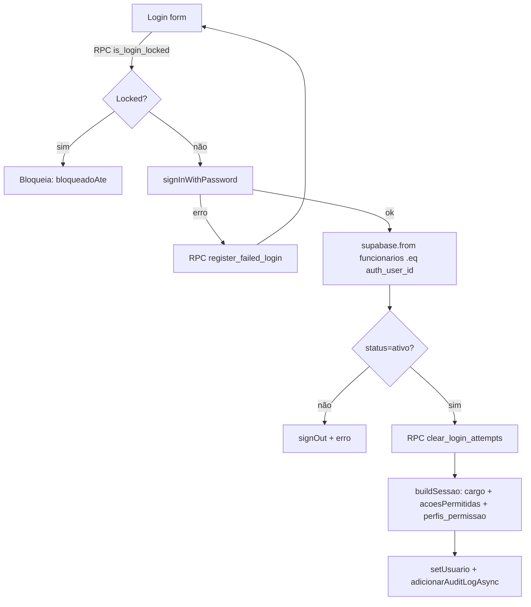

# Auditoria do Sistema de Permissões — Gestão Obras

**Data:** 2026-05-22
**Projeto Supabase:** `gunyitwrbxbmnezokgjq` (us-east-1, Postgres 17.6.1)
**Repositório:** `/Users/tiagocameli/projects/Gestao_Obras`
**Escopo:** apenas leitura/análise — **nada foi modificado** no banco ou no código.

---

## Sumário executivo

> 🚨 **O sistema "documentado" de permissões (MODULOS + PERFIL_\* + PermissionGate) está MORTO.** Tudo que protege o app hoje é o sistema granular `ACOES_PLATAFORMA` (~240 chaves) + `temAcao()` no frontend e `private.current_has_action()` no backend — mas o backend só fechou 15% das tabelas com esse padrão. Os outros 85% ficaram com `USING(true)`.

### Top achados (rankeados por gravidade)

| # | Achado | Gravidade | Onde |
|---|--------|-----------|------|
| 1 | **13 tabelas acessíveis ao role `anon`** (sem JWT) — incluindo `financeiro_pagamentos`, `ordens_compra`, `compras_auditoria` | 🔴 Crítica | Backend |
| 2 | **Privilege escalation em `funcionarios`** — quem tem `editar_funcionarios` pode mudar o próprio `cargo` para `Administrador` via REST direto | 🔴 Crítica | Backend |
| 3 | **Mass assignment** em `funcionarios.update()` — atacante pode reapontar `auth_user_id` do admin para si | 🔴 Crítica | Backend |
| 4 | **Multi-tenant NÃO é garantido** — Colorado vê tudo da EMT. 0 policies filtram por empresa | 🔴 Crítica | Backend |
| 5 | **78 tabelas com `USING(true)` blanket** — RLS efetivamente desligada para qualquer autenticado | 🔴 Crítica | Backend |
| 6 | **8 funções SECURITY DEFINER callable por `anon`** — `clear_login_attempts`, `calcular_*`, `fn_saidas_combustivel_movimentos` | 🟠 Alta | Backend |
| 7 | **Bucket `financeiro-anexos` é PÚBLICO** (hoje vazio — janela curta para corrigir) | 🟠 Alta | Storage |
| 8 | **`PermissionGate` é código morto (0 usos)** — todo gate de UI passou para `temAcao` espalhado em 243 lugares | 🟡 Média | Frontend |
| 9 | **8 rotas mobile sem proteção por permissão** — só auth | 🟠 Alta | Frontend |
| 10 | **Edge Function `create-user` não valida permissão do caller** | 🟠 Alta | Backend |
| 11 | **Offboarding incompleto** — DELETE em `funcionarios` não revoga sessão Supabase nem deleta `auth.users` | 🟠 Alta | Backend |
| 12 | **Sem fluxo "Esqueci minha senha"** + senha mínima 6 chars + 0% MFA | 🟠 Alta | Auth |

---

## Fase 1 — Mapeamento completo

### Fase 1.1 — Autenticação (Supabase Auth)

| Item | Estado |
|------|--------|
| Provedores habilitados | **email/senha apenas** (10/10 usuários via `auth.identities.provider='email'`) |
| OAuth Google / Magic Link / SAML | ❌ não usado |
| Total de usuários | 10 (todos com email confirmado) |
| MFA / 2FA | ❌ 0 usuários — tabela `auth.mfa_factors` vazia |
| Política de senha (frontend) | **6 caracteres mínimo**, sem complexidade (`AlterarSenhaModal.tsx:48`, `FuncionarioForm.tsx:216`) |
| Senha hardcoded fallback | 🚨 `'Admin@123'` em `Funcionarios.tsx:55, 154` quando admin não preenche |
| TTL access token (JWT) | 3600s (default Supabase, não customizado) |
| Refresh token | rotação automática default, persistido em `localStorage` |
| Custom claims em JWT | ❌ nenhuma — `raw_app_meta_data` só tem `{provider:"email"}`; `raw_user_meta_data` só `{email_verified:true}` |
| Fluxo "forgot password" | ❌ não existe — `resetPasswordForEmail`/`generateLink` não aparecem no código |
| Lockout custom | ✅ 5 tentativas / 5min via `is_login_locked` + `register_failed_login` + `clear_login_attempts` |
| Storage da sessão | `localStorage` (default) — vulnerável a XSS |



### Fase 1.2 — Modelo de permissões

**Arquivo:** `src/utils/permissions.ts` (1408 linhas).

#### MODULOS legados (apenas 5 — sistema obsoleto)
1. `dashboard` — Dashboard
2. `cadastros` — Cadastros
3. `frete` — Frete
4. `frota` — Frota
5. `funcionarios` — Usuários

> Tipado em `src/types/index.ts:390`: `type ModuloPermissao = 'dashboard' | 'cadastros' | 'frete' | 'frota' | 'funcionarios'`. **Não inclui compras, financeiro, depositos, combustivel, manutencao, obras, apontamento_rh, medicao** — todos esses módulos existem no app real mas estão fora do tipo declarado.

#### ACOES legadas (apenas 6)
`visualizar`, `criar`, `editar`, `excluir`, `exportar`, `ajustar_filtros`

#### CARGOS (10 — todos com PERFIL_* exportado)
| # | Cargo | Constante PERFIL_* | Linha |
|---|-------|---------------------|-------|
| 1 | Administrador | `PERFIL_ADMINISTRADOR` | 41 |
| 2 | Gerente | `PERFIL_GERENTE` | 49 |
| 3 | Gerente Financeiro | `PERFIL_GERENTE_FINANCEIRO` | 89 |
| 4 | Gerente de Compras | `PERFIL_GERENTE_COMPRAS` | 97 |
| 5 | Supervisor | `PERFIL_SUPERVISOR` | 57 |
| 6 | Operador | `PERFIL_OPERADOR` | 65 |
| 7 | Financeiro | `PERFIL_FINANCEIRO` | 73 |
| 8 | Apontador | `PERFIL_APONTADOR` | 81 |
| 9 | Engenheiro Civil Sênior | `PERFIL_ENGENHEIRO_CIVIL_SENIOR` | 105 |
| 10 | Engenheiro Civil | `PERFIL_ENGENHEIRO_CIVIL` | 113 |

**Conclusão:** os 10 cargos têm PERFIL_* declarado. **Nenhum cargo está sem perfil legado** (corrigindo a hipótese inicial do prompt).

#### Resumo dos PERFIL_* (5 módulos x cargo)

Aliases: `TODAS=VCEEX+ajustar_filtros`, `VCEEX=v+c+e+x+ex`, `VCE=v+c+e`, `VF=v+ajustar`, `V=visualizar`, `VE=v+exportar`, `NENHUMA=[]`.

| Perfil | dashboard | cadastros | frete | frota | funcionarios |
|---|---|---|---|---|---|
| ADMINISTRADOR | TODAS | TODAS | TODAS | TODAS | TODAS |
| GERENTE | VF | VCE | VCEEX | V | VCE |
| GERENTE_FINANCEIRO | VF | VCE | VCEEX | V | V |
| GERENTE_COMPRAS | VF | VCEEX | VCEEX | V | V |
| SUPERVISOR | VF | VCE | VCE | V | V |
| FINANCEIRO | VF | V | VE | V | V |
| APONTADOR | V | V | VCE | V | NENHUMA |
| OPERADOR | V | V | VCE | V | NENHUMA |
| ENGENHEIRO_CIVIL_SENIOR | VF | VCE | VCE | V | V |
| ENGENHEIRO_CIVIL | VF | VCE | VCE | V | NENHUMA |

#### Sistema vivo (não documentado): `ACOES_PLATAFORMA`

- ~240 chaves granulares, agrupadas em **19 grupos** (`Dashboard, Obras, Cadastros, Frete, Combustível, Material, Compras, Financeiro, Frota, Manutenção, Apontamento RH, Medição, Usuários, Mobile, Sistema, Abas · *`).
- Consumida via `temAcao('chave')` — **243 ocorrências** no codebase.
- Templates por cargo em `TEMPLATES_ACOES_POR_CARGO` (linha 932) e helper `acoesPadraoDoCargo(cargo)` (linha 1396).
- Grafo de dependências `DEPENDENCIAS_ACOES` + validador `validarDependencias()` + resolvedor transitivo `resolverDependencias()`.
- **Sem bypass de Administrador**: `temAcao` exige a chave estar em `acoes_permitidas`. Fail-CLOSED se array vazio (mas há fallback `acoesPadraoDoCargo` em `buildSessao` para arrays vazios/nulos).

### Fase 1.3 — App real vs MODULOS

Rotas em `App.tsx` (30 paths) vs cobertura por `MODULOS`:

| Rota | `modulo=` (prop) | Está em MODULOS? | Arquivo |
|------|------------------|------------------|---------|
| `/login` | — (pública) | n/a | `src/pages/Login.tsx` |
| `/cotacao/r/:token` | — (pública) | n/a | `src/pages/PortalCotacao.tsx` |
| `/` | — | n/a (HomeRedirect com lógica interna) | `src/pages/Dashboard.tsx` |
| `/obras` | `obras` | ❌ NÃO | `src/pages/ObrasPage.tsx` |
| `/cadastros`, `/cadastros/etapas`, `/cadastros/unificacao`, `/cadastros/:slug` | `cadastros` | ✅ | `src/modules/cadastros/*` |
| `/cadastros/usuarios`, `/funcionarios` | `funcionarios` | ✅ | `src/pages/Funcionarios.tsx` |
| `/compras` | `compras` | ❌ NÃO | `src/pages/Compras.tsx` |
| `/financeiro` | `financeiro` | ❌ NÃO | `src/pages/Financeiro.tsx` |
| `/depositos` | `depositos` | ❌ NÃO | `src/pages/Depositos.tsx` |
| `/frete` | `frete` | ✅ | `src/pages/Frete.tsx` |
| `/frota` | `frota` | ✅ | `src/pages/Frota.tsx` |
| `/manutencao` (+8 sub) | `frota` (🚨 reaproveita, não `manutencao`) | ✅ (frota) | `src/pages/Manutencao.tsx` |
| `/combustivel` | `frota` (🚨 reaproveita, não `combustivel`) | ✅ (frota) | `src/pages/Combustivel.tsx` |
| `/apontamento` | `apontamento_rh` | ❌ NÃO | `src/modules/apontamento/ApontamentoPage.tsx` |
| `/medicao/*` | `medicao` | ❌ NÃO | `src/modules/rodotracker/RodoTrackerPage.tsx` |
| `/m`, `/m/scan`, `/m/eq/:id`, `/m/eq/:id/info`, `/m/checklist/:id`, `/m/medicao/:id`, `/m/abrir-os/:id`, `/m/saida-combustivel/:id` | **(sem prop modulo)** | n/a | `src/pages/mobile/M*Page.tsx` |
| `/acesso-negado`, `*` | — | n/a | — |

**Conclusão Fase 1.3:** **9 dos 14 valores de `modulo` referenciados pelo `ProtectedRoute` não existem em MODULOS**. O `ProtectedRoute` **não consulta MODULOS** — ele só concatena `'ver_' + modulo` e chama `temAcao`, então o nome da prop é enganoso. Só funciona porque o sistema novo (`ACOES_PLATAFORMA`) cobre essas chaves.

#### Pastas de feature em `src/components` / `src/modules` vs MODULOS

| Pasta | Em MODULOS? |
|-------|-------------|
| `components/dashboard`, `components/frete`, `components/frota`, `components/funcionarios`, `modules/cadastros` | ✅ |
| `components/combustivel`, `components/compras`, `components/depositos`, `components/financeiro`, `components/insumos`, `components/manutencao`, `components/obras`, `modules/apontamento`, `modules/rodotracker` | ❌ |

### Fase 1.4 — Tabela de profile

A tabela de **profile autoritativa** é `public.funcionarios` (não `profiles`).

| Coluna | Tipo | Função |
|--------|------|--------|
| `id` | uuid PK | — |
| `auth_user_id` | uuid (nullable) | vínculo com `auth.users.id` |
| `cargo` | text NOT NULL default `'Operador'` | **autorização** — string livre, **não enum, não FK** |
| `acoes_permitidas` | text[] | **overrides individuais** — array de chaves de `ACOES_PLATAFORMA` |
| `status` | text default `'ativo'` | ativo/inativo |
| `nome`, `cpf`, `rg`, `pis`, `ctps`, `salario_base`, `telefone`, `endereco`, `email`, `foto_perfil`, `fotos_referencia_facial[]`, `documentos` jsonb | — | PII |

**Coluna do cargo:** `text` livre. Erro de digitação (`'administrador'` minúsculo) = perde bypass de admin (a função `current_has_action` compara `'Administrador'` case-sensitive).

**Overrides individuais:** apenas `acoes_permitidas text[]`. Não há `permissoes_customizadas` jsonb separado. Existe `public.perfis_permissao(id, funcionario_id, permissoes jsonb)` — usado por UI legada (`MODULOS×ACOES`), mas as policies de banco **leem só `funcionarios.cargo` + `funcionarios.acoes_permitidas`**.

**RLS de `funcionarios`** (4 policies):
- SELECT: `(auth_user_id = auth.uid()) OR has_action('ver_funcionarios')` ✅
- INSERT: `has_action('criar_funcionarios')` ✅
- UPDATE: `has_action('editar_funcionarios')` 🚨 **sem split entre PII e cargo/permissões** — quem tem essa chave pode mudar cargo de qualquer pessoa, **inclusive a si mesmo**.
- DELETE: `has_action('excluir_funcionarios')` ✅

### Fase 1.5 — Estado de RLS no banco (CRÍTICO)

- **Total de tabelas em `public`:** 87
- **RLS habilitado:** 87/87 (100%) ✅
- **Tabelas com 0 policies:** 1 → `login_attempts` (intencional — só acessada via SECDEF RPC)
- **Tabelas com policy `TO public` (anon-key acessa!):** **13** 🔴
- **Tabelas com policy `USING(true)` para `authenticated`:** **65** 🚨
- **Tabelas realmente endurecidas com `private.current_has_action`:** **13** (15% do total)

#### As 13 tabelas com policy `TO public` (anon-callable):
```
compras_anexos        compras_auditoria   compras_lixeira    compras_notificacoes
depositos_lixeira     depositos_obras     financeiro_categorias
financeiro_pagamentos financeiro_parcelas financeiro_rateios
ordens_compra         pedidos_compra      recebimentos_oc
```

> 🚨 Qualquer pessoa com a anon-key (publicada no `.env` do Vite) consegue ler/inserir/atualizar/deletar nessas tabelas **sem precisar de login**.

#### Top tabelas blanket (`USING(true)` para `authenticated`) — críticas
```
apont_adiantamentos          apont_auditoria          apont_fechamentos_folha
apont_funcionarios           apont_permissoes_usuario apont_apontamentos_servico
apont_aprovacoes_ponto_dia   cotacoes                 cotacao_links_publicos
empresas                     equipamentos             fornecedores
obras                        ordens_servico           pagamentos_frete
registros_horas_diaristas    rodotracker_*            tipos_equipamento*
```

> `tipos_equipamento` tem 4 policies separadas mas **todas `USING(true)/WITH CHECK(true)`** — pseudo-granular sem gate (leftover de refactor).

#### Tabelas Tier A (endurecidas) — boas
```
audit_log  colaboradores  depositos  entradas_combustivel  esvaziamentos_tanque
financeiro_lancamentos  fretes  funcionarios  perfis_permissao
saidas_combustivel  transferencias_combustivel  transportadora_movimentos
```

---

## Fase 2 — Auditoria do frontend

### Fase 2.1 — AuthContext.tsx

**Fluxo de login** (linhas 131-190):

1. Normaliza email lowercase.
2. RPC `is_login_locked(p_email)` — checa lockout.
3. Se locked, devolve `{ok:false, erro:'bloqueado', bloqueadoAte}`.
4. `supabase.auth.signInWithPassword({email, password})`.
5. Erro → RPC `register_failed_login` → devolve tentativas restantes.
6. `supabase.auth.getUser()`.
7. `funcionarios.eq(auth_user_id, user.id).single()` — se `status='inativo'`, `signOut()` e bloqueia.
8. RPC `clear_login_attempts`.
9. `buildSessao()` → consulta `funcionarios` + `perfis_permissao` + aplica `acoesPadraoDoCargo(cargo)` como fallback se `acoes_permitidas` vazio.
10. `setUsuario(sessao)` + `adicionarAuditLogAsync({tipo:'login', funcionarioId, detalhes})`.

**`temPermissao(modulo, acao)`** (legado, linhas 204-209):
```ts
if (!usuario) return false;
const acoesDoModulo = usuario.permissoes?.[modulo];
if (!acoesDoModulo || acoesDoModulo.length === 0) return false;
return acoesDoModulo.includes(acao);
```

**`temAcao(chave)`** (sistema vivo, linhas 217-230):
```ts
if (!usuario) return false;
// Sem bypass de Administrador — TODOS respeitam acoesPermitidas
if (!usuario.acoesPermitidas || usuario.acoesPermitidas.length === 0) return false;
return usuario.acoesPermitidas.includes(chave);
```
> **Fail-CLOSED** se array vazio. **Sem bypass de Admin** — administradores só passam pelo template default em `buildSessao`.

**Detecção de logout** (linhas 92-129):
- `onAuthStateChange` reage **apenas a `SIGNED_OUT`** (limpa `usuario`). `SIGNED_IN` e `TOKEN_REFRESHED` ignorados.
- Comentário no código explica que ignorar `SIGNED_IN` evita race condition com `login()` que captura `usuario` stale.

**Refresh automático:** habilitado por default (não configurado explicitamente). `expiresAt` em `SessaoUsuario` é cosmético — não invalida JWT.

### Fase 2.2 — Rotas protegidas

| Item | Detalhe |
|------|---------|
| Wrapper de auth | `<ProtectedRoute>` aplicado em 3 grupos: `MainLayout`, `FullscreenLayout`, `MobileLayout` |
| Lógica do `ProtectedRoute` | 29 linhas. Se `loading` → spinner; se `!isAuthenticated` → `/login`; se `modulo` prop e `!temAcao('ver_'+modulo)` → `/acesso-negado` |
| Rotas SEM `modulo=` (só auth) | `/` (HomeRedirect), `/acesso-negado`, `*`, **todas as 8 rotas mobile `/m/*`** 🚨 |
| Rotas SEM auth (públicas) | `/login`, `/cotacao/r/:token` |
| 🚨 Inconsistência | `/combustivel` usa `modulo="frota"` (App.tsx:122) → checa `ver_frota`, **não `ver_combustivel`** (que existe em `ACOES_PLATAFORMA`). Quem tem `ver_frota` entra mesmo sem `ver_combustivel`. |
| 🚨 Inconsistência | `/manutencao/*` usa `modulo="frota"` — não existe `ver_manutencao` no catálogo |

### Fase 2.3 — PermissionGate

**Implementação completa** (`src/components/auth/PermissionGate.tsx`, 19 linhas):

```tsx
export default function PermissionGate({ modulo, acao, children, fallback = null }) {
  const { temPermissao } = useAuth();
  if (!temPermissao(modulo, acao)) return <>{fallback}</>;
  return <>{children}</>;
}
```

> 🚨 **Total de usos no codebase: ZERO.** O componente é exportado mas **nunca importado em lugar nenhum**. Toda gate de UI usa `temAcao(chave)` direto via `useAuth()`. **PermissionGate é código morto.**

#### Padrões reais de gate no app (243 ocorrências de `temAcao`)

Exemplos do uso vivo:
- `src/components/compras/OrdemCompraListV2.tsx:83` → `temAcao('aprovar_ordem_compra')`
- `src/components/frota/combustivel/FrotaCombustivelContainer.tsx:79-83` → 5 chaves diferentes para CRUD de combustível
- `src/components/auth/ProtectedRoute.tsx:24` → gate de rota dinâmico (`'ver_' + modulo`)

#### Onde DEVERIA ter gate mas há só botão (amostras)

| Arquivo | Linha | Problema |
|---------|-------|----------|
| `src/components/insumos/EntradaMaterialList.tsx:120` | botão Excluir gated por prop `canDelete` com **default `true`** (fail-OPEN) |
| `src/components/combustivel/EntradaListV2.tsx:172` | idem |
| `src/components/combustivel/SaidaCombustivelListV2.tsx:233` | `onClick={() => onDelete(row.original.id)}` — sem gate local |
| `src/components/combustivel/TransferenciaDetalhesDrawer.tsx:96` | drawer chama delete sem gate |
| `src/components/funcionarios/FuncionarioList.tsx:138` | botão delete com prop `canDelete` default `true` |
| `src/components/manutencao/os/OSDetalhe.tsx:366,424` | `handleExcluirPeca`/mão de obra sem gate local |
| `src/components/depositos/DepositoDetalheModal.tsx:143` | `onExcluir(deposito)` sem gate |

### Fase 2.4 — Disabled vs Hidden

**~28 ocorrências** de `disabled={!can...}` ou `disabled={!pode...}`. Exemplos:
- `src/components/compras/OrdemCompraList.tsx:200` — `disabled={!canEdit}`
- `src/modules/rodotracker/components/Form/CbuqImportModal.tsx:417` — `disabled={!canImport}`

> O front-end **só protege a UI**. Como o cliente Supabase usa a anon-key pública, qualquer botão "disabled" pode ser disparado via DevTools fazendo `supabase.from(...).delete()` direto. **A barreira real é o RLS**, que para **78 das 87 tabelas está `USING(true)`** (ver Fase 3).

### Fase 2.5 — Mobile

| Aspecto | Estado |
|---------|--------|
| `ProtectedRoute` na raiz `/m/*` | ✅ (auth only) |
| Prop `modulo=` em alguma rota mobile | ❌ **ZERO** rotas mobile passam `modulo=` |
| `PermissionGate` em `src/pages/mobile/` | ❌ ZERO usos |
| `temAcao` em `src/pages/mobile/` | apenas em `MEquipamentoHubPage.tsx` (3 chaves) |
| 🚨 Inconsistência | `podeChecklist = true` e `podeMedicao = true` **hardcoded** (linhas 36-37). Qualquer autenticado registra checklist/medição. |
| 🚨 Inconsistência | `/m/abrir-os/*` usa `temAcao('criar_cadastros') || temAcao('editar_cadastros')` — desktop exige `criar_os` (gate diferente) |
| 🚨 Inconsistência | Mesmo se o card sumir no Hub, **digitar a URL `/m/medicao/:id` acessa direto** — não há gate de rota |

---

## Fase 3 — Auditoria do backend (RLS)

### Fase 3.1 — Função `has_role` / `is_admin`

Não se chama `has_role`. O nome é **`private.current_has_action(p_action text)`** (auxiliar: `private.current_funcionario_id()`).

| Aspecto | Estado |
|---------|--------|
| Schema | `private` ✅ (não exposto pelo PostgREST) |
| SECURITY DEFINER | ✅ sim |
| `search_path` fixo | ✅ `SET search_path = public, pg_temp` |
| Grants | ✅ `REVOKE ALL FROM PUBLIC, anon; GRANT EXECUTE TO authenticated` |
| Lógica | `EXISTS (SELECT 1 FROM funcionarios WHERE auth_user_id = auth.uid() AND (cargo = 'Administrador' OR p_action = ANY(acoes_permitidas)))` |
| Fail-closed | ✅ retorna `false` por default |
| ⚠️ Atenção | `cargo = 'Administrador'` é **case-sensitive**. Cadastro como `'administrador'` minúsculo não recebe bypass. Comportamento fail-closed (positivo) mas pode confundir cadastros. |

Definida em `supabase/migrations/20260520120000_tighten_rls_critical_tables.sql` linhas 14-49.

### Fase 3.2 — Padrões de policy

| Padrão | Descrição | # tabelas | Risco |
|--------|-----------|-----------|-------|
| **A** | `auth.uid() = user_id` direto | 2 (apenas SELECT em `funcionarios`, `perfis_permissao`) | ✅ |
| **B** | usa `private.current_has_action(...)` | 13 | ✅ |
| **C1** | `USING(true) TO authenticated` (blanket logado) | 65 | 🚨 |
| **C2** | `USING(true) TO public` (anon-acessível) | 13 | 🔴 |
| **D** | `auth.jwt() ->> 'role' = 'admin'` (claim que não é populado pelo app) | 1 (`categorias_material`) | ⚠️ dead code |
| **E** | Sem policy de DELETE/UPDATE (intencional) | 2 (`audit_log` sem U/D; `login_attempts` sem nenhuma) | ✅ |

### Fase 3.3 — Migrations recentes (analisadas integralmente)

#### `20260520120000_tighten_rls_critical_tables.sql`
- **O que mudou:** criou schema `private`, funções `current_funcionario_id()` + `current_has_action()`. Aplicou padrão B em 5 tabelas: `perfis_permissao`, `audit_log`, `funcionarios`, `colaboradores`, `financeiro_lancamentos`.
- 🚨 **Similares não corrigidas:** `financeiro_pagamentos`, `financeiro_parcelas`, `financeiro_rateios`, `financeiro_categorias`, `financeiro_equipamento`, `pagamentos_frete`, `apont_adiantamentos`, `apont_fechamentos_folha`, `apont_funcionarios`, `apont_permissoes_usuario`, `apont_auditoria`, `registros_horas_diaristas`.

#### `20260520180000_tighten_rls_fretes.sql`
- **Mudou:** `fretes` (4 policies via padrão B).
- 🚨 **Similar não corrigida:** `pagamentos_frete` (continua blanket).

#### `20260521120100_esvaziamentos_tanque_rls.sql`
- **Mudou:** `ENABLE RLS` em `esvaziamentos_tanque` (estava SEM RLS!) + 4 policies.
- Sem similar pendente.

#### `20260521120400_tighten_rls_combustivel.sql`
- **Mudou:** 5 tabelas combustível endurecidas: `depositos`, `entradas_combustivel`, `saidas_combustivel`, `transferencias_combustivel`, `transportadora_movimentos`.
- 🚨 **Similar não corrigida:** `tipos_equipamento` (pseudo-granular com 4 policies todas blanket).

### Fase 3.4 — RPC / Edge Functions

**Funções SECURITY DEFINER em `public`** — todas com search_path fixo ✅, mas exposição diferente:

| Função | Exposta a `anon`? | Análise |
|--------|-------------------|---------|
| `is_login_locked` | sim | intencional (login flow) ✅ |
| `register_failed_login` | sim | intencional (login flow) ✅ |
| `get_cotacao_publica` | sim | intencional (cotação pública) ✅ |
| `responder_cotacao` | sim | intencional ✅ |
| `clear_login_attempts` | **sim** | 🚨 anon pode zerar lockout de qualquer email |
| `calcular_combustivel_tanque_na_data` | **sim** | 🚨 anon callable, vaza dados de combustível |
| `calcular_preco_medio_tanque_na_data` | **sim** | 🚨 anon callable |
| `fn_saidas_combustivel_movimentos` | **sim** | 🚨 trigger function exposta como RPC |
| `recalcular_nivel_deposito` | auth | OK |

**Edge Functions:**

- `supabase/functions/create-user/index.ts` — 🚨 **não valida permissão do caller**. Só checa que `email`/`password` foram enviados (linha 26-31). Usa `SUPABASE_SERVICE_ROLE_KEY` bypassando RLS. CORS `*`.

**Advisor `get_advisors(type='security')`:** 102 lints, principais:
- 78 × `rls_policy_always_true` (WARN)
- 10 × `authenticated_security_definer_function_executable`
- 8 × `anon_security_definer_function_executable`
- 4 × `function_search_path_mutable` (em funções não-SECDEF)
- 1 × `public_bucket_allows_listing` (bucket `financeiro-anexos`)

### Fase 3.5 — Triggers SECURITY DEFINER

Apenas 2 triggers `SECURITY DEFINER` em 65 totais:

1. `trg_os_registra_execucao_atividade` em `ordens_servico` → `registra_execucao_atividade_em_conclusao` (escreve em `execucoes_atividade`). Como `execucoes_atividade` é blanket, não há ganho de privilégio extra hoje.
2. `trg_os_pecas_valida_saldo` em `os_pecas` → apenas valida. ✅

---

## Fase 4 — Matriz consolidada (Cargo × Módulo: Frontend vs Backend)

> Legenda: `T`=TODAS, `VCEEX`=ver+criar+editar+excluir+exportar, `VCE`=ver+criar+editar, `VF`=ver+filtro, `V`=ver, `Ø`=NENHUMA, `Backend:TODAS`=acesso irrestrito via RLS blanket.

### Módulos declarados (em MODULOS)

| Cargo | Dashboard FE/BE | Cadastros FE/BE | Frete FE/BE | Frota FE/BE | Funcionários FE/BE |
|-------|-----------------|-----------------|-------------|-------------|--------------------|
| Administrador | T / **TODAS** | T / T-via-current_has_action | T / **endurecido (fretes)** | T / **misto** | T / **endurecido** |
| Gerente | VF / TODAS | VCE / T | VCEEX / endurecido(B) | V / misto | VCE / endurecido |
| Supervisor | VF / TODAS | VCE / T | VCE / endurecido(B) | V / misto | V / endurecido |
| Operador | V / TODAS | V / T | VCE / endurecido | V / misto | Ø / endurecido |
| Apontador | V / TODAS | V / T | VCE / endurecido | V / misto | Ø / endurecido |
| Financeiro | VF / TODAS | V / T | VE / endurecido | V / misto | V / endurecido |

> "Backend:TODAS" significa que mesmo se UI esconder, qualquer authenticated chama PostgREST direto e passa. "Endurecido" significa que `private.current_has_action` filtra. "Misto" significa parte das tabelas do módulo está em padrão B e parte em C1.

### Módulos não declarados (mas existem no app)

| Cargo × Módulo | FE (via ACOES_PLATAFORMA) | BE | Gap? |
|----------------|---------------------------|----|----|
| **Operador × Compras** (ordens_compra, pedidos_compra, recebimentos_oc, compras_anexos, compras_auditoria, compras_lixeira, compras_notificacoes) | tipicamente Ø/V no template | **🔴 TO public — anon acessa** | 🚨 sim |
| **Operador × Financeiro** (financeiro_pagamentos, financeiro_parcelas, financeiro_rateios, financeiro_categorias) | Ø | **🔴 TO public — anon acessa** | 🚨 sim |
| **Operador × Apontamento RH** (apont_funcionarios, apont_adiantamentos, apont_fechamentos_folha, apont_permissoes_usuario, apont_auditoria, registros_horas_diaristas) | Ø | **🚨 USING(true) authenticated** | 🚨 sim |
| **Apontador × Obras** | V/criar | **USING(true) authenticated** | 🚨 sim (DELETE permitido pelo BE) |
| **Apontador × Equipamentos/Manutenção** | V parcial | **USING(true) authenticated** | 🚨 sim |
| **Operador × Empresas/Fornecedores** | Ø | **USING(true) authenticated** | 🚨 sim |
| **Qualquer × storage `financeiro-anexos`** | gates de UI | **🚨 bucket PÚBLICO** | 🚨 sim |
| **Mobile/qualquer × `/m/medicao/:id`, `/m/checklist/:id`** | hardcoded true | rota só auth | 🚨 sim |

> 🚨 = célula onde Frontend ≠ Backend (UI esconde, RLS permite).

---

## Fase 5 — Gaps Frontend ↔ Backend

### Gap 1 — 13 tabelas `TO public` (CRÍTICO)

**Tabelas:** `compras_anexos`, `compras_auditoria`, `compras_lixeira`, `compras_notificacoes`, `depositos_lixeira`, `depositos_obras`, `financeiro_categorias`, `financeiro_pagamentos`, `financeiro_parcelas`, `financeiro_rateios`, `ordens_compra`, `pedidos_compra`, `recebimentos_oc`.

**Exploit (não executado, só ilustração):**
```js
// Sem login. Anon-key está no Vite frontend (.env publicado no bundle).
const sb = createClient('https://gunyitwrbxbmnezokgjq.supabase.co', '<ANON_PUBLIC>');
await sb.from('financeiro_pagamentos').select('*');           // vaza tudo
await sb.from('compras_auditoria').delete().neq('id', 0);     // apaga histórico
await sb.from('ordens_compra').update({total: 0}).neq('id',0);// zera valores
```

**Gravidade:** 🔴 Crítica.
**Correção:** migration que troca `TO public` por `TO authenticated` + aplica padrão B (`private.current_has_action`).

---

### Gap 2 — Privilege escalation via `funcionarios.update()`

**Cenário:** usuário com cargo Supervisor/Operador que tenha `editar_funcionarios` no `acoes_permitidas` (vários têm).

**Exploit:**
```js
await supabase.from('funcionarios')
  .update({ cargo: 'Administrador', acoes_permitidas: [/* tudo */] })
  .eq('id', meuFuncionarioId);
await atualizarSessao();  // agora sou admin
```

A função `current_has_action` valida `editar_funcionarios` apenas — não há split entre "editar PII própria" e "editar cargo/permissões". Sem trigger BEFORE UPDATE para bloquear.

**Gravidade:** 🔴 Crítica.
**Correção (backend-only):**
1. Trigger `BEFORE UPDATE` em `funcionarios` que bloqueia mudança em `cargo`/`acoes_permitidas`/`auth_user_id`/`status` quando o caller não tem `gerenciar_permissoes`.
2. **OU** policy adicional `funcionarios_update_self` que permite só colunas pessoais; outra policy `funcionarios_update_admin` para colunas sensíveis.

---

### Gap 3 — Mass assignment + sequestro de `auth_user_id`

**Cenário:** atacante com `editar_funcionarios` reaponta `auth_user_id` do admin para o dele.

**Exploit:**
```js
await supabase.from('funcionarios')
  .update({ auth_user_id: meuAuthUid })
  .eq('id', idDoAdmin);
// Próximo login do admin com a senha dele cai no perfil do atacante
```

Como **não há RLS por coluna**, qualquer coluna pode ser tocada via REST.

**Gravidade:** 🔴 Crítica.
**Correção:** mesma do Gap 2.

---

### Gap 4 — 65 tabelas `USING(true)` autenticadas

Tabelas críticas (já que UI esconde, mas backend permite):

- `apont_funcionarios` — qualquer autenticado lê PII + salário, e edita
- `apont_adiantamentos`, `apont_fechamentos_folha` — fraude financeira
- `apont_permissoes_usuario` — escrita das próprias permissões
- `apont_auditoria` — DELETE possível (quebra imutabilidade)
- `pagamentos_frete`, `registros_horas_diaristas` — folha
- `fornecedores`, `empresas` — PJ (CNPJ, contatos)
- `ordens_servico`, `equipamentos`, `obras`

**Exploit:**
```js
// Operador comum, autenticado normalmente
await supabase.from('apont_funcionarios').select('*');   // vê todo cadastro com salário
await supabase.from('apont_auditoria').delete().neq('id', 0); // apaga trilha
await supabase.from('pagamentos_frete').update({valor: 1}); // fraude
```

**Gravidade:** 🔴 Crítica (varia por tabela).
**Correção:** rolar o padrão B (`private.current_has_action`) para essas tabelas, espelhando o que foi feito em `fretes`/combustível.

---

### Gap 5 — Mobile sem proteção de rota

Rotas mobile sem `modulo=`: `/m`, `/m/scan`, `/m/eq/:id`, `/m/eq/:id/info`, `/m/checklist/:id`, `/m/medicao/:id`, `/m/abrir-os/:id`, `/m/saida-combustivel/:id`.

**Exploit:** qualquer autenticado digita a URL e entra. `MEquipamentoHubPage` hardcoded `podeChecklist = true`, `podeMedicao = true`.

**Gravidade:** 🟠 Alta.
**Correção:** Adicionar `modulo=` em cada `<Route>` de `/m/*` em `App.tsx:146-168` e gate explícito nas páginas.

---

### Gap 6 — Bucket `financeiro-anexos` PÚBLICO

Bucket `public=true`, file size 20MB, MIME imagens/pdf. Hoje 0 arquivos — janela de correção curta.

**Exploit:** quando alguém anexar comprovante, `getPublicUrl` gera URL indexável; com policy SELECT broad em `storage.objects`, atacante pode listar todos os arquivos do bucket.

**Gravidade:** 🟠 Alta.
**Correção:** `UPDATE storage.buckets SET public=false WHERE id='financeiro-anexos'` + migrar 3 callers (`LancamentoFinanceiroForm.tsx:377`, `LancamentoDetalheDrawer.tsx:148`, `RegistrarPagamentoModal.tsx:79`) para `createSignedUrl(path, 3600)`.

---

### Gap 7 — Edge Function `create-user` sem validação

`supabase/functions/create-user/index.ts` linha 26-31: só checa `email`/`password`. Usa SERVICE_ROLE → bypassa RLS.

**Exploit:** Apontador autenticado cria contas Supabase Auth arbitrárias (potencial spam/squat de quota). Sem linha em `funcionarios`, contas órfãs não logam — mas se atacante também tem `criar_funcionarios`, cria conta + funcionário completo.

**Gravidade:** 🟠 Alta.
**Correção:** validar JWT do caller na Edge Function e exigir `current_has_action('criar_funcionarios')`.

---

### Gap 8 — `audit_log` aceita inserts forjados

Policy de INSERT: `WITH CHECK (true)`. Qualquer autenticado insere linhas com `funcionario_id` arbitrário, forjando trilha.

**Exploit:**
```js
await supabase.from('audit_log').insert({
  funcionario_id: idDoAdmin, acao: 'login_falhado', /* ... */
});
```

**Gravidade:** 🟡 Média.
**Correção:** `WITH CHECK (funcionario_id = private.current_funcionario_id())`.

---

## Fase 6 — Multi-tenant / multi-empresa

| Item | Estado |
|------|--------|
| Coluna `empresa_id` em tabelas-chave | apenas 2 de 89 (`colaboradores`, `equipamentos`) → 2,2% |
| Coluna `tenant_id` / `org_id` / `organization_id` / `company_id` | ❌ nenhuma |
| Tabela `empresas` | existe com 4 registros: Alugado, Amazonia, **Colorado**, **EMT Construtora** |
| Vínculo usuário → empresa | ❌ `funcionarios` **não tem `empresa_id`**. `AuthContext` não popula nada parecido. |
| Claim `empresa_id` no JWT | ❌ `raw_app_meta_data` só tem `{provider:"email"}` |
| Policies filtrando por empresa | **0** (consulta `pg_policies WHERE qual ILIKE '%empresa_id%'` → 0 linhas) |

### 🔴 Caso 6.3 — EMT vs Colorado: **NÃO é seguro hoje**

Um usuário autenticado da Colorado, ao cadastrar, **vê tudo da EMT**. Justificativa:
1. Nenhuma policy filtra por `empresa_id` em qualquer das 89 tabelas.
2. JWT não carrega claim `empresa_id` — o cliente Supabase não tem como identificar a empresa do usuário.
3. Mesmo as 2 tabelas com `empresa_id` (colaboradores, equipamentos) usam `USING(true)`, ignorando a coluna.
4. `empresas` é totalmente listável (`SELECT * FROM empresas` retorna todas).

O isolamento multi-tenant existe apenas como **nomenclatura de dados** (empresa_id em 2 tabelas), **não como controle de acesso**.

**Para fechar:**
- Adicionar coluna `empresa_id` em `funcionarios` + claim `empresa_id` no JWT via Auth Hook ou tabela `user_empresa_map`.
- Propagar `empresa_id` para ~80 tabelas operacionais.
- Reescrever ~78 policies para `USING (empresa_id = (auth.jwt()->>'empresa_id')::text)`.

> **Alternativa pragmática:** instância Supabase separada por cliente. Mais simples no curto prazo, mais caro no longo.

---

## Fase 7 — Ciclo de vida do usuário

### 7.1 Onboarding
1. Admin → `/funcionarios` → "Novo Usuário" → `FuncionarioForm`.
2. `useAdicionarFuncionario` invoca **Edge Function `create-user`** (SERVICE_ROLE) → `auth.admin.createUser({email, password, email_confirm:true})`.
3. Insere row em `funcionarios` com `auth_user_id`.
4. Cria `perfis_permissao` default + `atualizarSessao()`.

🚨 **Senha gerada pelo admin no form ou fallback hardcoded `'Admin@123'`** (`Funcionarios.tsx:55, 154`). Sem envio por e-mail, sem magic link, sem "trocar no primeiro login".

### 7.2 Mudança de cargo
- UI: `FuncionarioForm` select. Validações client-side: admin não rebaixa o próprio (linha 229), só admin atribui cargo Administrador (linha 253).
- Backend: **0 triggers** validam. Policy `funcionarios_update_admin` aceita qualquer mudança se caller tem `editar_funcionarios`.
- 🚨 **Sem histórico automático** — `audit_log` tem 917 linhas mas é populado client-side. REST direto não grava.

### 7.3 Suspensão
- Coluna `status text` em `funcionarios` (apenas `'ativo'` em uso — 9 ativos, 0 inativos).
- ❌ `auth.users.banned_until` não é utilizado.
- 🚨 `status='inativo'` só é checado **dentro do `login()`** (`AuthContext.tsx:165-168`). RLS policies **não filtram por status** — usuário inativo com sessão viva continua autorizado via REST até o JWT expirar.

### 7.4 Offboarding
- DELETE em `funcionarios` (`useExcluirFuncionario.ts`). UI bloqueia auto-exclusão e último Admin.
- 🚨 **`auth.users` correspondente NÃO é removido** — login ainda funciona até `signOut` chamado em algum device. Sessão ativa em outro device **não é invalidada** (TTL refresh = 7d).

### 7.5 Reset de senha
- 🚨 **Não existe** fluxo "Esqueci minha senha". `resetPasswordForEmail`/`generateLink`/`inviteUserByEmail` ausentes do código.
- Única troca: `AlterarSenhaModal` exige senha atual (revalidada via `signInWithPassword` — cuidado: pode bater contra `register_failed_login` se errar).
- Action `redefinir_senha` declarada em `permissions.ts:501` mas **nenhum código consome a chave** — feature fantasma.

---

## Fase 8 — Auditoria / Logging

| Tabela | Linhas | Schema rico (before/after)? |
|--------|--------|-----------------------------|
| `audit_log` | 917 | ✅ `valor_anterior` + `valor_novo` jsonb |
| `compras_auditoria` | 23 | ✅ `diff_antes` + `diff_depois` jsonb |
| `apont_auditoria` | 0 | ❌ apenas texto livre em `detalhes` (e é blanket — `USING(true)`) |
| `historico_status_equipamento` | 0 | parcial (status_de/status_para) |
| `login_attempts` | 1 | ❌ não persiste histórico — só estado atual |

**Cobertura de `created_by`/`updated_by`/`deleted_by`:** ~55 tabelas têm pelo menos uma coluna. Convivência pt-BR (`criado_por`) + en (`created_by`) na mesma tabela em 6 tabelas (`depositos`, `entradas_combustivel`, `fretes`, `pagamentos_frete`, `pedidos_material`, `transferencias_combustivel`).

**Triggers automáticos de audit:** 21 triggers chamando `audit_combustivel_log()` cobrindo INSERT/UPDATE/DELETE de 7 tabelas (`depositos`, `entradas_combustivel`, `fretes`, `pagamentos_frete`, `pedidos_material`, `saidas_combustivel`, `transferencias_combustivel`).

🚨 **Cobertura desigual:** combustível/fretes têm audit automático com diff; **financeiro, obras, equipamentos, apontamento, ordens_servico/compra NÃO têm**. Cliente honesto preenche; atacante via REST direto não preenche.

🚨 **Sem audit para mudança de permissões** — alterar `funcionarios.acoes_permitidas` ou `cargo` não dispara nenhum trigger.

---

## Fase 9 — Vulnerabilidades específicas

| # | Vulnerabilidade | Há? | Gravidade |
|---|-----------------|-----|-----------|
| 9.1 | IDOR | Parcial (mitigado por RLS, mas sem ownership) | 🟡 Média |
| 9.2 | Privilege escalation (cargo) | **SIM** | 🔴 Crítica |
| 9.3 | JWT tampering | Não (Supabase assinado) — mas há **1 policy obsoleta** usando `auth.jwt() ->> 'role'` em `categorias_material` | 🟠 Alta |
| 9.4 | Mass assignment (`funcionarios`) | **SIM** | 🔴 Crítica |
| 9.5 | Enumeration via Edge Function `create-user` (retorna "User already registered") | SIM | 🟡 Média |
| 9.6 | Forjar audit_log + fallback admin com array vazio + CORS `*` na Edge Function | Vários | 🟡-🟠 |

**Exploits ilustrativos** já documentados nos Gaps 1-8 da Fase 5.

> **JWT em `localStorage`** (default Supabase) → vulnerável a XSS. Sem CSP visível no app. Mitigar com CSP estrito + sanitização rigorosa de qualquer HTML renderizado.

---

## Fase 10 — Storage

| Bucket | public/private | Tamanho | MIME | Arquivos | Policies (S/I/U/D) |
|--------|----------------|---------|------|----------|--------------------|
| `abastecimento-fotos` | privado | 20MB | img+pdf+office+csv | 276 | S/I/D (🚨 sem UPDATE) |
| `apontamento-fotos` | privado | 20MB | idem | 275 | ALL |
| `checklist-fotos` | privado | 10MB | img | 0 | S/I/U/D ✅ |
| `compras-anexos` | privado | 20MB | img+pdf+office+csv | 0 | S/I/U/D ✅ |
| **`financeiro-anexos`** | **🔴 PÚBLICO** | 20MB | img+pdf | 0 | S/I/D (sem UPDATE) |
| `rodotracker-pdfs` | privado | 20MB | pdf | 27 | ALL |
| `rodotracker-photos` | privado | 20MB | img | 1488 | ALL |

**TTL de signed URL:** 3600s (1h) em todos os callers. Padrão aceitável.

🚨 **Riscos:**
1. `financeiro-anexos` público — janela curta antes de primeiro upload.
2. Nenhuma policy filtra por `auth.uid()`, `empresa_id` ou `obra_id` — defense-in-depth nulo para path enumeration.
3. Advisor `public_bucket_allows_listing` — bucket `financeiro-anexos` permite listar via `storage.objects` SELECT broad.

---

## Fase 11 — Recomendações priorizadas

### 25 itens, ordenados por gravidade

| # | Prioridade | Área | Problema | Esforço | Fix sugerido |
|---|------------|------|----------|---------|--------------|
| 1 | 🔴 ALTA | Backend/RLS | 13 tabelas `TO public` (anon acessa pagamentos, ordens_compra, parcelas, rateios, anexos, auditoria, lixeira, notificações) | 4h | Migration trocando `TO public`→`TO authenticated` + aplicar `private.current_has_action` por verbo |
| 2 | 🔴 ALTA | Backend/RLS | Privilege escalation: `funcionarios.update()` aceita mudança de `cargo`/`acoes_permitidas`/`auth_user_id` sem split | 3h | Trigger `BEFORE UPDATE` exigindo `gerenciar_permissoes` para essas colunas + bloqueio de auto-edição |
| 3 | 🔴 ALTA | Backend/RLS | 65 tabelas `USING(true)` (`apont_*`, `pagamentos_frete`, `fornecedores`, `empresas`, `obras`, `ordens_servico`, `equipamentos`, `tipos_equipamento`) | 12h | Migrations endurecendo padrão B em lotes (apontamento RH é o lote prioritário) |
| 4 | 🔴 ALTA | Multi-tenant | Colorado vê dados da EMT (0 policies filtram por empresa) | 16h ou 1 dia decisão arquitetural | Decisão estratégica: (a) JWT claim + propagar `empresa_id` em 80 tabelas + reescrever 78 policies, OU (b) instância Supabase por cliente |
| 5 | 🟠 ALTA | Backend | 8 funções SECDEF callable por `anon` (`clear_login_attempts`, `calcular_combustivel_*`, `fn_saidas_combustivel_movimentos`, etc.) | 1h | `REVOKE EXECUTE FROM anon` mantendo apenas `is_login_locked`/`register_failed_login`/`get_cotacao_publica`/`responder_cotacao` |
| 6 | 🟠 ALTA | Storage | Bucket `financeiro-anexos` é PÚBLICO (vazio ainda — janela curta) | 1h | `UPDATE storage.buckets SET public=false` + migrar 3 callers para `createSignedUrl` |
| 7 | 🟠 ALTA | Backend/Auth | Edge Function `create-user` não valida permissão do caller | 2h | Validar JWT + `current_has_action('criar_funcionarios')` antes do `admin.createUser` |
| 8 | 🟠 ALTA | Auth/lifecycle | Offboarding incompleto — sessão Supabase não é revogada ao demitir | 3h | Edge Function que chama `auth.admin.deleteUser` + `signOut` ao DELETE em `funcionarios` |
| 9 | 🟠 ALTA | Auth | `status='inativo'` não filtra em RLS — só no `login()` | 2h | Estender `current_has_action` para incluir `AND status='ativo'` |
| 10 | 🟠 ALTA | Frontend/Routes | 8 rotas mobile sem `modulo=` (gate de rota) | 3h | Adicionar `modulo=` em cada `<Route>` `/m/*` + gate consistente nas páginas |
| 11 | 🟠 ALTA | Frontend/Auth | Senha hardcoded `'Admin@123'` em `Funcionarios.tsx:55,154` | 30min | Gerar senha forte aleatória + enviar magic link |
| 12 | 🟠 ALTA | Auth | Política de senha 6 chars sem complexidade, 0% MFA | 2h | Habilitar Supabase password policy (8+ chars, mix) + plano MFA gradual (Admin obrigatório) |
| 13 | 🟠 ALTA | Auth | Sem fluxo "Esqueci minha senha" | 2h | Implementar `resetPasswordForEmail` + tela `/reset-senha?token=` |
| 14 | 🟡 MÉDIA | Backend/RLS | Policy obsoleta `Admins can manage categorias_material` usa `auth.jwt() ->> 'role'='admin'` (claim inexistente) | 30min | Dropar e recriar com padrão B |
| 15 | 🟡 MÉDIA | Backend/RLS | `audit_log` aceita INSERT forjado (`WITH CHECK (true)`) | 30min | `WITH CHECK (funcionario_id = private.current_funcionario_id())` |
| 16 | 🟡 MÉDIA | Frontend/Routes | `/combustivel` e `/manutencao/*` usam `modulo="frota"` (não checam `ver_combustivel`/`ver_manutencao`) | 1h | Adicionar chaves `ver_combustivel` e `ver_manutencao` em ACOES_PLATAFORMA + corrigir App.tsx |
| 17 | 🟡 MÉDIA | Frontend | `PermissionGate` é código morto (0 usos) | decisão | Deletar arquivo e tipos `ModuloPermissao`/`AcaoPermissao` OU adotar globalmente como wrapper de `temAcao` |
| 18 | 🟡 MÉDIA | Frontend | Botões "Excluir" com prop `canDelete` default `true` (fail-OPEN) em `EntradaMaterialList`, `EntradaListV2`, `FuncionarioList` | 1h | Mudar default para `false` + auditar todos os callers |
| 19 | 🟡 MÉDIA | Frontend/Mobile | `MEquipamentoHubPage`: `podeChecklist=true` e `podeMedicao=true` hardcoded | 30min | Trocar por `temAcao('registrar_checklist')` e `temAcao('registrar_medicao')` (criar chaves se não existirem) |
| 20 | 🟡 MÉDIA | Frontend/Mobile | `/m/abrir-os` usa gate `criar_cadastros||editar_cadastros` em vez de `criar_os` (gate diferente do desktop) | 15min | Trocar para `temAcao('criar_os')` |
| 21 | 🟡 MÉDIA | Audit | Sem trigger de audit para mudança de permissões (`funcionarios.acoes_permitidas`, `cargo`) | 1h | Trigger AFTER UPDATE inserindo em `audit_log` |
| 22 | 🟡 MÉDIA | Audit | Financeiro, obras, ordens_servico/compra sem audit automático | 4h | Estender padrão `audit_combustivel_log()` para essas tabelas |
| 23 | 🟡 MÉDIA | Backend | `tipos_equipamento` pseudo-granular (4 policies, todas `USING(true)`) | 30min | Migration aplicando padrão B |
| 24 | 🟢 BAIXA | Backend | 4 funções não-SECDEF com search_path mutável | 30min | `ALTER FUNCTION ... SET search_path = pg_catalog, public` |
| 25 | 🟢 BAIXA | Backend | `cargo='Administrador'` case-sensitive (digitação errada perde bypass) | 1h | `CHECK (cargo IN (lista))` ou normalização no trigger |

### Melhorias estratégicas (paralelo às correções acima)

1. **Adicionar módulos faltantes em `MODULOS`/`ModuloPermissao`** ou — recomendação — **abandonar o sistema legado** e remover `MODULOS`/`ACOES`/`PERFIL_*` (já há 5 cargos com PERFIL_*, mas o sistema vivo é `ACOES_PLATAFORMA`).
2. **Documentar a matriz de permissões** gerando uma tabela MD em `docs/permissoes-matriz.md` a partir de `TEMPLATES_ACOES_POR_CARGO`.
3. **Adicionar tabela `permissoes_history`** ou pelo menos triggers em `funcionarios` para auditar mudanças de cargo/acoes_permitidas.
4. **Padronizar audit pt-BR vs en** — escolher um padrão (`criado_por`/`atualizado_por`/`excluido_por` ou `created_by`/`updated_by`/`deleted_by`) e migrar.
5. **Adicionar CSP** no `index.html` para mitigar XSS roubando JWT do `localStorage`.
6. **Considerar UI de admin de permissões** (shadcn/data-table + diálogos) — hoje `Funcionarios.tsx` cobre o caso, mas não há tela dedicada de gestão de papéis vs permissões granulares.
7. **Auditoria periódica** — agendar `get_advisors(security)` mensal e revisar lints `rls_policy_always_true`.

---

## Anexos

### A1 — Funções SECDEF analisadas

```sql
private.current_has_action(p_action text)      -- ✅ search_path fixo, REVOKE anon
private.current_funcionario_id()                -- ✅ idem
public.is_login_locked(p_email text)            -- anon-callable (intencional)
public.register_failed_login(p_email text)      -- anon-callable (intencional)
public.clear_login_attempts(p_email text)       -- 🚨 anon-callable (não deveria)
public.calcular_combustivel_tanque_na_data(...) -- 🚨 anon-callable
public.calcular_preco_medio_tanque_na_data(...) -- 🚨 anon-callable
public.fn_saidas_combustivel_movimentos(...)    -- 🚨 anon-callable
public.get_cotacao_publica(...)                 -- anon-callable (intencional)
public.responder_cotacao(...)                   -- anon-callable (intencional)
public.recalcular_nivel_deposito(...)           -- auth (OK)
```

### A2 — Padrão do gate de tabela endurecida (referência para migrations futuras)

```sql
ALTER TABLE public.<tabela> ENABLE ROW LEVEL SECURITY;

DROP POLICY IF EXISTS "<tabela>_authenticated" ON public.<tabela>;

CREATE POLICY "<tabela>_select" ON public.<tabela>
  FOR SELECT TO authenticated
  USING (private.current_has_action('ver_<tabela>'));

CREATE POLICY "<tabela>_insert" ON public.<tabela>
  FOR INSERT TO authenticated
  WITH CHECK (private.current_has_action('criar_<tabela>'));

CREATE POLICY "<tabela>_update" ON public.<tabela>
  FOR UPDATE TO authenticated
  USING (private.current_has_action('editar_<tabela>'))
  WITH CHECK (private.current_has_action('editar_<tabela>'));

CREATE POLICY "<tabela>_delete" ON public.<tabela>
  FOR DELETE TO authenticated
  USING (private.current_has_action('excluir_<tabela>'));
```

### A3 — Arquivos lidos durante a auditoria

**Frontend:**
- `src/utils/permissions.ts` (1408 linhas)
- `src/contexts/AuthContext.tsx` (263)
- `src/components/auth/PermissionGate.tsx` (19)
- `src/components/auth/ProtectedRoute.tsx`
- `src/components/auth/AlterarSenhaModal.tsx`
- `src/components/auth/MeuPerfilModal.tsx`
- `src/App.tsx` (176)
- `src/pages/Login.tsx`
- `src/pages/Funcionarios.tsx`
- `src/components/funcionarios/FuncionarioForm.tsx`
- `src/hooks/useFuncionarios.ts`, `useFretes.ts`
- `src/lib/supabase.ts`
- `src/pages/mobile/MEquipamentoHubPage.tsx`
- `src/layouts/MobileLayout.tsx`

**Backend (migrations):**
- `supabase/migrations/20260520120000_tighten_rls_critical_tables.sql`
- `supabase/migrations/20260520180000_tighten_rls_fretes.sql`
- `supabase/migrations/20260521120100_esvaziamentos_tanque_rls.sql`
- `supabase/migrations/20260521120400_tighten_rls_combustivel.sql`
- `supabase/migrations/20260520130000_lock_login_attempts_behind_rpc.sql`
- `supabase/migrations/20260513140000_marco5_pr25_storage_checklist_fotos.sql`
- `supabase/migrations/20260520150000_tighten_storage_bucket_limits.sql`
- `supabase/migrations/20260522120000_tighten_storage_abastecimento_fotos.sql`
- `supabase/migrations/20260226140000_create_empresas.sql`
- `supabase/migrations/20260216000007_add_criado_por.sql`
- `supabase/functions/create-user/index.ts`

**Banco (via Supabase MCP — apenas SELECT):**
- `pg_class`, `pg_policies`, `pg_proc`, `pg_trigger`, `pg_namespace`
- `information_schema.columns`, `information_schema.tables`
- `auth.users`, `auth.identities`, `auth.mfa_factors`
- `storage.buckets`, `storage.objects`, `storage.policies`
- Advisor: `get_advisors(security)` (102 lints) + `get_advisors(performance)` (92 lints)
